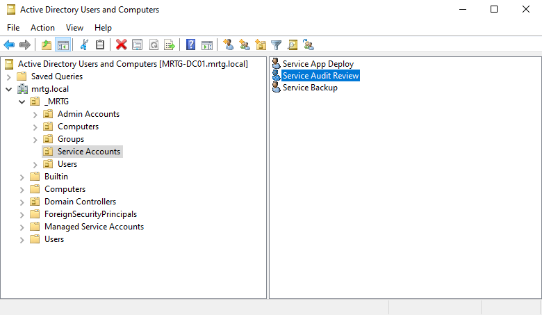
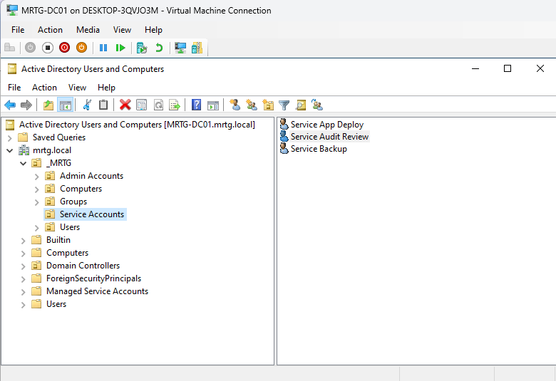
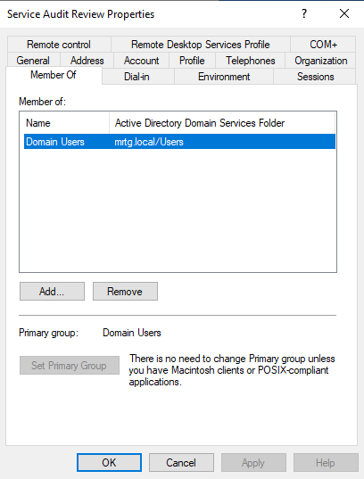

# Lab 25 — Service Account Governance Foundation

---

## Objective

The objective of this lab is to establish a service account governance foundation within the Monroe Redstone Technology Group Active Directory environment.

Service accounts are non-human identities used by systems, applications, services, scripts, or scheduled tasks. If these accounts are not documented, reviewed, and controlled, they can become long-term security risks.

This lab focuses on creating, documenting, and validating a governed service account using Active Directory Users and Computers.

---

## Business Problem

Monroe Redstone Technology Group needs a repeatable process for managing service accounts in Active Directory.

Without a governance process, service accounts may have:

- Unclear ownership
- Poor naming standards
- Excessive permissions
- Weak documentation
- No recurring review schedule
- No clear business or technical purpose

This creates risk because service accounts are often used by systems and automation processes, but may not receive the same review discipline as standard user accounts.

---

## Lab Summary

In this lab, I created and documented a governed service account named `svc-audit-review`.

The account was placed in the existing Service Accounts OU, assigned a clear naming standard, documented with ownership and review information, and validated to ensure it did not have privileged group membership.

This lab establishes a service account governance foundation that can be expanded in future labs.

---

## Environment

| Component | Details |
|---|---|
| Domain | `mrtg.local` |
| Domain Controller | `MRTG-DC01` |
| Management Tool | Active Directory Users and Computers |
| Target OU | `_MRTG\Service Accounts` |
| Service Account Created | `svc-audit-review` |
| Lab Organization | Monroe Redstone Technology Group |
| Virtualization Platform | Hyper-V |

---

## Service Account Governance Standard

MRTG service accounts should follow these governance requirements:

- Use a clear service account naming standard
- Be placed in the Service Accounts OU
- Have a documented business or technical purpose
- Have an assigned owner or responsible team
- Avoid privileged group membership unless formally approved
- Be reviewed on a recurring schedule
- Be disabled or removed when no longer needed
- Be monitored when used for automation, services, or scheduled tasks

For this lab, the naming standard used was:

`svc-[function]-[purpose]`

Example:

`svc-audit-review`

This naming format makes it clear that the account is a service account and helps separate non-human identities from standard user accounts.

---

## Hyper-V Pre-Lab Checkpoint

Before beginning Lab 25, I created a Hyper-V checkpoint to preserve the pre-change state of the domain controller.

Checkpoint created:

`MRTG-DC01_Pre-Lab25-Service-Account-Governance`

This checkpoint provides a rollback point before creating or modifying service account objects.

---

## Existing Service Accounts OU

The lab environment already contained a dedicated Service Accounts OU under the `_MRTG` organizational unit.

Path:

`mrtg.local\_MRTG\Service Accounts`

This OU is used to separate service accounts from standard user accounts.

---

## Service Account Created

A new service account was created inside the existing Service Accounts OU.

| Field | Value |
|---|---|
| First Name | Service |
| Last Name | Audit Review |
| Display Name | Service Audit Review |
| User Logon Name | `svc-audit-review` |
| OU | `_MRTG\Service Accounts` |
| Account Type | Service Account |
| Purpose | Governance and future audit-review simulation |

---

## Account Description

The Active Directory Description field was used to document basic ownership and review information.

Description used:

`Lab 25 svc acct. Owner: IT Ops. Review: Qtrly.`

This provides quick visibility into the account purpose, ownership, and review expectation directly inside Active Directory.

---

## Service Account Purpose

The `svc-audit-review` account was created as a governed non-human identity for Lab 25.

It represents a service account used for future audit-review simulation and service account governance documentation.

| Item | Value |
|---|---|
| Owner | IT Operations |
| Review Frequency | Quarterly |
| Privilege Level | Standard domain user |
| Account Type | Non-human identity |
| Business Function | Audit-review simulation and governance documentation |

---

## Account Logon Settings

The service account logon name was confirmed as:

`svc-audit-review`

The account was configured with the following lab settings:

| Setting | Configuration |
|---|---|
| User cannot change password | Enabled |
| Password never expires | Enabled for lab continuity |
| Account expires | Never |
| Account enabled | Yes |

---

## Password Never Expires Note

The `Password never expires` option was enabled for lab continuity.

This should not be treated as a blanket production best practice.

In a production environment, service account password handling should be governed through an approved process. Where appropriate, Group Managed Service Accounts should be considered to reduce manual password management risk.

Production environments should also consider:

- Password rotation schedules
- Service dependency documentation
- Formal change approval
- Monitoring for abnormal service account activity
- Migration to Group Managed Service Accounts where supported

---

## Group Membership Validation

The service account was reviewed to confirm that it did not have unnecessary privileged group membership.

The account was only a member of:

`Domain Users`

This confirms that the account was created as a standard domain user and was not added to privileged groups such as:

- Domain Admins
- Enterprise Admins
- Account Operators
- Server Operators
- Administrators

---

## Service Account Inventory View

The Service Accounts OU contains multiple service-style accounts, including the newly created Service Audit Review account.

This view supports the governance purpose of the lab by showing that service accounts are grouped in a dedicated location for easier review and management.

---

## Service Account Inventory

| Account Name | Display Name | Purpose | Owner | System/Application | Privilege Level | Review Frequency | Status |
|---|---|---|---|---|---|---|---|
| `svc-audit-review` | Service Audit Review | Governance and future audit-review simulation | IT Operations | Active Directory Lab | Standard domain user | Quarterly | Active |

---

## Risk Addressed

Unmanaged service accounts create long-term security risk because they may have unclear ownership, excessive permissions, weak documentation, or no recurring review process.

This lab reduces that risk by creating a governance model for service account naming, ownership, purpose, privilege level, and review frequency.

The main risks addressed include:

- Orphaned service accounts
- Excessive privilege assignments
- Poor service account documentation
- Lack of recurring review
- Difficulty identifying account purpose
- Weak accountability for non-human identities
- Inconsistent service account placement in Active Directory
- Lack of audit-ready evidence for service account governance

---

## Control Mapping

This lab supports the following IAM and security concepts:

| Control Area | How This Lab Supports It |
|---|---|
| Non-human identity governance | Creates and documents a governed service account |
| Least privilege | Confirms the account has no privileged group membership |
| Access review | Assigns a quarterly review frequency |
| Accountability | Documents ownership through IT Operations |
| Identity lifecycle management | Establishes a basic inventory for tracking service accounts |
| Audit readiness | Collects screenshots and documentation as evidence |
| Privileged access management | Validates that the account was not added to privileged groups |
| Operational governance | Establishes a repeatable standard for service account documentation |

---

## Validation

The following validation checks were completed:

| Validation Item | Result |
|---|---|
| Service Accounts OU exists | Passed |
| `svc-audit-review` account created | Passed |
| Account placed in Service Accounts OU | Passed |
| Account follows naming standard | Passed |
| Description field documents ownership and review | Passed |
| Account logon name confirmed | Passed |
| Account is only a member of Domain Users | Passed |
| No privileged group membership found | Passed |
| Pre-lab checkpoint created | Passed |
| Post-lab checkpoint created | Passed |

---

## Evidence Collected

The following evidence was collected during the lab:

| Evidence | File |
|---|---|
| Pre-lab Hyper-V checkpoint | `images/lab25-hyperv-pre-lab-checkpoint.png` |
| Created service account | `images/lab25-svc-audit-review-account.png` |
| Account description field | `images/lab25-service-account-description.png` |
| Account logon settings | `images/lab25-service-account-logon-settings.png` |
| Group membership validation | `images/lab25-service-account-group-membership.png` |
| Service account inventory view | `images/lab25-service-account-inventory-view.png` |
| Post-lab Hyper-V checkpoint | `images/lab25-hyperv-post-lab-checkpoint.png` |

---

## Hyper-V Post-Lab Checkpoint

After completing the service account governance work, a post-lab checkpoint was created.

Checkpoint created:

`MRTG-DC01_Post-Lab25-Service-Account-Governance-Validated`

This checkpoint preserves the completed Lab 25 state and provides a stable rollback point before beginning Lab 26.

---

## What I Would Improve in Production

In a production environment, I would improve this process by:

- Using a formal service account request and approval workflow
- Assigning both a business owner and technical owner to each service account
- Requiring documented justification for any privileged access
- Reviewing service account permissions on a recurring schedule
- Monitoring service account logon activity
- Rotating service account passwords through an approved process
- Using Group Managed Service Accounts where appropriate
- Alerting on abnormal service account behavior
- Disabling or removing unused service accounts
- Documenting service account dependencies before making changes
- Storing service account documentation in a centralized system of record
- Requiring change control before modifying service account permissions

---

## Lessons Learned

This lab reinforced that service accounts should be treated as governed identities, not just normal user accounts with different names.

The most important takeaway is that IAM is not only about creating accounts. It is also about documenting ownership, controlling privilege, validating group membership, and maintaining review processes.

Service accounts can become security risks when they are unmanaged, overprivileged, or forgotten. A simple inventory and governance standard can reduce that risk and make future reviews easier.

This lab also reinforced the importance of validating account membership before assigning a service account to automation, scheduled tasks, applications, or services.

---

## Outcome

Lab 25 successfully established a service account governance foundation for the MRTG Active Directory environment.

The lab demonstrated:

- A dedicated location for service accounts
- A clear service account naming standard
- Creation of a governed non-human identity
- Ownership and review documentation
- Least privilege validation
- Evidence collection for audit readiness
- Pre-lab and post-lab rollback points

This creates the foundation for Lab 26, where the service account governance model can be extended into a practical least-privilege automation scenario.

---

## Next Lab

Lab 26 will build on this work by using a service account in a controlled automation scenario.

`Lab 26 — Scheduled Task with Least-Privilege Service Account`
