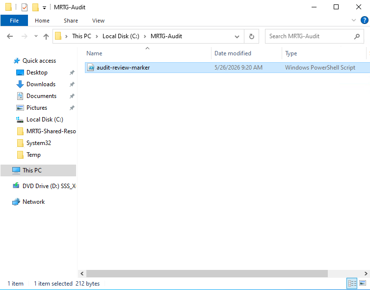
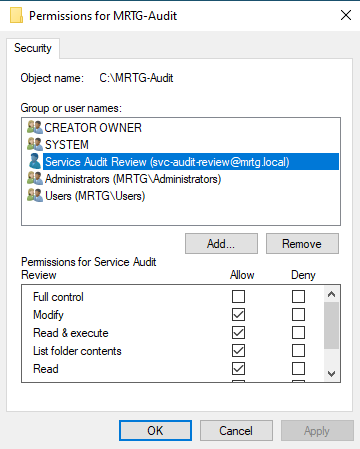
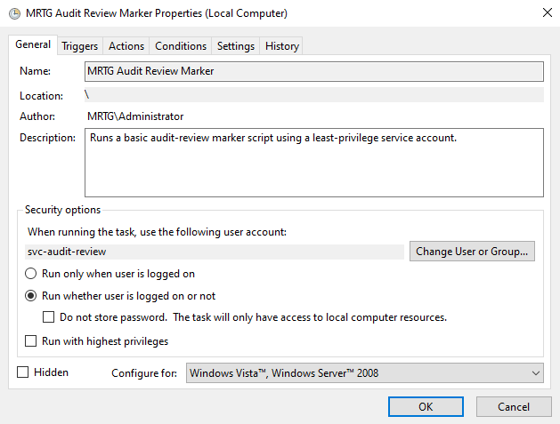
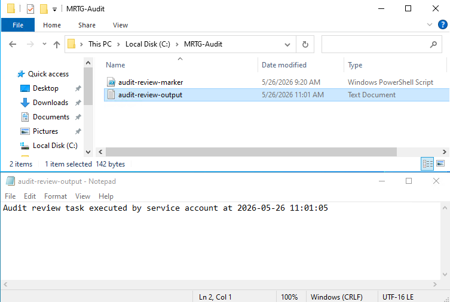

# Lab 26: Scheduled Task with a Least-Privilege Service Account


---

## Overview

This lab used the governed `svc-audit-review` service account from Lab 25 to run a Windows scheduled task without granting privileged Active Directory group membership or enabling elevated task execution.

The account received:

- The `Log on as a batch job` user right
- Modify permission on the task folder
- Permission to read and execute the PowerShell script
- Permission to create and update the output file

The scheduled task ran successfully and produced a timestamped output file. The validation demonstrated that the automation workflow functioned without adding the service account to the reviewed administrative groups.

---

## Business Problem

MRTG needed to run routine audit-review automation without using a personal administrator account or granting unnecessary administrative access to a service account.

Service accounts are frequently overprivileged because broad permissions are assigned simply to make automation work. This can increase risk because service accounts may:

- Operate without direct user interaction
- Persist for long periods
- Store reusable credentials
- Access sensitive resources
- Receive limited oversight
- Become targets for credential theft
- Support lateral movement when compromised
- Continue operating after their original purpose has ended

This lab addressed that risk by assigning a specific user right and resource-level permissions for one defined scheduled task.

---

## Lab Summary

A dedicated `C:\MRTG-Audit` folder and PowerShell marker script were created on `MRTG-DC01`.

The `svc-audit-review` account received Modify permission on the task folder. A dedicated Group Policy Object configured the `Log on as a batch job` user right required by Task Scheduler.

The `MRTG Audit Review Marker` task was configured to:

- Run as `svc-audit-review`
- Run whether or not the account was logged on
- Store the account credentials
- Run without highest privileges
- Execute the approved PowerShell script
- Write a timestamped validation record

The task completed successfully, and a subsequent Active Directory membership review showed the account remained a member of only `Domain Users`.

---

## Objectives

- Create a pre-lab Hyper-V checkpoint
- Create a dedicated audit folder
- Create a PowerShell validation script
- Identify the scheduled-task batch logon requirement
- Configure `Log on as a batch job`
- Grant scoped NTFS folder permissions
- Create a scheduled task using the governed service account
- Avoid highest-privilege task execution
- Review the account's Active Directory group membership
- Execute the task and validate its output
- Document security limitations and production improvements
- Create a post-lab Hyper-V checkpoint

---

## Scope

### Included

- Hyper-V checkpoints
- Audit folder creation
- PowerShell script creation
- NTFS permission assignment
- Group Policy user rights configuration
- Scheduled task configuration
- Active Directory group membership review
- Task execution
- Output validation
- Evidence collection

### Not Included

- Group Managed Service Account deployment
- Credential vault integration
- Automated password rotation
- Centralized script management
- PowerShell code signing
- Separate script and output directories
- SIEM monitoring
- Production change approval
- Scheduled-task alerting
- Interactive logon restrictions
- Remote Desktop logon restrictions
- Enterprise job-scheduling integration
- Local group membership review
- Effective access analysis beyond the documented task workflow

---

## Environment

| Component | Details |
|---|---|
| Organization | Monroe Redstone Technology Group |
| Domain | `mrtg.local` |
| Domain Controller | `MRTG-DC01` |
| Service Account | `svc-audit-review` |
| Target Folder | `C:\MRTG-Audit` |
| Script File | `C:\MRTG-Audit\audit-review-marker.ps1` |
| Output File | `C:\MRTG-Audit\audit-review-output.txt` |
| Scheduled Task | `MRTG Audit Review Marker` |
| Group Policy | `MRTG-GPO-Lab26-Service-Account-Batch-Logon` |
| Required User Right | `Log on as a batch job` |
| Management Tools | Task Scheduler, Group Policy Management, File Explorer |
| Hypervisor | Hyper-V |

---

## Scenario

MRTG requires a service account to execute a basic audit-review automation task.

The account must be able to run the task while no user is logged on and write the result to an approved folder. It must not receive unnecessary administrative access.

The access model used in this lab was:

```text
Governed identity
        |
        v
Specific user right
        |
        v
Scoped folder permission
        |
        v
Non-elevated scheduled task
        |
        v
Output validation
```

---

## Access Model

| Requirement | Implemented Control |
|---|---|
| Run a scheduled task while logged off | Assigned `Log on as a batch job` |
| Read and execute the script | Granted access through the folder ACL |
| Create and update the output file | Granted Modify permission on `C:\MRTG-Audit` |
| Avoid unnecessary task elevation | Left `Run with highest privileges` disabled |
| Avoid privileged domain membership | Retained only `Domain Users` membership |
| Preserve execution evidence | Generated a timestamped output file |
| Preserve lab states | Created pre-lab and post-lab checkpoints |

> Active Directory group membership is only one part of effective access. Local group membership, delegated permissions, user rights, file permissions, task configuration, and credential controls must also be reviewed.

---

## Implementation Steps

### Step 1: Create the Pre-Lab Checkpoint

A Hyper-V checkpoint was created before configuring the scheduled task.

Checkpoint name:

```text
MRTG-DC01_Pre-Lab26-Least-Privilege-Scheduled-Task
```

The checkpoint preserved a temporary lab state before changes were made to folder permissions, Group Policy, and Task Scheduler.

> Hyper-V checkpoints are useful for short-term lab recovery, but they are not substitutes for tested backups.


---

### Step 2: Create the MRTG Audit Folder

A dedicated folder was created on `MRTG-DC01`.

Folder path:

```text
C:\MRTG-Audit
```

The folder provided a controlled location for the PowerShell script and its output.


---

### Step 3: Create the Audit Review Marker Script

A PowerShell script was created in the audit folder.

Script path:

```text
C:\MRTG-Audit\audit-review-marker.ps1
```

The script was designed to:

- Execute through Task Scheduler
- Write a timestamped audit-review marker
- Create an output file
- Provide evidence that the service account completed the task

Expected output path:

```text
C:\MRTG-Audit\audit-review-output.txt
```



---

### Step 4: Configure the Batch Logon Right

The service account required the `Log on as a batch job` user right to run the task while no user was logged on.

Group Policy Object:

```text
MRTG-GPO-Lab26-Service-Account-Batch-Logon
```

Policy path:

```text
Computer Configuration
└── Policies
    └── Windows Settings
        └── Security Settings
            └── Local Policies
                └── User Rights Assignment
                    └── Log on as a batch job
```

Assigned identity:

```text
mrtg\svc-audit-review
```

This configured the specific Windows user right required by Task Scheduler without adding the account to an administrative Active Directory group.


---

### Step 5: Document the Batch Logon Warning

Task Scheduler displayed a warning that the selected account required `Log on as a batch job`.

Observed warning:

```text
This task requires that the user account specified has Log on as batch job rights.
```

The warning identified the missing user right. The requirement was addressed through the dedicated Group Policy setting instead of assigning administrative group membership.


---

### Step 6: Assign Folder Permissions

The `svc-audit-review` account was granted Modify access to:

```text
C:\MRTG-Audit
```

The documented permissions included:

- Modify
- Read and execute
- List folder contents
- Read
- Write

Full Control was not granted.

These permissions allowed the service account to read the script and create or update the output file without granting Full Control over the folder.

> Because the script and output were stored in the same folder, Modify permission could also allow the account to alter or delete the script. A production design should separate read-only executable content from writable output.



---

### Step 7: Configure the Scheduled Task

A scheduled task named `MRTG Audit Review Marker` was created.

| Setting | Value |
|---|---|
| Task Name | `MRTG Audit Review Marker` |
| Run As Account | `svc-audit-review` |
| Run Whether User Is Logged On or Not | Enabled |
| Do Not Store Password | Disabled |
| Run With Highest Privileges | Disabled |
| Script | `C:\MRTG-Audit\audit-review-marker.ps1` |

Task description:

```text
Runs a basic audit-review marker script using a least-privilege service account.
```

The task was intentionally configured without highest privileges. Because it was configured to run while the account was logged off, Task Scheduler stored credentials for the account.



---

### Step 8: Review Service Account Group Membership

The service account's Active Directory group membership was reviewed after the task was configured.

Observed membership:

```text
Domain Users
```

The reviewed account was not shown as a member of:

```text
Domain Admins
Enterprise Admins
Schema Admins
Administrators
Account Operators
Server Operators
Backup Operators
```

This evidence showed that the task functioned without adding the account to the reviewed privileged Active Directory groups.

> This review did not independently validate local group membership, delegated permissions, nested group paths, or every source of effective access.


---

### Step 9: Validate Task Output

The scheduled task was executed to validate the workflow.

The task created:

```text
C:\MRTG-Audit\audit-review-output.txt
```

Validated output:

```text
Audit review task executed by service account at 2026-05-26 11:01:05
```

The result demonstrated that the configured task could:

- Start under the service account
- Read the configured script
- Write to the task folder
- Generate timestamped execution evidence
- Complete without highest-privilege task execution
- Complete without the reviewed privileged group memberships



---

### Step 10: Create the Post-Lab Checkpoint

A post-lab checkpoint was created after the workflow was validated.

Checkpoint name:

```text
MRTG-DC01_Post-Lab26-Least-Privilege-Scheduled-Task-Validated
```

The checkpoint preserved the validated lab state before beginning Lab 27.


---

## Least-Privilege Analysis

The task required three primary capabilities:

| Capability | Permission Source |
|---|---|
| Start as a background scheduled task | `Log on as a batch job` |
| Read and execute the script | NTFS permissions on `C:\MRTG-Audit` |
| Create and update the output file | Modify permission on `C:\MRTG-Audit` |

The tested workflow did not require:

- Domain Admins membership
- The reviewed operator-group memberships
- Full Control on the task folder
- Highest-privilege task execution
- A personal administrator account

The lab demonstrates that least privilege must be evaluated across multiple control layers:

```text
Identity
User rights
Group membership
File permissions
Task settings
Credential storage
Execution results
```

The implementation was functional, but it was not a complete production least-privilege design. The service account could modify the folder containing its executable script, and additional controls such as logon restrictions, credential rotation, ownership, monitoring, and effective-access review remained outside the lab scope.

---

## Risk Addressed

The lab reduced exposure associated with:

- Scheduled tasks running under personal administrator accounts
- Unnecessary privileged group membership
- Highest-privilege task execution
- Full Control on the task folder
- Undocumented batch logon rights
- Missing evidence of task execution
- Failure to recheck account membership after implementation
- Long-lived automation identities with unclear permissions

Residual risks included:

- Stored reusable credentials
- A password configured not to expire in the Lab 25 implementation
- No demonstrated automated credential rotation
- No documented interactive logon restrictions
- Writable script and output content in the same folder
- Task execution on a domain controller
- No centralized monitoring or alerting
- No demonstrated code-signing control

---

## Control Mapping

| Control Area | Lab Implementation |
|---|---|
| Non-human identity governance | Used the service account created in Lab 25 |
| Least-privilege configuration | Used a specific user right and scoped folder ACL |
| Privileged access control | Avoided the reviewed privileged group memberships |
| User rights assignment | Configured `Log on as a batch job` through Group Policy |
| Resource authorization | Granted Modify permission to the task folder |
| Execution control | Left highest-privilege execution disabled |
| Access review | Rechecked Active Directory group membership |
| Functional validation | Executed the task and confirmed its output |
| Evidence collection | Captured configuration and output screenshots |
| Lab-state preservation | Created pre-lab and post-lab checkpoints |

> This mapping describes the controls demonstrated in the lab. It does not represent certification against a specific regulatory or security framework.

---

## Validation Summary

| Test | Expected Result | Observed Result | Status |
|---|---|---|---|
| Pre-lab checkpoint | Temporary recovery state exists | Checkpoint created | Passed |
| Audit folder | `C:\MRTG-Audit` exists | Folder created | Passed |
| PowerShell script | Marker script exists | Script created | Passed |
| Batch logon requirement | Required user right identified | Warning captured | Passed |
| Batch logon configuration | Account added to the GPO setting | Setting configured | Passed |
| Folder permission | Account has Modify access | Modify granted | Passed |
| Full Control avoided | Full Control is not assigned | Not selected in documented ACL | Passed |
| Scheduled task | Task uses `svc-audit-review` | Task created | Passed |
| Highest privileges | Elevated execution remains disabled | Setting disabled | Passed |
| AD group membership | No reviewed privileged membership | `Domain Users` observed | Passed |
| Task execution | Script completes successfully | Output generated | Passed |
| Output evidence | Timestamped output file exists | Output validated | Passed |
| Post-lab checkpoint | Validated lab state preserved | Checkpoint created | Passed |

---

## Evidence Collected

| Evidence | Screenshot |
|---|---|
| Pre-lab checkpoint | `screenshots/lab-26-01-pre-lab-checkpoint.png` |
| Audit folder | `screenshots/lab-26-02-mrtg-audit-folder-created.png` |
| PowerShell marker script | `screenshots/lab-26-03-audit-review-marker-script-created.png` |
| Batch logon GPO | `screenshots/lab-26-04-batch-logon-right-gpo-configured.png` |
| Batch logon warning | `screenshots/lab-26-05-batch-logon-right-warning.png` |
| Service account folder permissions | `screenshots/lab-26-06-folder-permissions-service-account.png` |
| Scheduled task configuration | `screenshots/lab-26-07-scheduled-task-service-account.png` |
| Service account group membership | `screenshots/lab-26-08-service-account-group-membership-validation.png` |
| Successful task output | `screenshots/lab-26-09-task-output-validation.png` |
| Post-lab checkpoint | `screenshots/lab-26-10-post-lab-checkpoint.png` |

---

## Troubleshooting Notes

Task Scheduler reported that the service account required `Log on as a batch job`.

The requirement was addressed by configuring that specific user right through Group Policy. The account was not added to a privileged group, and the task was not configured to run with highest privileges.

The troubleshooting process followed this model:

```text
Identify the missing permission
        |
        v
Grant the narrow requirement
        |
        v
Retest the workflow
        |
        v
Review for additional privilege
```

Functional success should not be treated as proof that no excess access exists. A complete review must also examine effective permissions, local memberships, credential protections, logon restrictions, and script integrity.

---

## Security Considerations

The task was configured to run while the service account was logged off, requiring Task Scheduler to store credentials for the account.

Additional concerns included:

- The Lab 25 account configuration used a non-expiring password
- No automated password rotation was demonstrated
- Interactive and Remote Desktop logon restrictions were not documented
- Modify permission applied to the folder containing the script
- The task ran on a domain controller
- Script signing was not implemented
- Centralized task monitoring was not configured
- Task modification alerts were not configured

Stronger controls would include:

- A Group Managed Service Account where supported
- Automated credential rotation
- Credential vault integration
- Deny logon locally
- Deny logon through Remote Desktop Services
- Separate read-only script and writable output directories
- Digitally signed PowerShell scripts
- Restricted script modification permissions
- Task Scheduler operational logging
- Alerts for task creation and modification
- Alerts for unexpected service account logons
- Periodic effective-access reviews
- Formal ownership and retirement records

---

## Real-World Relevance

Scheduled tasks and service accounts commonly support:

- Report generation
- File processing
- Backup operations
- System maintenance
- Monitoring
- Log collection
- Data synchronization
- Identity lifecycle automation
- Compliance evidence generation

In enterprise and government-regulated environments, automation should not rely on personal administrator accounts.

A governed automation identity should have:

- A documented owner
- A defined business and technical purpose
- Narrow resource access
- Only the required user rights
- No unnecessary administrative membership
- Protected and rotated credentials
- Restricted interactive access
- Monitored activity
- Retained execution evidence
- A recurring review schedule
- A defined retirement process

---

## Production Improvements

A production implementation should include:

- Formal service account request and approval
- Documented business and technical ownership
- A Group Managed Service Account where supported
- Automated credential rotation
- Credential vault integration
- Interactive logon restrictions
- Remote Desktop logon restrictions
- A controlled script repository
- Separate script and output directories
- Read-only script access for the service identity
- Digitally signed PowerShell scripts
- Restricted PowerShell execution
- Task Scheduler operational logging
- Centralized service account monitoring
- Alerts for task creation and modification
- Alerts for abnormal service account activity
- Periodic NTFS and effective-access reviews
- Group Policy change control
- Documented task dependencies
- A formal task and account retirement process
- Placement of the workload on a dedicated management or automation server instead of a domain controller

---

## Lessons Learned

- Service-account functionality does not inherently require administrator access
- User rights assignments are separate from group membership
- Scheduled tasks running while logged off require batch logon rights
- Folder permissions should be scoped to the required resource
- Modify permission can support output creation without granting Full Control
- Scripts and writable output should be separated in stronger designs
- Highest-privilege execution should remain disabled unless technically required
- Group membership should be reviewed after implementation
- Group membership alone does not establish effective least privilege
- Task output provides useful functional evidence
- Stored credentials introduce additional governance requirements
- Troubleshooting should identify and grant the narrow missing capability
- Least privilege must be assessed across identity, policy, file system, task, credential, and monitoring controls

---

## Skills Demonstrated

- Service account governance
- Least-privilege analysis
- Windows Task Scheduler configuration
- Group Policy user rights assignment
- NTFS permission management
- PowerShell automation
- Scheduled-task troubleshooting
- Non-human identity validation
- Privileged group review
- Functional task validation
- Evidence collection
- Hyper-V checkpoint management
- Production security analysis

---

## Outcome

Lab 26 demonstrated a functional scheduled-task workflow using a dedicated service account without enabling highest-privilege execution or adding the account to the reviewed privileged Active Directory groups.

The lab validated:

- Use of a dedicated non-human identity
- Group Policy-based batch logon rights
- Folder-scoped NTFS permissions
- Non-elevated scheduled-task execution
- Successful PowerShell script execution
- Timestamped output generation
- Continued `Domain Users` membership
- Configuration and validation evidence
- Pre-lab and post-lab checkpoints

The implementation established a least-privilege foundation for the specific lab workflow while also identifying production gaps involving credential management, script integrity, logon restrictions, effective-access review, monitoring, and domain-controller workload placement.

---

## Next Lab

[Lab 27: BitLocker and Endpoint Encryption Recovery](../Lab-27-BitLocker-and-Endpoint-Encryption-Recovery/)

Lab 27 focuses on BitLocker deployment, endpoint encryption, recovery-key handling, recovery validation, and layered endpoint security controls.
