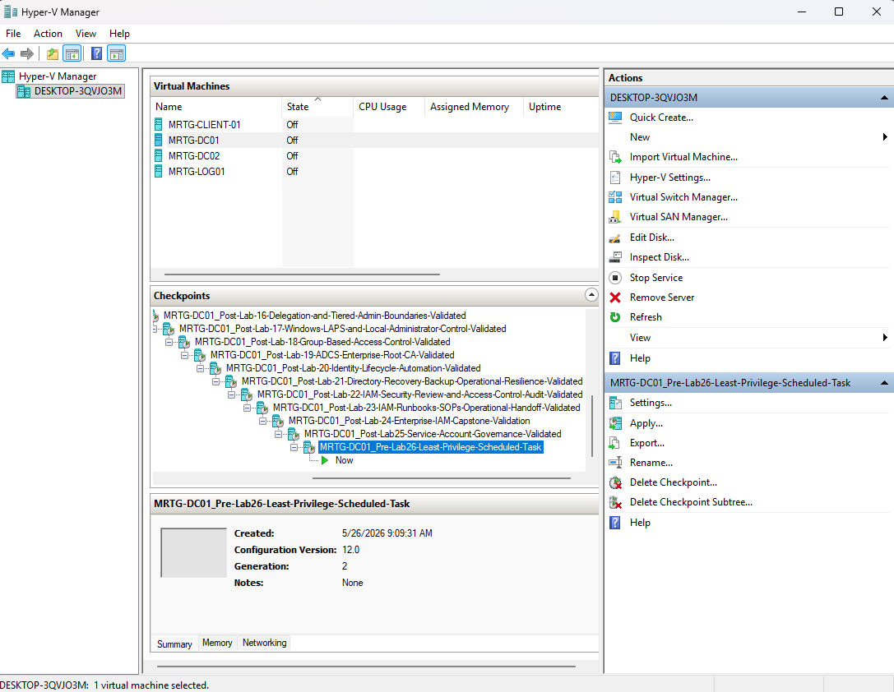
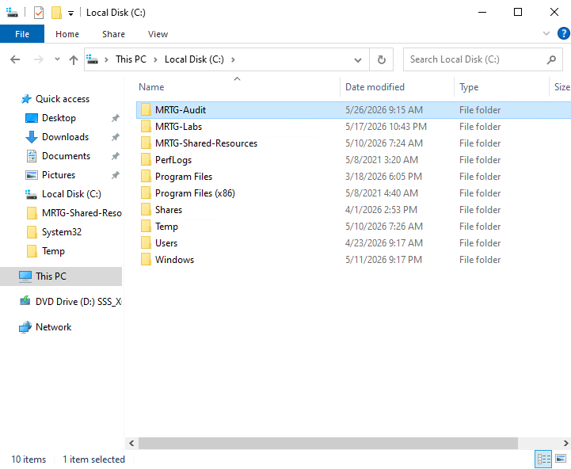
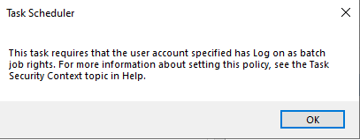
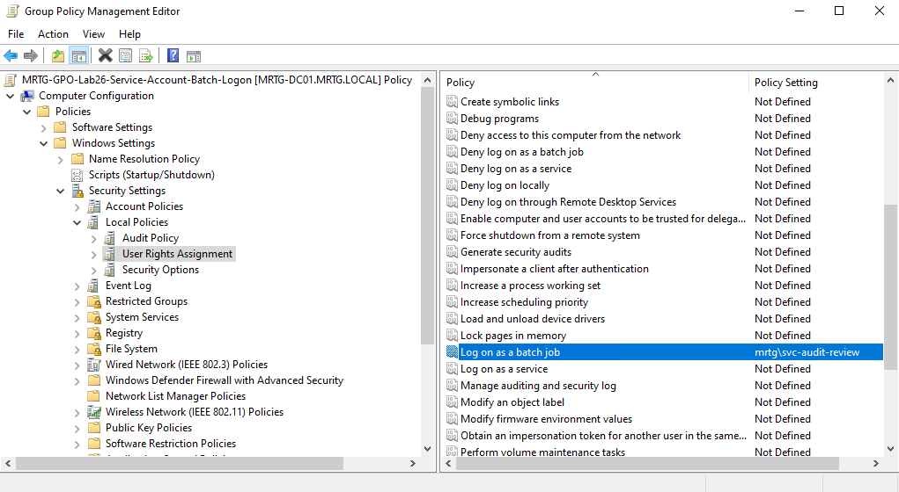
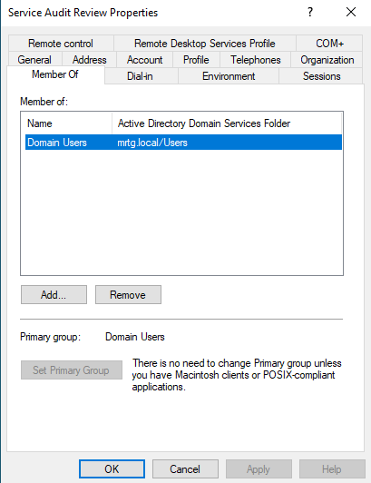
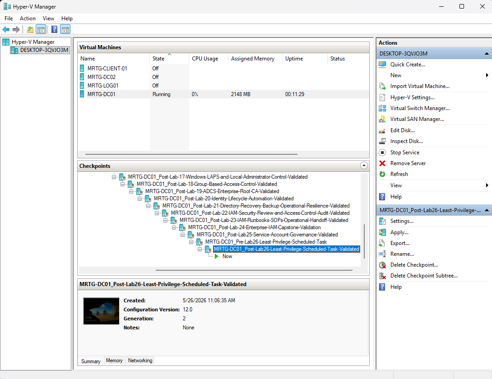

# Lab-26 — Scheduled Task with Least-Privilege Service Account

---

## Objective

The objective of this lab is to use a governed service account to run a scheduled task while maintaining least privilege.

This lab builds on Lab 25, where the `svc-audit-review` service account was created, documented, and validated as a governed non-human identity.

In Lab 26, that service account is used to run a controlled automation task without being added to privileged Active Directory groups.

---

## Business Problem

Monroe Redstone Technology Group needs a way to run routine audit-review automation without using a personal administrator account or granting unnecessary privileges to a service account.

In many environments, service accounts are overprivileged because administrators give them broad access just to make a task work.

This creates risk because service accounts may:

- Run automated jobs
- Access files or systems
- Persist for long periods of time
- Be forgotten after implementation
- Have permissions that are rarely reviewed
- Become a target for misuse or lateral movement

This lab demonstrates a safer approach by granting the service account only the specific permissions required to run the scheduled task.

---

## Lab Summary

In this lab, I configured the `svc-audit-review` service account to run a scheduled task named `MRTG Audit Review Marker`.

The task runs a PowerShell script that writes a timestamped audit-review marker to an output file.

The service account was granted Modify access only to the required folder and was assigned the `Log on as a batch job` right through Group Policy.

The account was not added to privileged groups.

---

## Environment

| Component | Details |
|---|---|
| Domain | `mrtg.local` |
| Domain Controller | `MRTG-DC01` |
| Service Account | `svc-audit-review` |
| Target Folder | `C:\MRTG-Audit` |
| Script File | `C:\MRTG-Audit\audit-review-marker.ps1` |
| Output File | `C:\MRTG-Audit\audit-review-output.txt` |
| Scheduled Task | `MRTG Audit Review Marker` |
| Group Policy Used | `MRTG-GPO-Lab26-Service-Account-Batch-Logon` |
| Lab Organization | Monroe Redstone Technology Group |
| Virtualization Platform | Hyper-V |

---

## Lab Scenario

MRTG needs a service account to run a basic audit-review scheduled task.

The service account should be able to complete the task, but it should not receive broad administrative access.

The goal is to prove that a service account can perform a defined automation function when given:

- Access to only the folder it needs
- The specific Windows logon right required for scheduled tasks
- No unnecessary privileged group membership

---

## Hyper-V Pre-Lab Checkpoint

Before beginning Lab 26, I created a Hyper-V checkpoint to preserve the pre-change state of the domain controller.

Checkpoint created: `MRTG-DC01_Pre-Lab26-Least-Privilege-Scheduled-Task`

This checkpoint provides a rollback point before configuring folder permissions, Group Policy settings, or the scheduled task.

---

## Audit Folder Created

A dedicated folder was created on the domain controller to store the audit-review script and output file.

Folder path: `C:\MRTG-Audit`

This folder was used as the controlled resource for the scheduled task.

---

## PowerShell Script Created

A PowerShell script was created inside the `C:\MRTG-Audit` folder.

Script file: `audit-review-marker.ps1`

The script writes a timestamped audit-review marker to an output text file.

Script purpose:

- Validate that the scheduled task can run successfully
- Generate simple evidence of task execution
- Confirm that the service account can write to the approved folder

---

## Folder Permission Assigned

The `svc-audit-review` service account was granted Modify access to the `C:\MRTG-Audit` folder.

Permission granted: `Modify`

Full Control was not granted.

This supports least privilege by giving the account enough access to create and update the task output file without granting broad control over the system.

---

## Scheduled Task Permission Issue

When creating the scheduled task, Windows displayed a warning that the selected service account required the `Log on as a batch job` user right.

This occurred because the task was configured to run as `svc-audit-review` whether the user was logged on or not.

Instead of adding the service account to an administrative group, I resolved the issue by granting only the specific user right required for the task.

---

## Batch Logon Right Assigned Through Group Policy

To resolve the scheduled task permission requirement, I configured a Group Policy setting to grant `svc-audit-review` the `Log on as a batch job` right.

Policy path:

`Computer Configuration > Policies > Windows Settings > Security Settings > Local Policies > User Rights Assignment > Log on as a batch job`

Assigned account: `mrtg\svc-audit-review`

This allowed the service account to run the scheduled task without being added to privileged groups.

---

## Scheduled Task Configuration

A scheduled task named `MRTG Audit Review Marker` was created using Task Scheduler.

The task was configured to run as the `svc-audit-review` service account.

Key task settings:

| Setting | Configuration |
|---|---|
| Task Name | `MRTG Audit Review Marker` |
| Run As Account | `svc-audit-review` |
| Run Whether User Is Logged On Or Not | Enabled |
| Run With Highest Privileges | Not enabled |
| Script Location | `C:\MRTG-Audit\audit-review-marker.ps1` |

The task was intentionally not configured to run with highest privileges.

---

## Task Output Validation

After the scheduled task was created, it was manually executed to validate functionality.

The task successfully created the output file:

`C:\MRTG-Audit\audit-review-output.txt`

The output confirmed that the audit-review script executed successfully.

---

## Service Account Group Membership Validation

After the scheduled task was successfully executed, the `svc-audit-review` account was reviewed again in Active Directory.

The account remained a member of only:

`Domain Users`

This confirmed that the scheduled task was not made functional by adding the service account to privileged groups.

---

## Service Account Access Model

The service account was granted only the access required for the task.

| Access Requirement | Control Used |
|---|---|
| Write to the audit folder | Modify permission on `C:\MRTG-Audit` |
| Run scheduled task while not logged on | `Log on as a batch job` user right |
| Avoid excessive privilege | No privileged AD group membership |
| Preserve task evidence | Output file generated by script |
| Support rollback | Hyper-V pre-lab and post-lab checkpoints |

---

## Risk Addressed

Overprivileged service accounts create security risk because they may allow automated processes to run with more access than required.

This lab reduces that risk by showing how a service account can be used for a specific scheduled task without granting broad administrative privileges.

The main risks addressed include:

- Service accounts being added to privileged groups unnecessarily
- Automation running under personal administrator accounts
- Lack of clear access boundaries for scheduled tasks
- Excessive permissions assigned to non-human identities
- Poor validation of service account privilege level
- Lack of evidence proving how a service account is used

---

## Control Mapping

This lab supports the following IAM and security concepts:

| Control Area | How This Lab Supports It |
|---|---|
| Least privilege | Grants only the permissions required for the scheduled task |
| Non-human identity governance | Uses a documented service account from Lab 25 |
| Privileged access control | Confirms the service account was not added to privileged groups |
| User rights assignment | Grants `Log on as a batch job` through Group Policy |
| Access validation | Confirms successful task execution and group membership |
| Audit readiness | Captures configuration and validation evidence |
| Operational security | Uses a repeatable and documented automation pattern |
| Change control readiness | Uses checkpoints before and after the lab |

---

## Validation

The following validation checks were completed:

| Validation Item | Result |
|---|---|
| Pre-lab checkpoint created | Passed |
| `C:\MRTG-Audit` folder created | Passed |
| PowerShell audit-review script created | Passed |
| `svc-audit-review` granted Modify access to the folder | Passed |
| Full Control was not granted to the service account | Passed |
| Scheduled task created using `svc-audit-review` | Passed |
| `Run with highest privileges` was not enabled | Passed |
| Batch logon requirement identified | Passed |
| `Log on as a batch job` assigned through GPO | Passed |
| Scheduled task executed successfully | Passed |
| Output file created successfully | Passed |
| Service account remained only in Domain Users | Passed |
| Post-lab checkpoint created | Passed |

---

## Evidence Collected

The following evidence was collected during the lab:

| Evidence | File |
|---|---|
| Pre-lab Hyper-V checkpoint | `images/lab26-hyperv-pre-lab-checkpoint.png` |
| Audit folder created | `images/lab26-mrtg-audit-folder.png` |
| PowerShell script created | `images/lab26-audit-review-script.png` |
| Folder permissions assigned to service account | `images/lab26-folder-permissions-service-account.png` |
| Batch logon warning | `images/lab26-batch-logon-warning.png` |
| Batch logon right assigned through GPO | `images/lab26-batch-logon-right-gpo.png` |
| Scheduled task configured with service account | `images/lab26-scheduled-task-service-account.png` |
| Task output validation | `images/lab26-task-output-validation.png` |
| Service account group membership validation | `images/lab26-service-account-group-membership-validation.png` |
| Post-lab Hyper-V checkpoint | `images/lab26-hyperv-post-lab-checkpoint.png` |

---

## Hyper-V Post-Lab Checkpoint

After completing the scheduled task configuration and validation, a post-lab checkpoint was created.

Checkpoint created: `MRTG-DC01_Post-Lab26-Least-Privilege-Scheduled-Task-Validated`

This checkpoint preserves the completed Lab 26 state and provides a rollback point before beginning Lab 27.

---

## What I Would Improve in Production

In a production environment, I would improve this process by:

- Using a formal service account request and approval workflow
- Documenting the business owner and technical owner for the scheduled task
- Using Group Managed Service Accounts where supported
- Storing scripts in a controlled administrative script repository
- Digitally signing PowerShell scripts where appropriate
- Avoiding long-term use of `-ExecutionPolicy Bypass`
- Monitoring service account logon activity
- Alerting on abnormal service account behavior
- Reviewing folder permissions on a recurring schedule
- Reviewing user rights assignments through Group Policy
- Documenting task ownership, purpose, and dependency impact
- Using change control before modifying service account permissions or task configuration

---

## Lessons Learned

This lab reinforced that making a service account work should not mean giving it administrator access.

The scheduled task initially required the `Log on as a batch job` right. Instead of solving that issue by adding the account to a privileged group, I granted the specific right required through Group Policy.

This is a better security pattern because it keeps the service account limited to the access it needs.

The most important takeaway is that least privilege is not just about group membership. It also includes file permissions, user rights assignments, task configuration, and validation after the work is complete.

---

## Outcome

Lab 26 successfully demonstrated how to use a governed service account for a scheduled task while maintaining least privilege.

The lab demonstrated:

- Controlled use of a non-human identity
- Folder-level permission assignment
- Scheduled task configuration using a service account
- Identification and resolution of a batch logon rights issue
- Group Policy-based user rights assignment
- Successful task execution and output validation
- Confirmation that the service account remained non-privileged
- Evidence collection for audit readiness
- Pre-lab and post-lab rollback points

This lab extends the service account governance foundation from Lab 25 into a practical least-privilege automation scenario.

---

## Next Lab

[Lab 27 — BitLocker and Endpoint Encryption Recovery](../Lab-27-BitLocker-and-Endpoint-Encryption-Recovery)

Lab 27 will focus on BitLocker, endpoint encryption, recovery key handling, and layered endpoint security controls.
