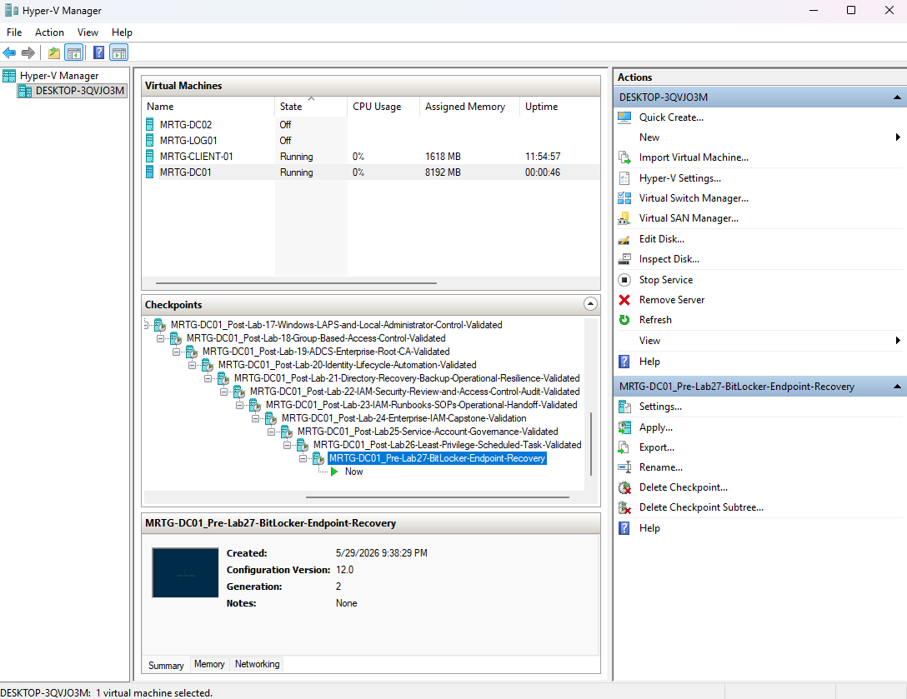
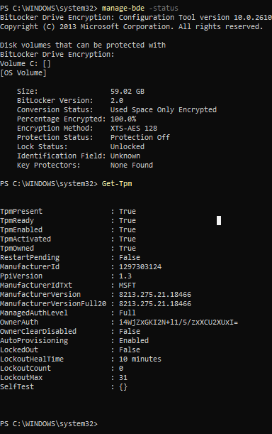
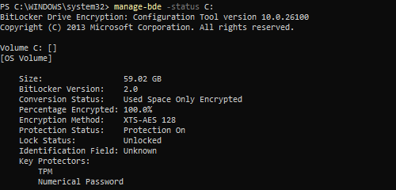
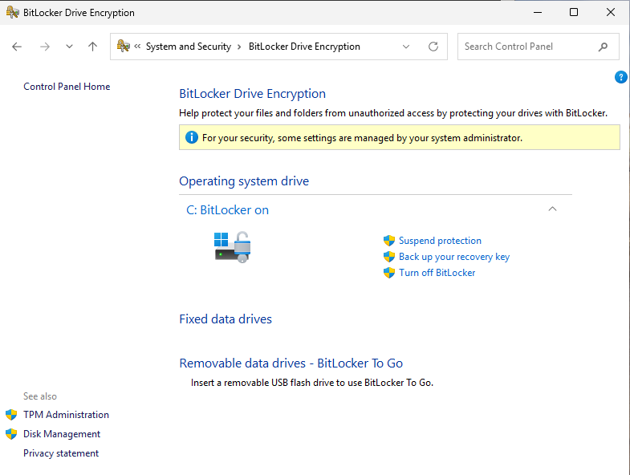

# Lab-27 — BitLocker & Endpoint Encryption Recovery

---

## Objective

The objective of this lab is to enable and validate BitLocker protection on an endpoint while documenting recovery key handling and encryption limitations.

This lab focuses on endpoint encryption as part of a broader identity and security operations model. BitLocker protects data at rest, but recovery access must be handled carefully because recovery keys are sensitive recovery material.

---

## Business Problem

Monroe Redstone Technology Group needs endpoint encryption to protect workstation data if a device is lost, stolen, or accessed while powered off.

However, enabling encryption is only part of the control. Recovery keys must also be protected, documented, and handled properly.

If recovery keys are exposed or poorly controlled, they can become a privileged access path.

This lab addresses the need to:

- Enable BitLocker protection on a workstation
- Validate TPM readiness
- Confirm BitLocker protection status
- Document recovery key handling
- Avoid exposing recovery key material in public documentation
- Explain BitLocker limitations as part of layered endpoint security

---

## Lab Summary

In this lab, I enabled BitLocker protection on `MRTG-CLIENT-01`.

The endpoint already showed encrypted status, but BitLocker protection was not active because no key protectors were configured.

After activation, BitLocker protection changed from `Protection Off` to `Protection On`, and the endpoint showed both TPM and numerical password key protectors.

The recovery key backup step was completed during activation, but the recovery key value is intentionally not displayed in this documentation.

---

## Environment

| Component | Details |
|---|---|
| Domain | `mrtg.local` |
| Domain Controller | `MRTG-DC01` |
| Endpoint | `MRTG-CLIENT-01` |
| Encryption Tool | BitLocker Drive Encryption |
| Validation Tool | `manage-bde` |
| TPM Validation | `Get-Tpm` |
| Virtualization Platform | Hyper-V |
| Lab Organization | Monroe Redstone Technology Group |

---

## Hyper-V Pre-Lab Checkpoints

Before making changes, I created pre-lab checkpoints for both the domain controller and the client endpoint.

These checkpoints preserve the pre-change state before BitLocker activation and endpoint encryption validation.

### Domain Controller Pre-Lab Checkpoint

Checkpoint created:

`MRTG-DC01_Pre-Lab27-BitLocker-Endpoint-Recovery`

### Client Pre-Lab Checkpoint

Checkpoint created:

`MRTG-CLIENT-01_Pre-Lab27-BitLocker-Endpoint-Recovery`

---

## Initial BitLocker and TPM Status

Before enabling BitLocker protection, I validated the endpoint encryption and TPM state using PowerShell.

Commands used:

`manage-bde -status`

`Get-Tpm`

The initial `manage-bde` output showed that the drive was already encrypted, but BitLocker protection was not active.

Key initial findings:

| Setting | Initial State |
|---|---|
| Percentage Encrypted | `100.0%` |
| Conversion Status | `Used Space Only Encrypted` |
| Protection Status | `Protection Off` |
| Lock Status | `Unlocked` |
| Key Protectors | `None Found` |

The TPM check confirmed that TPM was present and ready.

Key TPM findings:

| TPM Setting | Status |
|---|---|
| TpmPresent | `True` |
| TpmReady | `True` |
| TpmEnabled | `True` |
| TpmActivated | `True` |
| TpmOwned | `True` |

---

## Technical Interpretation

The endpoint showed encryption was already present, but BitLocker protection was not fully active.

This is an important distinction.

Encryption being present does not automatically mean the endpoint is fully protected by BitLocker. BitLocker protection requires key protectors such as TPM and a numerical recovery password.

Initial state:

| Area | Status |
|---|---|
| Disk encryption | Present |
| BitLocker protection | Off |
| Key protectors | Not configured |

Final goal:

| Area | Status |
|---|---|
| Disk encryption | Present |
| BitLocker protection | On |
| Key protectors | TPM and numerical password |

---

## BitLocker Recovery Key Backup Option

During BitLocker activation, Windows prompted for a recovery key backup method.

I selected the option to print the recovery key using Microsoft Print to PDF.

The recovery key value is intentionally not shown in this documentation.

BitLocker recovery keys are sensitive recovery material and should not be exposed in public repositories, screenshots, or LinkedIn posts.

---

## Recovery Key Handling

The recovery key backup step was completed during activation, but the actual recovery key value is intentionally excluded from this documentation.

This lab documents the recovery handling process without exposing sensitive recovery material.

Recovery keys should be treated like privileged access artifacts because they can be used to unlock protected systems.

In a production environment, BitLocker recovery keys should be escrowed to an approved protected location such as:

- Active Directory
- Microsoft Entra ID
- A privileged documentation vault
- An approved enterprise recovery key repository

Access to BitLocker recovery material should be limited to authorized administrators and reviewed periodically.

---

## BitLocker Protection Enabled

After completing the BitLocker activation process, I validated the endpoint protection state using:

`manage-bde -status C:`

The updated status showed that BitLocker protection was active.

Key final findings:

| Setting | Final State |
|---|---|
| Percentage Encrypted | `100.0%` |
| Conversion Status | `Used Space Only Encrypted` |
| Protection Status | `Protection On` |
| Lock Status | `Unlocked` |
| Key Protector | `TPM` |
| Key Protector | `Numerical Password` |

---

## BitLocker Control Panel Validation

The BitLocker Control Panel also confirmed that BitLocker protection was active on the operating system drive.

Final GUI status:

`C: BitLocker on`

---

## BitLocker Limitations and Layered Endpoint Security

BitLocker protects data at rest, especially if a device is lost, stolen, removed, or accessed while powered off.

However, BitLocker is not a standalone security solution.

BitLocker does not replace:

- Strong authentication
- Least privilege
- Local administrator control
- Endpoint hardening
- Logging and monitoring
- Physical security
- Patch management
- Secure recovery key handling

If a system is already unlocked, an attacker has valid credentials, or local administrative access is compromised, BitLocker alone does not prevent all forms of misuse.

For this reason, BitLocker should be treated as one layer in a broader endpoint and identity security model.

---

## IAM and Security Relevance

This lab connects to IAM because recovery keys represent sensitive access material.

Even though BitLocker is an endpoint security control, recovery key access still needs governance.

Important IAM connections include:

| IAM Area | Relevance |
|---|---|
| Access control | Recovery keys should only be available to authorized administrators |
| Least privilege | Recovery access should not be broadly available |
| Audit readiness | Recovery handling should be documented |
| Privileged access | Recovery keys can unlock protected systems |
| Operational security | Recovery procedures should be controlled and repeatable |
| Endpoint identity | Device protection supports secure identity operations |

---

## Risk Addressed

Unprotected endpoints create risk because data may be exposed if a device is lost, stolen, or accessed while powered off.

Poorly handled recovery keys also create risk because unauthorized users may be able to unlock encrypted systems.

This lab reduces those risks by enabling BitLocker protection, validating TPM readiness, confirming active key protectors, and documenting recovery key handling.

The main risks addressed include:

- Data exposure from lost or stolen endpoints
- BitLocker protection appearing incomplete or inactive
- Recovery keys being mishandled or exposed
- Lack of validation after encryption changes
- Weak documentation around endpoint protection
- Treating encryption as a standalone control instead of part of layered security

---

## Control Mapping

This lab supports the following IAM and security concepts:

| Control Area | How This Lab Supports It |
|---|---|
| Endpoint encryption | Enables BitLocker protection on a workstation |
| Data protection | Protects data at rest on the endpoint |
| Recovery governance | Documents recovery key handling without exposing the key |
| Least privilege | Treats recovery material as sensitive access material |
| TPM validation | Confirms TPM is present and ready |
| Security validation | Uses `manage-bde` and Control Panel to confirm protection |
| Audit readiness | Collects screenshots and validation evidence |
| Layered security | Explains BitLocker limitations and compensating controls |
| Operational resilience | Maintains pre-lab and post-lab rollback points |

---

## Validation

The following validation checks were completed:

| Validation Item | Result |
|---|---|
| DC01 pre-lab checkpoint created | Passed |
| CLIENT-01 pre-lab checkpoint created | Passed |
| Initial BitLocker status reviewed | Passed |
| TPM status validated | Passed |
| Initial protection status confirmed as off | Passed |
| Recovery key backup option selected | Passed |
| Recovery key value excluded from public documentation | Passed |
| BitLocker protection enabled | Passed |
| TPM key protector confirmed | Passed |
| Numerical password protector confirmed | Passed |
| Control Panel showed BitLocker on | Passed |
| DC01 post-lab checkpoint created | Passed |
| CLIENT-01 post-lab checkpoint created | Passed |

---

## Evidence Collected

The following evidence was collected during the lab:

| Evidence | File |
|---|---|
| DC01 pre-lab checkpoint | `images/lab27-dc01-pre-lab-checkpoint.png` |
| CLIENT-01 pre-lab checkpoint | `images/lab27-client01-pre-lab-checkpoint.png` |
| Initial BitLocker and TPM status | `images/lab27-manage-bde-and-tpm-status.png` |
| BitLocker recovery key print option | `images/lab27-bitlocker-print-recovery-key-option.png` |
| BitLocker protection enabled status | `images/lab27-manage-bde-protection-on-status.png` |
| BitLocker Control Panel final status | `images/lab27-bitlocker-control-panel-after.png` |
| DC01 post-lab checkpoint | `images/lab27-dc01-post-lab-checkpoint.png` |
| CLIENT-01 post-lab checkpoint | `images/lab27-client01-post-lab-checkpoint.png` |

---

## Hyper-V Post-Lab Checkpoints

After completing BitLocker activation and validation, I created post-lab checkpoints for both the client and domain controller.

### Domain Controller Post-Lab Checkpoint

Checkpoint created:

`MRTG-DC01_Post-Lab27-BitLocker-Endpoint-Recovery-Validated`

### Client Post-Lab Checkpoint

Checkpoint created:

`MRTG-CLIENT-01_Post-Lab27-BitLocker-Endpoint-Recovery-Validated`

---

## What I Would Improve in Production

In a production environment, I would improve this process by:

- Escrowing BitLocker recovery keys to Active Directory or Microsoft Entra ID
- Restricting recovery key access to authorized administrators
- Auditing recovery key access
- Documenting recovery procedures in an approved internal system
- Using endpoint management tools to enforce BitLocker policy
- Applying BitLocker settings through Group Policy or Microsoft Intune
- Monitoring devices for encryption compliance
- Alerting on BitLocker suspension or protection changes
- Testing recovery procedures in a controlled process
- Avoiding local or user-controlled recovery key storage
- Aligning encryption policy with organizational compliance requirements

---

## Lessons Learned

This lab reinforced that endpoint encryption is not complete until protection status and key protectors are validated.

The endpoint initially showed that the drive was encrypted, but BitLocker protection was off and no key protectors were configured.

After activation, BitLocker showed `Protection On` with TPM and numerical password protectors.

The lab also reinforced that recovery keys are sensitive. They should not be exposed in public screenshots or documentation. Recovery key handling should be controlled, documented, and reviewed like other privileged access paths.

The biggest takeaway is that BitLocker is one layer of endpoint security. It protects data at rest, but it does not replace authentication, least privilege, monitoring, endpoint hardening, or recovery governance.

---

## Outcome

Lab 27 successfully enabled and validated BitLocker protection on `MRTG-CLIENT-01`.

The lab demonstrated:

- Pre-lab rollback planning
- Initial BitLocker and TPM validation
- BitLocker activation
- Recovery key handling without public key exposure
- TPM and numerical password protector validation
- BitLocker Control Panel validation
- Documentation of BitLocker limitations
- Post-lab rollback planning
- Endpoint encryption tied back to IAM and security governance

This lab strengthens the MRTG environment by adding endpoint encryption and recovery handling to the IAM operations expansion track.

---

## Next Lab

[Lab 28 — Local Administrator Access Review and Remediation](../Lab-28-Local-Administrator-Access-Review-and-Remediation)

Lab 28 will focus on reviewing local administrator exposure, validating privileged access controls, and documenting remediation steps for endpoint administrator risk.
