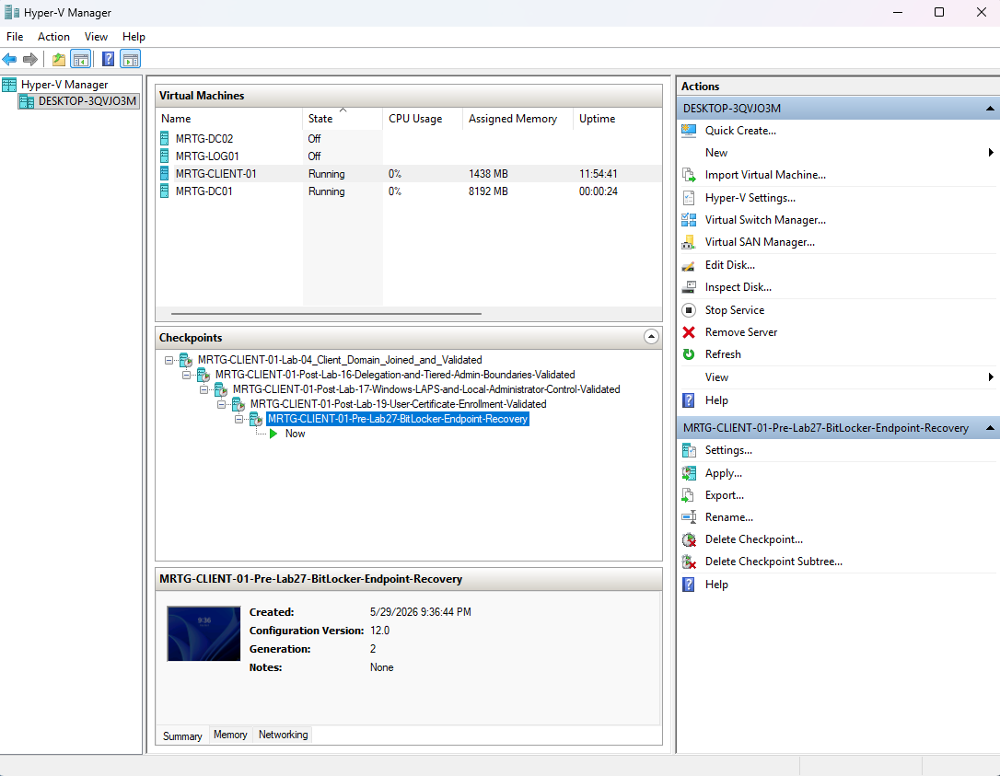
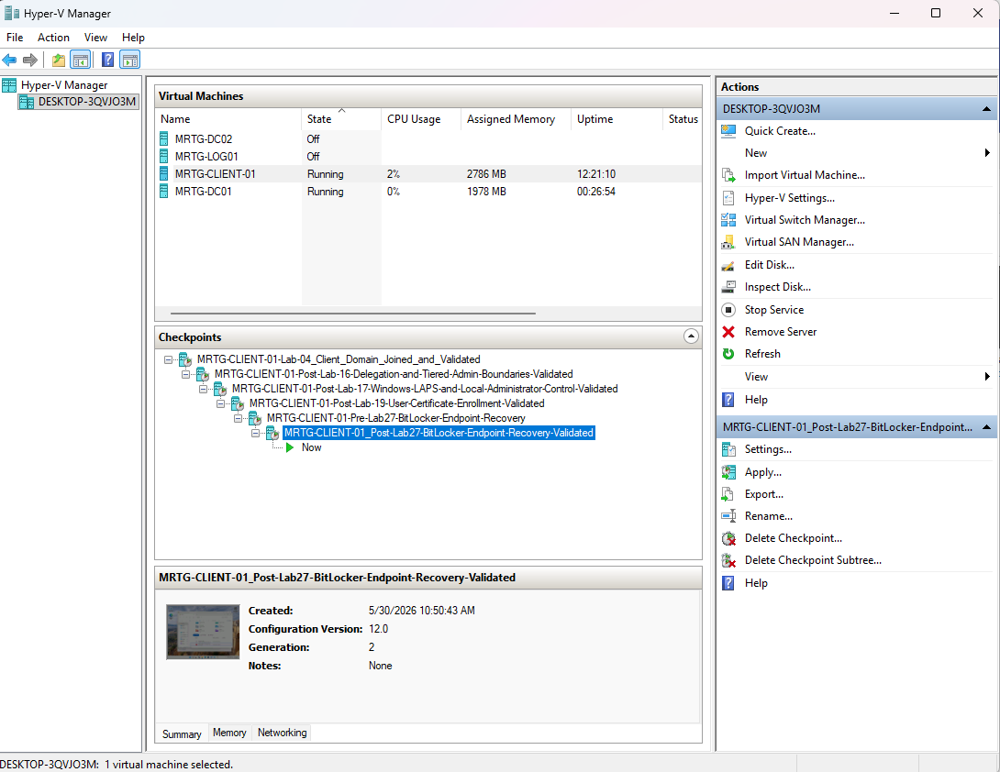
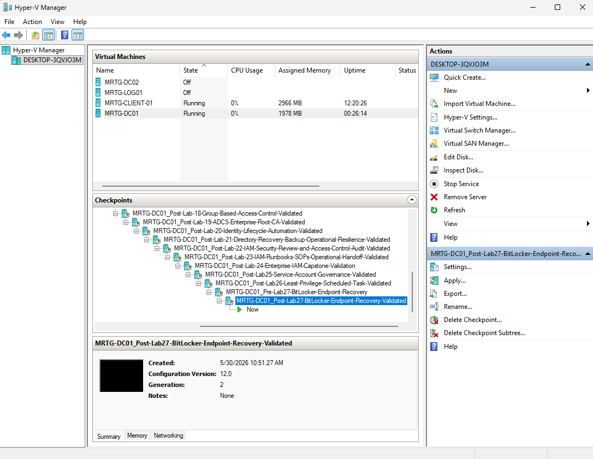

# Lab 27: BitLocker and Endpoint Encryption Recovery


---

## Overview

This lab enabled and validated BitLocker protection on the Windows 11 client hosted in the `MRTG-CLIENT-01` Hyper-V virtual machine.

The operating system volume was already fully encrypted, but BitLocker protection was off because no key protectors were configured. After activation, the protection status changed to `Protection On`, and the volume displayed both TPM and numerical password protectors.

The recovery password was intentionally excluded from screenshots and public documentation.

> The presence of a numerical password protector establishes that recovery material exists. It does not prove that the recovery password was successfully escrowed, retrieved, or tested.

---

## Business Problem

MRTG needed endpoint encryption to reduce the risk of data exposure if a workstation or its storage was lost, stolen, removed, or accessed while powered off.

Encryption alone is insufficient. The organization must also verify that:

- Protection is active
- Appropriate key protectors are configured
- Recovery material is protected
- Recovery access is restricted
- Key retrieval is logged
- Recovery procedures are tested
- Protection status is continuously monitored

Recovery passwords require strong governance because possession of a valid recovery password may allow someone to unlock the protected volume.

---

## Lab Summary

Pre-lab checkpoints were created for `MRTG-DC01` and the `MRTG-CLIENT-01` virtual machine.

On the Windows 11 client, `manage-bde` and `Get-Tpm` were used to review the initial state. The operating system volume was 100 percent encrypted, but protection was off and no key protectors were present.

BitLocker protection was activated using TPM and numerical password protectors. The Microsoft Print to PDF option was selected during the recovery-key backup workflow, but the recovery password itself was not included in the public evidence.

The BitLocker Control Panel displayed `C: BitLocker on`, and command-line validation confirmed:

- `Protection On`
- TPM protector present
- Numerical password protector present

Post-lab checkpoints were then created for the client and domain controller.

---

## Objectives

- Create pre-lab Hyper-V checkpoints
- Review the initial BitLocker state
- Validate TPM readiness
- Distinguish encryption status from protection status
- Enable BitLocker protection
- Configure TPM and numerical password protectors
- Review the recovery-key backup workflow
- Exclude recovery material from public documentation
- Validate BitLocker through Control Panel
- Validate protection with `manage-bde`
- Document recovery and security limitations
- Create post-lab Hyper-V checkpoints

---

## Scope

### Included

- Hyper-V checkpoints
- TPM readiness validation
- Initial BitLocker status review
- BitLocker protection activation
- Recovery-key backup workflow review
- Recovery-key handling documentation
- Control Panel validation
- Command-line protection validation
- Key protector validation
- Layered endpoint security analysis
- Evidence collection

### Not Included

- Forced BitLocker recovery
- Recovery password entry testing
- Recovery password retrieval testing
- Verified recovery-key escrow
- Active Directory recovery-key storage
- Microsoft Entra ID recovery-key storage
- Microsoft Intune deployment
- Group Policy deployment
- Organization-wide compliance reporting
- BitLocker suspension testing
- Removable-drive encryption
- Secure Boot validation
- Recovery-key rotation
- Production recovery-access auditing

---

## Environment

| Component | Details |
|---|---|
| Organization | Monroe Redstone Technology Group |
| Domain | `mrtg.local` |
| Domain Controller | `MRTG-DC01` |
| Hyper-V Virtual Machine | `MRTG-CLIENT-01` |
| Windows Guest | `CLIENT01` |
| Operating System | Windows 11 |
| Protected Volume | `C:` |
| Encryption Technology | BitLocker Drive Encryption |
| Status Tool | `manage-bde` |
| TPM Tool | `Get-Tpm` |
| Encryption Method | `XTS-AES 128` |
| Encryption Scope | Used space only |
| Hypervisor | Hyper-V |

---

## Scenario

MRTG needs to protect data stored on a Windows endpoint.

The operating system volume should resist unauthorized offline access if the virtual disk or physical device is removed, stolen, or accessed outside its trusted startup process.

The endpoint should use TPM-based protection during normal startup and retain a numerical recovery password for authorized recovery scenarios.

The lab followed this model:

```text
Validate TPM
     |
     v
Review encryption state
     |
     v
Review recovery workflow
     |
     v
Enable protection
     |
     v
Validate key protectors
```

---

## Encryption and Protection Model

BitLocker encryption status and protection status are related but separate.

| State | Meaning |
|---|---|
| Drive encrypted | Data on the volume has been encrypted |
| Protection off | Configured protectors are not actively enforcing BitLocker access protection |
| Protection on | BitLocker protectors are actively protecting access to the encrypted volume |
| TPM protector | TPM releases protected key material when platform validation succeeds |
| Numerical password | Recovery password can unlock the volume during an authorized recovery event |

The initial drive was encrypted but not actively protected.

The target state was:

```text
Encrypted volume
        +
TPM protector
        +
Numerical password protector
        +
Protection On
```

---

## Implementation Steps

### Step 1: Create the DC01 Pre-Lab Checkpoint

A checkpoint was created for `MRTG-DC01` before beginning the lab.

Checkpoint name:

```text
MRTG-DC01_Pre-Lab27-BitLocker-Endpoint-Recovery
```

The domain controller was not the BitLocker configuration target. Its checkpoint preserved the broader lab environment state.

> Hyper-V checkpoints are temporary lab recovery tools. They are not substitutes for tested backups or recovery-key escrow.


---

### Step 2: Create the Client Pre-Lab Checkpoint

A checkpoint was created for the `MRTG-CLIENT-01` virtual machine before changing its BitLocker configuration.

Checkpoint name:

```text
MRTG-CLIENT-01_Pre-Lab27-BitLocker-Endpoint-Recovery
```

This preserved the client state before protection was activated.



---

### Step 3: Validate Initial BitLocker and TPM Status

The initial BitLocker and TPM states were reviewed.

Commands used:

```powershell
manage-bde -status
Get-Tpm
```

Initial BitLocker results:

| Setting | Initial State |
|---|---|
| Volume | `C:` |
| BitLocker Version | `2.0` |
| Conversion Status | Used Space Only Encrypted |
| Percentage Encrypted | `100.0%` |
| Encryption Method | `XTS-AES 128` |
| Protection Status | `Protection Off` |
| Lock Status | `Unlocked` |
| Identification Field | Unknown |
| Key Protectors | None Found |

TPM results:

| TPM Setting | Result |
|---|---|
| `TpmPresent` | `True` |
| `TpmReady` | `True` |
| `TpmEnabled` | `True` |
| `TpmActivated` | `True` |
| `TpmOwned` | `True` |
| `RestartPending` | `False` |

The volume was encrypted, but BitLocker was not actively protected because no key protectors were configured.


---

### Step 4: Select the Recovery-Key Print Workflow

During BitLocker activation, Windows presented options for backing up the recovery key.

Microsoft Print to PDF was selected as the lab workflow for handling the recovery information.

The recovery password was not captured in any public screenshot or included in this README.

> Selecting a backup option does not independently prove that the recovery password was securely stored, remained retrievable, or could unlock the volume.


---

## Recovery-Key Handling

A BitLocker recovery password is sensitive authentication material. It can bypass the normal TPM-based startup process and unlock the protected volume during a recovery event.

Recovery material should not be stored in:

- Public GitHub repositories
- Social media posts
- Unprotected screenshots
- Public documentation
- Unencrypted email
- General-purpose shared folders
- Unapproved personal storage
- Unprotected local PDF files

Approved production repositories may include:

- Active Directory Domain Services
- Microsoft Entra ID
- Microsoft Intune
- A privileged access management platform
- An approved enterprise recovery repository

Recovery-key access should be:

- Restricted by role
- Tied to an authorized request
- Logged and monitored
- Periodically reviewed
- Rotated after disclosure or use
- Validated through controlled recovery testing

---

### Step 5: Confirm BitLocker Through Control Panel

The BitLocker Control Panel displayed the following status for the operating system drive:

```text
C: BitLocker on
```

The interface also provided options to:

- Suspend protection
- Back up the recovery key
- Turn off BitLocker

This provided graphical confirmation that Windows reported BitLocker as enabled.


---

### Step 6: Validate Protection and Key Protectors

The final BitLocker state was validated from the command line.

Command used:

```powershell
manage-bde -status C:
```

Final results:

| Setting | Final State |
|---|---|
| Volume | `C:` |
| BitLocker Version | `2.0` |
| Conversion Status | Used Space Only Encrypted |
| Percentage Encrypted | `100.0%` |
| Encryption Method | `XTS-AES 128` |
| Protection Status | `Protection On` |
| Lock Status | `Unlocked` |
| Key Protector | TPM |
| Key Protector | Numerical Password |

The results confirmed that BitLocker protection was active and that both TPM and numerical password protectors were present.

They did not validate successful recovery-password retrieval or volume recovery.


---

### Step 7: Create the Client Post-Lab Checkpoint

A post-lab checkpoint was created for the protected client.

Checkpoint name:

```text
MRTG-CLIENT-01_Post-Lab27-BitLocker-Endpoint-Recovery-Validated
```



---

### Step 8: Create the DC01 Post-Lab Checkpoint

A post-lab checkpoint was created for the domain controller.

Checkpoint name:

```text
MRTG-DC01_Post-Lab27-BitLocker-Endpoint-Recovery-Validated
```



---

## Before and After Comparison

| Control | Before | After |
|---|---|---|
| Drive encryption | 100 percent encrypted | 100 percent encrypted |
| Encryption method | XTS-AES 128 | XTS-AES 128 |
| Protection status | Off | On |
| TPM readiness | Ready | Ready |
| TPM protector | Not present | Present |
| Numerical password protector | Not present | Present |
| Control Panel status | Not documented | BitLocker on |
| Public recovery-key exposure | Not applicable | Recovery value excluded |
| Verified recovery-key escrow | Not validated | Not validated |
| Recovery test | Not performed | Not performed |

---

## BitLocker Limitations

BitLocker primarily protects data at rest.

It is most effective when a device or volume is:

- Powered off
- Lost or stolen
- Accessed through removed storage
- Booted outside its trusted configuration

BitLocker does not independently protect against:

- Attackers using an unlocked session
- Compromised user credentials
- Malware running after authentication
- Excessive local administrator access
- Weak account security
- Missing security updates
- Unmonitored endpoint activity
- Recovery-key exposure
- Data copied from an unlocked system

BitLocker must be combined with strong authentication, least privilege, endpoint hardening, monitoring, patching, and controlled recovery procedures.

---

## IAM and Security Relevance

BitLocker is an endpoint security technology, but recovery-key access is also an identity and access management responsibility.

| IAM Area | Relevance |
|---|---|
| Authentication | TPM-based protection supports trusted startup |
| Authorization | Only approved personnel should retrieve recovery material |
| Least privilege | Recovery-key access should be narrowly assigned |
| Privileged access | A recovery password can unlock a protected volume |
| Auditability | Recovery requests and key retrieval should be logged |
| Identity governance | Recovery access requires ownership and recurring review |
| Operational resilience | Controlled recovery can restore authorized access |
| Device trust | TPM-based protection connects key release to platform state |

---

## Risk Addressed

This lab addressed risks associated with:

- Data exposure from lost or stolen endpoints
- Mistaking encryption for active protection
- Missing key protectors
- Public exposure of recovery material
- Failure to validate protection after configuration
- Incomplete endpoint security documentation
- Treating encryption as a complete security solution

Residual risks included:

- No verified enterprise recovery-key escrow
- No forced recovery test
- No recovery-password retrieval test
- No Group Policy or Intune enforcement
- No Secure Boot validation
- No centralized compliance reporting
- No demonstrated recovery-access logging
- No demonstrated recovery-key rotation

---

## Control Mapping

| Control Area | Lab Implementation |
|---|---|
| Endpoint encryption | Confirmed the operating system volume was encrypted |
| Data-at-rest protection | Activated BitLocker protection |
| Hardware-backed protection | Validated TPM readiness and TPM protector presence |
| Recovery mechanism | Confirmed a numerical password protector was present |
| Sensitive evidence handling | Excluded the recovery value from public evidence |
| Security validation | Used Control Panel and `manage-bde` |
| Privileged access awareness | Treated recovery material as sensitive |
| Layered security | Documented controls BitLocker does not replace |
| Lab-state preservation | Created pre-lab and post-lab checkpoints |
| Evidence collection | Preserved non-sensitive configuration evidence |

> This mapping describes the controls demonstrated in the lab. It does not represent certification against a specific security or regulatory framework.

---

## Validation Summary

| Test | Expected Result | Observed Result | Status |
|---|---|---|---|
| DC01 pre-lab checkpoint | Temporary lab state preserved | Checkpoint created | Passed |
| Client pre-lab checkpoint | Client state preserved | Checkpoint created | Passed |
| Initial encryption review | Encryption state documented | 100 percent encrypted | Passed |
| Initial protection review | Protection state documented | Protection Off | Passed |
| TPM readiness | TPM present and ready | TPM ready | Passed |
| Initial protector review | Protector state identified | None found | Passed |
| Recovery workflow | Backup option selected | Print workflow selected | Passed |
| Public evidence handling | Recovery value excluded | Value not exposed | Passed |
| Control Panel validation | BitLocker shown as enabled | BitLocker on | Passed |
| Protection activation | Protection status on | Protection On | Passed |
| TPM protector | TPM listed | Present | Passed |
| Numerical password protector | Recovery protector listed | Present | Passed |
| Recovery-key escrow | Secure storage verified | Not tested | Not Validated |
| Recovery operation | Volume unlocked with recovery password | Not tested | Not Validated |
| Client post-lab checkpoint | Validated client state preserved | Checkpoint created | Passed |
| DC01 post-lab checkpoint | Lab environment state preserved | Checkpoint created | Passed |

---

## Evidence Collected

| Evidence | Screenshot |
|---|---|
| DC01 pre-lab checkpoint | `screenshots/lab-27-01-dc01-pre-lab-checkpoint.png` |
| Client pre-lab checkpoint | `screenshots/lab-27-02-client01-pre-lab-checkpoint.png` |
| Initial TPM and BitLocker status | `screenshots/lab-27-03-tpm-and-bitlocker-status-before-protection.png` |
| Recovery-key print workflow | `screenshots/lab-27-04-bitlocker-recovery-key-print-option.png` |
| BitLocker Control Panel validation | `screenshots/lab-27-05-bitlocker-control-panel-enabled.png` |
| Final protection and key protectors | `screenshots/lab-27-06-bitlocker-protection-on-validation.png` |
| Client post-lab checkpoint | `screenshots/lab-27-07-client01-post-lab-checkpoint.png` |
| DC01 post-lab checkpoint | `screenshots/lab-27-08-dc01-post-lab-checkpoint.png` |

---

## Troubleshooting Notes

The initial state demonstrated an important distinction:

```text
Percentage Encrypted: 100.0%
Protection Status: Protection Off
Key Protectors: None Found
```

The volume contained encrypted data, but BitLocker protection was not actively enforced through a configured protector.

After activation, the final state showed:

```text
Protection Status: Protection On
Key Protectors:
- TPM
- Numerical Password
```

This confirmed active protection and protector presence. It did not confirm that the recovery password had been escrowed or tested.

---

## Security Considerations

The recovery password was intentionally excluded from the evidence.

The Print to PDF workflow demonstrated an available backup option, but a locally stored PDF is not an appropriate production escrow strategy unless it is transferred immediately to an approved protected repository and securely removed from local storage.

Hyper-V checkpoints were used as temporary lab state-preservation tools. They do not replace:

- BitLocker recovery passwords
- Secure recovery-key escrow
- System backups
- Disaster recovery procedures
- Controlled recovery testing

Virtual TPM and checkpoint operations also require careful lifecycle management. Restoring or moving protected virtual machines can affect the trusted platform state and may trigger BitLocker recovery.

---

## Production Improvements

A production or government-regulated implementation should include:

- Automatic recovery-key escrow to Active Directory or Microsoft Entra ID
- Microsoft Intune or Group Policy enforcement
- Restricted recovery-key retrieval permissions
- Logged and monitored recovery-key access
- Help desk identity-verification procedures
- Ticket requirements for recovery requests
- Encryption compliance reporting
- Alerts when BitLocker is suspended
- Alerts when protection is disabled
- Controlled recovery testing
- Secure Boot validation
- TPM health monitoring
- Encryption algorithms defined by organizational policy
- Removable-media encryption controls
- Recovery-key rotation after disclosure or use
- Centralized endpoint monitoring
- Documented device retirement procedures
- Secure deletion of temporary recovery-key files

---

## Lessons Learned

- Encryption percentage and protection status measure different conditions
- A fully encrypted drive can still have protection disabled
- BitLocker requires active key protectors
- TPM readiness should be validated before activation
- Numerical recovery passwords are privileged authentication material
- Recovery values should never appear in public documentation
- Protector presence does not prove successful escrow or recovery
- Control Panel and command-line validation provide complementary evidence
- BitLocker protects data at rest, not an unlocked session
- Encryption must be combined with identity and endpoint controls
- Hyper-V checkpoints do not replace recovery-key escrow
- Complete validation requires a controlled recovery test

---

## Skills Demonstrated

- BitLocker administration
- Endpoint encryption validation
- TPM readiness assessment
- `manage-bde` usage
- PowerShell TPM validation
- Recovery-key governance
- Key protector validation
- Data-at-rest security analysis
- Sensitive evidence handling
- Layered endpoint security analysis
- Hyper-V checkpoint management
- Security evidence documentation
- Production control planning

---

## Outcome

Lab 27 enabled and validated BitLocker protection on the Windows 11 client hosted in `MRTG-CLIENT-01`.

The lab demonstrated:

- Pre-change state preservation
- TPM readiness validation
- Identification of an encrypted but unprotected volume
- BitLocker protection activation
- TPM and numerical password protector configuration
- Exclusion of recovery material from public evidence
- Control Panel and command-line validation
- Layered endpoint security analysis
- Post-change state preservation

The endpoint completed the lab with `Protection On`, a TPM protector, and a numerical password protector.

Recovery-key escrow, retrieval, and forced recovery were not validated and remain required components of a complete production recovery process.

---

## Next Lab

[Lab 28: Local Administrator Access Review and Remediation](../Lab-28-Local-Administrator-Access-Review-and-Remediation/)

Lab 28 reviews local administrator exposure, validates privileged endpoint access, removes unnecessary membership, and documents the remediation process.
