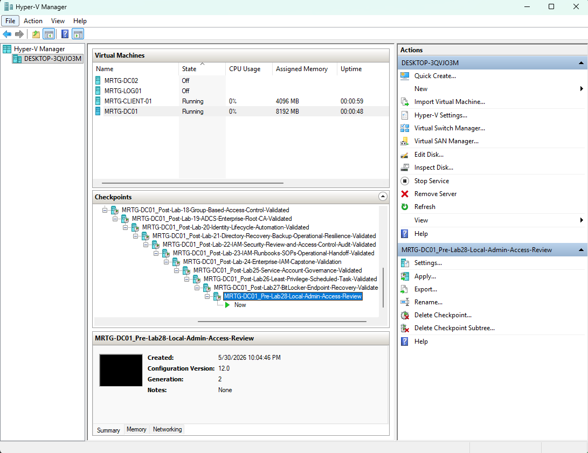
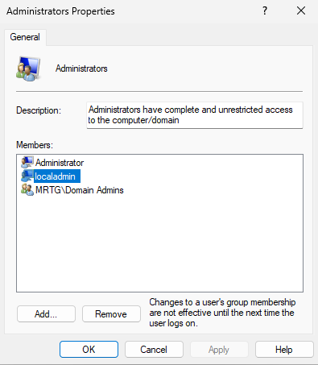
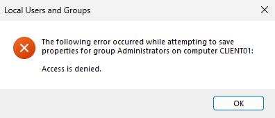
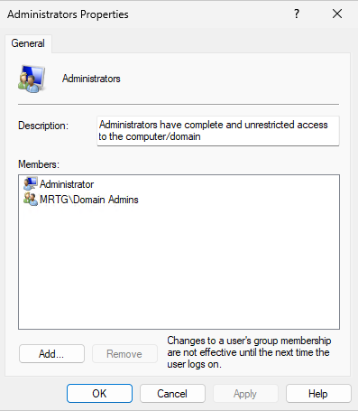

# Lab 28: Local Administrator Access Review and Remediation


---

## Overview

This lab reviewed local administrator access on the Windows 11 client hosted in `MRTG-CLIENT-01`, identified unnecessary privileged membership, completed remediation, and validated the resulting state.

The initial local Administrators group contained:

```text
Administrator
localadmin
MRTG\Domain Admins
```

The standalone `localadmin` account was identified as unnecessary for the approved lab configuration and removed from the local Administrators group.

After remediation, the group contained:

```text
Administrator
MRTG\Domain Admins
```

The lab demonstrated a complete access-review workflow:

```text
Establish baseline
        |
        v
Assess membership
        |
        v
Identify finding
        |
        v
Remove access
        |
        v
Validate final state
```

---

## Business Problem

MRTG needed to review local administrator access on endpoints to determine whether privileged membership remained necessary, justified, and controlled.

Members of the local Administrators group can potentially:

- Install software
- Modify system settings
- Disable security controls
- Access protected local data
- Create additional privileged accounts
- Change file permissions
- Establish persistence
- Access locally stored credentials
- Support lateral movement

Unnecessary local administrator membership increases endpoint risk and weakens least privilege.

This lab addressed that risk by reviewing current membership, removing one unnecessary member, and preserving before-and-after evidence.

---

## Lab Summary

Pre-lab checkpoints were created for `MRTG-DC01` and the `MRTG-CLIENT-01` virtual machine.

The local Administrators group on the Windows client was reviewed through Local Users and Groups and validated with:

```powershell
net localgroup administrators
```

The `localadmin` account was identified as unnecessary for the approved lab baseline.

The first remediation attempt returned an access-denied error, indicating that the active management context lacked sufficient effective authority or elevation to modify the group. After using an authorized elevated context, `localadmin` was removed.

The final membership was validated through both the command line and graphical interface. Post-lab checkpoints were then created for both virtual machines.

---

## Objectives

- Create pre-lab Hyper-V checkpoints
- Review the local Administrators group
- Establish a command-line membership baseline
- Assess each identified member
- Identify unnecessary privileged membership
- Document the initial access-denied result
- Use an authorized elevated context
- Remove the unnecessary membership
- Validate the corrected membership through the command line
- Validate the corrected membership through the GUI
- Preserve before-and-after evidence
- Document residual privileged-access risks
- Create post-lab Hyper-V checkpoints

---

## Scope

### Included

- Hyper-V checkpoints
- Local Administrators group review
- GUI-based membership validation
- Command-line membership validation
- Privileged-access finding documentation
- Local administrator membership removal
- Administrative-context troubleshooting
- Before-and-after comparison
- Least-privilege analysis
- Evidence collection

### Not Included

- Removal of `MRTG\Domain Admins`
- Built-in Administrator account hardening
- Windows LAPS reconfiguration
- Local administrator password rotation
- Group Policy membership enforcement
- Microsoft Intune account-protection policies
- Enterprise-wide endpoint scanning
- Just-in-time privilege
- Privileged access management deployment
- SIEM alert creation
- Review of every local group
- Nested group expansion
- Effective-access analysis outside the local Administrators group
- Production change approval

---

## Environment

| Component | Details |
|---|---|
| Organization | Monroe Redstone Technology Group |
| Domain | `mrtg.local` |
| Domain Controller | `MRTG-DC01` |
| Hyper-V Virtual Machine | `MRTG-CLIENT-01` |
| Windows Guest | `CLIENT01` |
| Local Group | `Administrators` |
| Membership Removed | `localadmin` |
| Retained Local Account | `Administrator` |
| Retained Domain Group | `MRTG\Domain Admins` |
| Management Tools | Local Users and Groups, PowerShell |
| Validation Command | `net localgroup administrators` |
| Hypervisor | Hyper-V |

---

## Scenario

MRTG needs to review privileged access on a Windows endpoint.

The review must determine:

- Who currently belongs to the local Administrators group
- Whether each member is identifiable
- Whether each membership is required
- Which membership should be removed
- Whether the reviewer has authority to perform remediation
- Whether the final state matches the approved lab baseline

The lab followed this review model:

```text
Establish baseline
        |
        v
Assess membership
        |
        v
Attempt remediation
        |
        v
Correct administrative context
        |
        v
Remove membership
        |
        v
Validate final state
```

---

## Review Criteria

Each identified member was evaluated against the following criteria:

| Criterion | Review Question |
|---|---|
| Identity | Is the account or group clearly identifiable? |
| Purpose | Is there a documented reason for administrator access? |
| Ownership | Is a person or team responsible for the access? |
| Necessity | Does the identity still require administrator rights? |
| Privilege | Is local administrator membership broader than required? |
| Governance | Is the membership controlled through an approved process? |
| Monitoring | Can privileged activity be reviewed? |
| Lifecycle | Will the access be removed when no longer required? |

---

## Implementation Steps

### Step 1: Create the DC01 Pre-Lab Checkpoint

A checkpoint was created for `MRTG-DC01` before beginning the review.

Checkpoint name:

```text
MRTG-DC01_Pre-Lab28-Local-Admin-Access-Review
```

The domain controller was not the remediation target. Its checkpoint preserved the broader lab environment state.

> Hyper-V checkpoints are temporary lab recovery tools. They are not substitutes for tested backups.



---

### Step 2: Create the Client Pre-Lab Checkpoint

A checkpoint was created for the `MRTG-CLIENT-01` virtual machine before modifying local administrator membership.

Checkpoint name:

```text
MRTG-CLIENT-01_Pre-Lab28-Local-Admin-Access-Review
```


---

### Step 3: Review the Local Administrators Group

The local Administrators group was reviewed through Local Users and Groups.

Navigation path:

```text
Local Users and Groups
└── Groups
    └── Administrators
```

Initial membership:

```text
Administrator
localadmin
MRTG\Domain Admins
```



---

## Baseline Findings

| Account or Group | Identity Type | Finding | Lab Decision |
|---|---|---|---|
| `Administrator` | Built-in local account | Present in the expected built-in group | Retain for this lab |
| `localadmin` | Standalone local account | Membership not required by the approved lab baseline | Remove from Administrators |
| `MRTG\Domain Admins` | Domain security group | Retained for current lab administration | Retain for lab use only |

The remediation target was:

```text
localadmin
```

> Retention in this lab does not establish that the remaining memberships represent a preferred production configuration.

---

### Step 4: Document the Access-Denied Error

The first attempt to remove `localadmin` failed.

Observed error:

```text
The following error occurred while attempting to save properties for group Administrators on computer CLIENT01:

Access is denied.
```

The result indicated that the active management context lacked sufficient effective authority or elevation to modify the local Administrators group.



---

## Administrative Context Analysis

The error demonstrated an important distinction:

```text
Visibility does not equal modification authority.
```

A user may be able to open a management console and inspect group membership without having sufficient effective rights to change it.

Privileged remediation requires:

- An authorized administrative identity
- An elevated management process
- Authority on the target endpoint
- An approved remediation purpose
- Validation of the resulting state

The remediation was completed after using the required administrative context.

---

### Step 5: Validate Membership Before Remediation

The baseline membership was confirmed from an elevated PowerShell session.

Command used:

```powershell
net localgroup administrators
```

Observed membership:

```text
Administrator
localadmin
MRTG\Domain Admins
```

The command-line result matched the graphical baseline.


---

### Step 6: Remove the Unnecessary Membership

After using an authorized elevated context, `localadmin` was removed from the local Administrators group.

Remediation performed:

```text
Remove localadmin from the local Administrators group
```

The account itself was not documented as disabled or deleted.

Removing group membership reduced the account's documented local privilege. Account disablement, deletion, credential rotation, and dependency review are separate lifecycle actions.

---

### Step 7: Validate Membership After Remediation

The corrected group membership was validated from PowerShell.

Command used:

```powershell
net localgroup administrators
```

Final membership:

```text
Administrator
MRTG\Domain Admins
```

The `localadmin` account was no longer listed as a direct member of the local Administrators group.

> This result does not independently prove that the account lacks privilege through another local group, domain group, delegated permission, service, scheduled task, or other access path.


---

### Step 8: Confirm the Final State Through the GUI

Local Users and Groups was reviewed again after remediation.

The graphical view showed:

```text
Administrator
MRTG\Domain Admins
```

This provided a second validation method for the direct membership change.



---

### Step 9: Create the DC01 Post-Lab Checkpoint

A post-lab checkpoint was created for `MRTG-DC01`.

Checkpoint name:

```text
MRTG-DC01_Post-Lab28-Local-Admin-Access-Review-Validated
```


---

### Step 10: Create the Client Post-Lab Checkpoint

A post-lab checkpoint was created for the `MRTG-CLIENT-01` virtual machine.

Checkpoint name:

```text
MRTG-CLIENT-01_Post-Lab28-Local-Admin-Access-Review-Validated
```


---

## Before and After Comparison

| Review Stage | `Administrator` | `localadmin` | `MRTG\Domain Admins` |
|---|---|---|---|
| Before remediation | Present | Present | Present |
| After remediation | Present | Removed | Present |

---

## Access Review Results

| Account or Group | Before | After | Lab Decision |
|---|---|---|---|
| `Administrator` | Direct local Administrators member | Direct member retained | Retained for this lab |
| `localadmin` | Direct local Administrators member | Direct membership removed | Remediated |
| `MRTG\Domain Admins` | Direct local Administrators member | Direct member retained | Retained for lab administration |

The evidence validates direct membership in the local Administrators group. It does not provide a complete effective-access assessment.

---

## Important Production Finding

Retaining `MRTG\Domain Admins` in the local Administrators group supported the current lab administration model, but it is not the preferred design for routine workstation management.

Highly privileged domain credentials should generally be protected from workstation logon exposure.

A stronger model would use:

- A dedicated workstation administrator group
- Separate administrator identities
- Windows LAPS for local administrator password management
- Just-in-time privileged access
- Privileged access workstations
- Restricted Domain Admin logon rights
- Administrative tier boundaries

This reduces the chance that a compromised workstation exposes credentials with broad domain authority.

---

## LAPS and Local Administrator Governance

This lab did not repeat the Windows LAPS deployment completed in Lab 17.

Instead, it demonstrated a review and remediation process that should operate alongside LAPS.

A mature local administrator control model includes:

- LAPS-managed local administrator passwords
- Restricted Administrators group membership
- Separate administrator identities
- Periodic access reviews
- Removal of unnecessary memberships
- Monitoring for privileged logons
- Alerts for group membership changes
- Documented business justification
- Account ownership
- Defined access expiration

LAPS manages local administrator passwords. It does not independently determine who should belong to the local Administrators group.

---

## Risk Addressed

This lab addressed risks associated with:

- Excessive local administrator access
- Unnecessary privileged local-account membership
- Weak endpoint privilege governance
- Unreviewed administrator membership
- Privileged access persistence
- Missing remediation evidence
- Failure to validate changes
- Confusion between visibility and modification authority

Residual risks included:

- Retention of `MRTG\Domain Admins`
- Unknown built-in Administrator account status
- No nested group or effective-access analysis
- No review of other local groups
- No demonstrated account disablement or deletion
- No centralized membership enforcement
- No membership-change monitoring
- No production approval workflow

---

## Control Mapping

| Control Area | Lab Implementation |
|---|---|
| Least privilege | Removed unnecessary direct administrator membership |
| Privileged access review | Reviewed direct members of the local Administrators group |
| Endpoint security | Reduced documented privileged exposure |
| Access remediation | Removed `localadmin` from Administrators |
| Administrative authorization | Used an authorized elevated context |
| Dual validation | Confirmed the result through PowerShell and the GUI |
| Evidence collection | Captured baseline, error, and final-state evidence |
| Local administrator governance | Connected membership review with LAPS controls |
| Lab-state preservation | Created pre-lab and post-lab checkpoints |

> This mapping describes the controls demonstrated in the lab. It does not represent certification against a specific security or regulatory framework.

---

## Validation Summary

| Test | Expected Result | Observed Result | Status |
|---|---|---|---|
| DC01 pre-lab checkpoint | Temporary lab state preserved | Checkpoint created | Passed |
| Client pre-lab checkpoint | Client state preserved | Checkpoint created | Passed |
| GUI baseline review | Direct members visible | Three members identified | Passed |
| Access finding | Unnecessary membership identified | `localadmin` identified | Passed |
| Initial failure | Insufficient context produces an error | Access denied captured | Passed |
| Command-line baseline | CLI matches GUI | Three direct members confirmed | Passed |
| Authorized context | Remediation can be completed | Membership removed | Passed |
| `localadmin` remediation | Direct membership removed | Account no longer listed | Passed |
| Command-line final state | `localadmin` absent | Two direct members confirmed | Passed |
| GUI final state | GUI matches CLI | Two direct members confirmed | Passed |
| Effective-access review | Other privilege paths evaluated | Not performed | Not Validated |
| Account lifecycle review | Disablement or deletion assessed | Not documented | Not Validated |
| DC01 post-lab checkpoint | Lab environment state preserved | Checkpoint created | Passed |
| Client post-lab checkpoint | Client state preserved | Checkpoint created | Passed |

---

## Evidence Collected

| Evidence | Screenshot |
|---|---|
| DC01 pre-lab checkpoint | `screenshots/lab-28-01-dc01-pre-lab-checkpoint.png` |
| Client pre-lab checkpoint | `screenshots/lab-28-02-client01-pre-lab-checkpoint.png` |
| Local Administrators group before review | `screenshots/lab-28-03-local-administrators-group-before-review.png` |
| Access-denied remediation attempt | `screenshots/lab-28-04-local-admin-remediation-access-denied.png` |
| Command-line membership before remediation | `screenshots/lab-28-05-net-localgroup-administrators-before-remediation.png` |
| Command-line membership after remediation | `screenshots/lab-28-06-net-localgroup-administrators-after-remediation.png` |
| Local Administrators group after review | `screenshots/lab-28-07-local-administrators-group-after-review.png` |
| DC01 post-lab checkpoint | `screenshots/lab-28-08-dc01-post-lab-checkpoint.png` |
| Client post-lab checkpoint | `screenshots/lab28-client01-post-lab-checkpoint.png` |

---

## Troubleshooting Notes

The first removal attempt returned:

```text
Access is denied.
```

The result indicated insufficient effective authority or elevation in the active management context.

The remediation workflow was:

```text
Review error
     |
     v
Confirm administrative context
     |
     v
Use authorized elevation
     |
     v
Remove membership
     |
     v
Validate result
```

The error was resolved by using an appropriate administrative context. No broader permanent membership was documented as part of the remediation.

---

## Security Considerations

Removing `localadmin` from the Administrators group reduced its documented direct privilege but did not disable or delete the account.

A production review should also determine:

- Whether the account is still required
- Whether it should be disabled
- Whether it should be deleted after applicable retention requirements
- Whether it belongs to other local or domain groups
- Whether it has active sessions
- Whether it owns files, services, or scheduled tasks
- Whether it has recently authenticated
- Whether its password remains valid
- Whether related credentials exist elsewhere
- Whether it has another path to elevated access

Privilege removal and account lifecycle management are related but separate processes.

---

## Real-World Relevance

Local administrator reviews are common in:

- Endpoint security operations
- IAM access certifications
- Privileged access management
- Help desk administration
- Compliance assessments
- Incident response
- Cybersecurity maturity reviews
- Government-regulated environments

A complete review should answer:

- Who has local administrator access?
- Why is the access required?
- Who approved it?
- Is the access still necessary?
- When was it last reviewed?
- Can the privilege be reduced?
- Was remediation validated?
- Is evidence available for review?

This lab demonstrated the direct-membership review and remediation workflow on one endpoint.

---

## Production Improvements

A production implementation should include:

- Centralized local administrator inventory
- Recurring access reviews
- Windows LAPS enforcement
- Dedicated workstation administrator groups
- Removal of Domain Admins from routine workstation administration
- Separate privileged identities
- Restricted privileged logon paths
- Just-in-time access
- Just-enough administration
- Privileged access workstations
- Group Policy or Intune membership enforcement
- Nested group expansion
- Effective-access analysis
- Alerts for additions to local Administrators
- SIEM monitoring for privileged local logons
- Change tickets for membership changes
- Business justification and access expiration
- Account disablement after privilege removal when appropriate
- Automated compliance reporting

---

## Lessons Learned

- Local administrator access requires recurring review
- LAPS does not replace membership governance
- Viewing privileged membership does not grant authority to change it
- Administrative context must be validated before remediation
- Access-denied errors should not automatically lead to broader permissions
- Privileged findings require remediation and validation
- GUI and command-line evidence should agree
- Removing group membership is different from deleting an account
- Direct membership review does not establish complete effective access
- Domain Admins should not be the default workstation administration model
- Before-and-after evidence improves review quality
- Least privilege is an ongoing governance process

---

## Skills Demonstrated

- Local administrator access review
- Privileged access analysis
- Windows Local Users and Groups management
- `net localgroup` validation
- Least-privilege remediation
- Administrative-context troubleshooting
- Before-and-after validation
- Endpoint privilege governance
- Windows LAPS governance analysis
- Evidence collection
- Hyper-V checkpoint management
- Production security planning

---

## Outcome

Lab 28 reviewed and remediated direct local administrator membership on the Windows 11 client hosted in `MRTG-CLIENT-01`.

The lab demonstrated:

- Pre-change state preservation
- GUI and command-line membership review
- Identification of unnecessary direct administrator membership
- Administrative-context troubleshooting
- Removal of `localadmin` from Administrators
- Dual-method final validation
- Local administrator governance analysis
- Before-and-after evidence
- Post-change state preservation

The final validation confirmed that `localadmin` was no longer a direct member of the local Administrators group.

The account's broader effective access, lifecycle status, and other possible privilege paths were not validated and remain separate review requirements.

---

## Next Lab

[Lab 29: SIEM Identity Monitoring with Splunk](../Lab-29-SIEM-Identity-Monitoring-with-Splunk/)

Lab 29 focuses on collecting identity-related Windows events, searching security logs, and using Splunk to identify authentication and account activity patterns.
