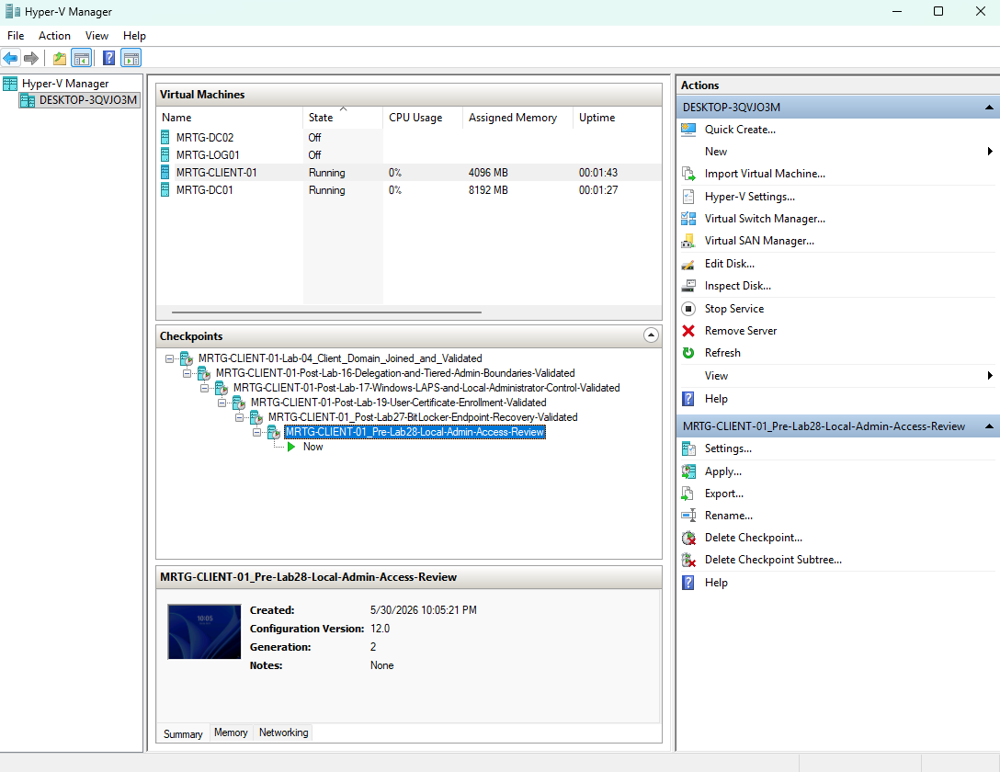
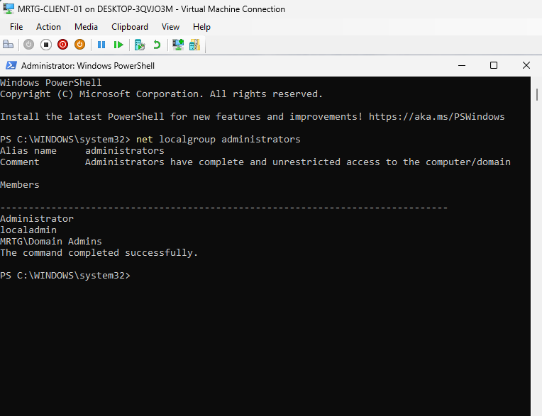
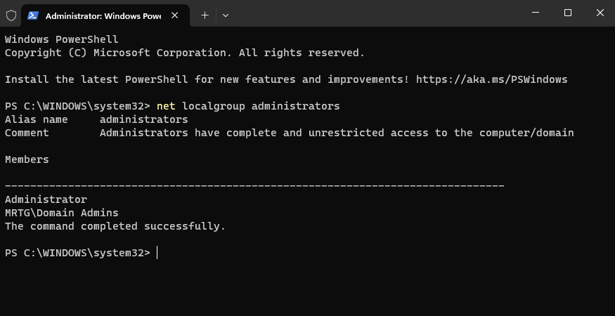
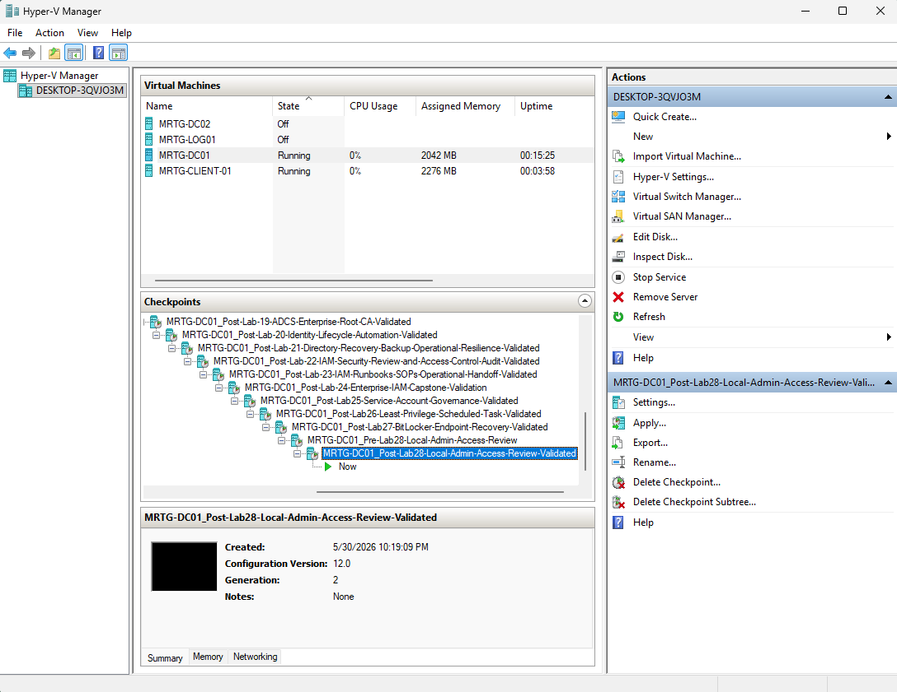
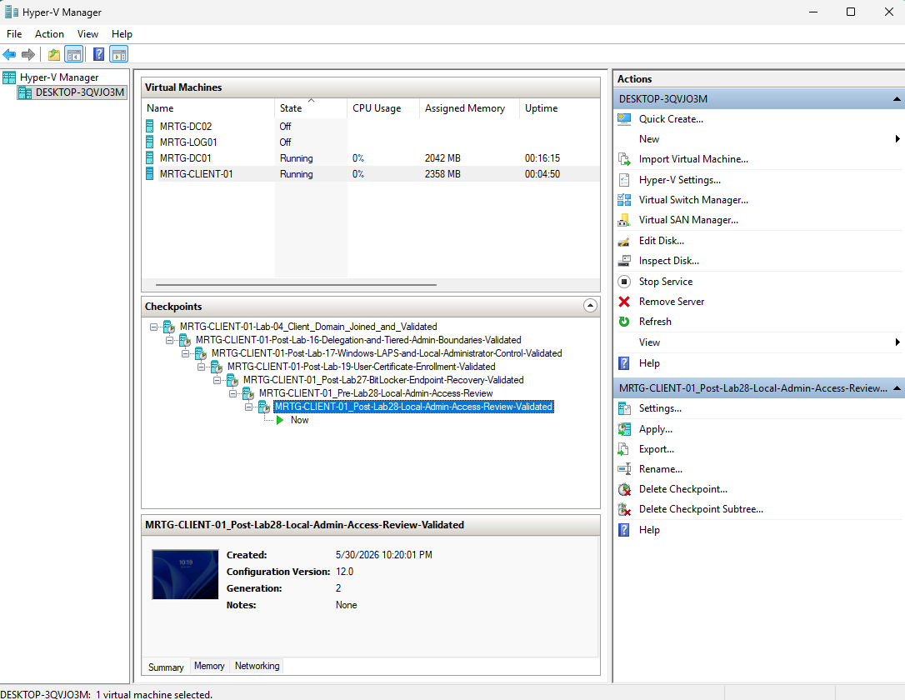

# Lab-28 — Local Administrator Access Review and Remediation

---

## Objective

The objective of this lab is to review local administrator access on an endpoint, identify unnecessary local administrator exposure, perform remediation, and validate the corrected access state.

This lab builds on earlier endpoint and privileged access controls by focusing on operational review and cleanup rather than initial configuration.

Lab 17 focused on Windows LAPS and local administrator control.

Lab 28 focuses on reviewing local administrator membership, identifying unnecessary access, removing unnecessary local admin exposure, and documenting validation evidence.

---

## Business Problem

Monroe Redstone Technology Group needs to periodically review local administrator access on endpoints to ensure privileged access remains limited, justified, and controlled.

Unnecessary local administrator access creates security risk because local administrators can make system-level changes, install software, modify security settings, access sensitive local data, and potentially support lateral movement.

This lab addresses the need to:

- Review local administrator group membership
- Identify unnecessary local administrator exposure
- Remove unneeded local administrator access
- Validate the corrected membership state
- Document remediation evidence
- Reinforce least privilege on endpoints

---

## Lab Summary

In this lab, I reviewed the local Administrators group on `MRTG-CLIENT-01`.

The baseline review showed the following members:

- `Administrator`
- `localadmin`
- `MRTG\Domain Admins`

The `localadmin` account was identified as unnecessary local administrator exposure and removed from the local Administrators group.

After remediation, the local Administrators group contained only:

- `Administrator`
- `MRTG\Domain Admins`

This lab demonstrated a full local administrator access review workflow: baseline review, finding, remediation, validation, and checkpoint preservation.

---

## Environment

| Component | Details |
|---|---|
| Domain | `mrtg.local` |
| Domain Controller | `MRTG-DC01` |
| Endpoint Reviewed | `MRTG-CLIENT-01` |
| Local Group Reviewed | `Administrators` |
| Account Remediated | `localadmin` |
| Validation Tools | Computer Management, PowerShell |
| Virtualization Platform | Hyper-V |
| Lab Organization | Monroe Redstone Technology Group |

---

## Hyper-V Pre-Lab Checkpoints

Before making changes, I created pre-lab checkpoints for both the domain controller and the client endpoint.

These checkpoints preserve the pre-change state before reviewing or modifying local administrator access.

### Domain Controller Pre-Lab Checkpoint

Checkpoint created:

`MRTG-DC01_Pre-Lab28-Local-Admin-Access-Review`

### Client Pre-Lab Checkpoint

Checkpoint created:

`MRTG-CLIENT-01_Pre-Lab28-Local-Admin-Access-Review`

---

## Local Administrators Group Baseline Review

On `MRTG-CLIENT-01`, I reviewed the local Administrators group using Computer Management.

Path reviewed:

`Computer Management > Local Users and Groups > Groups > Administrators`

The baseline GUI review showed the following local administrator members:

- `Administrator`
- `localadmin`
- `MRTG\Domain Admins`

---

## Command-Line Baseline Validation

I also validated the local Administrators group membership using PowerShell.

Command used:

`net localgroup administrators`

The command-line output confirmed the same baseline membership.

---

## Baseline Access Review Findings

The local Administrators group was reviewed to determine whether each entry was expected, justified, or unnecessary.

| Account / Group | Access Type | Review Finding | Risk | Action |
|---|---|---|---|---|
| `Administrator` | Built-in local administrator | Expected local admin account | High privilege | Retained for lab; should be controlled through local admin governance |
| `localadmin` | Local administrator account | Unnecessary local admin exposure | Medium/High | Removed |
| `MRTG\Domain Admins` | Domain admin group | Expected in this lab environment for administrative control | High privilege | Retained for lab; should be tightly controlled in production |

The key remediation target was:

`localadmin`

---

## Administrative Context Issue

During the first remediation attempt, removing `localadmin` from the local Administrators group failed because the session did not have the required administrative context on `MRTG-CLIENT-01`.

This produced an access denied message.

This reinforced an important IAM and security concept:

Having visibility into privileged group membership is not the same as having permission to modify it.

Privileged access remediation requires the correct effective administrative rights on the target system.

---

## Remediation Performed

After signing in with the correct administrative context, I removed the unnecessary `localadmin` account from the local Administrators group on `MRTG-CLIENT-01`.

Remediation action:

`localadmin` removed from local `Administrators`

After remediation, the local Administrators group contained:

- `Administrator`
- `MRTG\Domain Admins`

---

## Command-Line Remediation Validation

After removing `localadmin`, I validated the corrected local Administrators group membership using PowerShell.

Command used:

`net localgroup administrators`

The command-line output confirmed that `localadmin` was no longer a member of the local Administrators group.

---

## Before and After Comparison

| Review Stage | Local Administrators Members |
|---|---|
| Before Remediation | `Administrator`, `localadmin`, `MRTG\Domain Admins` |
| After Remediation | `Administrator`, `MRTG\Domain Admins` |

The unnecessary local administrator account was successfully removed.

---

## Local Administrator Access Review Summary

| Account / Group | Before | After | Final Decision |
|---|---|---|---|
| `Administrator` | Present | Present | Retained |
| `localadmin` | Present | Removed | Remediated |
| `MRTG\Domain Admins` | Present | Present | Retained for lab administration |

---

## LAPS and Local Admin Governance Context

This lab does not repeat the Windows LAPS implementation from Lab 17.

Instead, Lab 28 validates and remediates local administrator exposure as part of an ongoing privileged access review process.

Local administrator risk should be controlled through:

- LAPS-managed local administrator passwords
- Restricted local Administrators group membership
- Periodic access reviews
- Removal of unnecessary local admin accounts
- Monitoring for privileged local logons
- Documentation of justified administrative access
- Clear ownership of local administrator controls

---

## Risk Addressed

Unnecessary local administrator access creates risk because local admins can make system-level changes on endpoints.

This lab reduces that risk by reviewing local administrator group membership, identifying an unnecessary local admin account, removing it, and validating the corrected access state.

The main risks addressed include:

- Excessive local administrator access
- Unnecessary local privileged accounts
- Weak endpoint privilege governance
- Lack of recurring local admin review
- Poor visibility into endpoint administrator exposure
- Privileged access remediation without proper validation
- Confusion between viewing access and having authority to modify access

---

## Control Mapping

This lab supports the following IAM and security concepts:

| Control Area | How This Lab Supports It |
|---|---|
| Least privilege | Removes unnecessary local administrator access |
| Privileged access review | Reviews membership of the local Administrators group |
| Endpoint security | Reduces privileged exposure on the endpoint |
| Access remediation | Removes the `localadmin` account from local Administrators |
| Administrative context validation | Demonstrates that remediation requires proper effective permissions |
| Audit readiness | Captures before, error, after, and validation evidence |
| Local admin governance | Supports periodic review of endpoint administrator assignments |
| Operational security | Preserves pre-lab and post-lab rollback points |

---

## Validation

The following validation checks were completed:

| Validation Item | Result |
|---|---|
| DC01 pre-lab checkpoint created | Passed |
| CLIENT-01 pre-lab checkpoint created | Passed |
| Local Administrators group reviewed in Computer Management | Passed |
| Baseline membership validated with `net localgroup administrators` | Passed |
| `localadmin` identified as unnecessary local admin exposure | Passed |
| Initial remediation attempt produced access denied due to admin context | Passed |
| Correct administrative context used for remediation | Passed |
| `localadmin` removed from local Administrators group | Passed |
| GUI after-remediation validation completed | Passed |
| Command-line after-remediation validation completed | Passed |
| DC01 post-lab checkpoint created | Passed |
| CLIENT-01 post-lab checkpoint created | Passed |

---

## Evidence Collected

The following evidence was collected during the lab:

| Evidence | File |
|---|---|
| DC01 pre-lab checkpoint | `images/lab28-dc01-pre-lab-checkpoint.png` |
| CLIENT-01 pre-lab checkpoint | `images/lab28-client01-pre-lab-checkpoint.png` |
| Local Administrators group before remediation | `images/lab28-local-admin-group-before.png` |
| Command-line local admin review before remediation | `images/lab28-net-localgroup-administrators-before.png` |
| Access denied during first remediation attempt | `images/lab28-local-admin-remediation-access-denied.png` |
| Local Administrators group after remediation | `images/lab28-local-admin-group-after.png` |
| Command-line local admin review after remediation | `images/lab28-net-localgroup-administrators-after.png` |
| DC01 post-lab checkpoint | `images/lab28-dc01-post-lab-checkpoin.png` |
| CLIENT-01 post-lab checkpoint | `images/lab28-client01-post-lab-checkpoint.png` |

---

## Hyper-V Post-Lab Checkpoints

After completing the local administrator access review and remediation, I created post-lab checkpoints for both the domain controller and the client endpoint.

### Domain Controller Post-Lab Checkpoint

Checkpoint created:

`MRTG-DC01_Post-Lab28-Local-Admin-Access-Review-Validated`

### Client Post-Lab Checkpoint

Checkpoint created:

`MRTG-CLIENT-01_Post-Lab28-Local-Admin-Access-Review-Validated`

---

## What I Would Improve in Production

In a production environment, I would improve this process by:

- Reviewing local Administrators membership on a recurring schedule
- Managing local administrator passwords with Windows LAPS
- Using Group Policy or endpoint management tooling to enforce approved local admin membership
- Avoiding unnecessary standalone local administrator accounts
- Documenting business justification for any local administrator assignment
- Monitoring privileged local logons
- Alerting on unauthorized additions to the local Administrators group
- Using centralized reporting for local admin exposure
- Requiring change control for privileged access changes
- Reviewing Domain Admin usage and minimizing broad administrative access
- Using separate privileged admin accounts instead of daily-use accounts
- Applying just-in-time or just-enough administration where appropriate

---

## Lessons Learned

This lab reinforced that local administrator access should be reviewed and remediated as part of ongoing endpoint security operations.

The baseline review showed that `localadmin` was a member of the local Administrators group. Since it was not required for the lab’s intended administrative model, it was removed.

The access denied message during the first remediation attempt was also important. It showed that viewing local administrator membership does not automatically mean the current session has permission to change it.

The biggest takeaway is that privileged access review is not complete until findings are remediated and validated.

---

## Outcome

Lab 28 successfully reviewed and remediated local administrator exposure on `MRTG-CLIENT-01`.

The lab demonstrated:

- Pre-lab rollback planning
- GUI-based local Administrators group review
- Command-line validation
- Identification of unnecessary local admin exposure
- Administrative context validation
- Removal of `localadmin`
- After-remediation validation
- Documentation of local admin governance
- Post-lab rollback planning

This lab strengthens the MRTG environment by reducing unnecessary endpoint administrator exposure and documenting a repeatable local administrator access review process.

---

## Next Lab

[Lab 29 — SIEM Identity Monitoring with Splunk](../Lab-29-SIEM-Identity-Monitoring-with-Splunk)

Lab 29 will focus on monitoring identity-related events, forwarding security logs, and using Splunk to detect account activity patterns.
