# Lab 29: SIEM Identity Monitoring with Splunk


---

## Overview

This lab installed Splunk Enterprise on `MRTG-LOG01`, ingested the server's local Windows Security event log, and tested identity-focused searches.

The searches examined:

- Successful logons
- Failed logons
- Account lifecycle events
- Global security group changes
- Local security group changes
- Administrator-related group additions

The lab also demonstrated that a zero-result search can provide useful information when the query, time range, event source, and collection scope are understood.

This implementation established a foundation for centralized identity-event monitoring. It did not collect Security logs from the domain controllers or other remote systems and did not deploy Splunk Enterprise Security.

---

## Business Problem

MRTG needed improved visibility into identity-related activity.

Authentication, account-management, and group-membership events can provide evidence of:

- Normal account activity
- Failed authentication attempts
- Password or service credential problems
- Account lifecycle changes
- Privilege assignments
- Unauthorized group modifications
- Possible credential attacks
- Endpoint administrator changes

Without centralized collection and search capabilities, these events remain distributed across individual Windows systems and are more difficult to investigate.

This lab addressed the initial collection and search requirement by deploying Splunk Enterprise and validating a repeatable identity-event search workflow against one local event source.

---

## Lab Summary

Pre-lab checkpoints were created for `MRTG-DC01` and `MRTG-LOG01`.

Because the logging server did not have direct internet access, a local `C:\Installers` staging folder was created and the Splunk Enterprise installer was transferred to it.

A service query found no existing Splunk services. Splunk Enterprise was then installed using the installer's local virtual account option. A local Splunk administrator account was configured, and Splunk Web was accessed through TCP port `8000`.

The local Windows Security event log was added as an input using:

- Index: `main`
- Sourcetype: `WinEventLog:Security`
- Host: `MRTG-LOG01`

Searches were tested for:

- All indexed Security events
- Event ID `4624`
- Event ID `4625`
- Account lifecycle events
- Global and local group changes
- Local group additions
- Administrator-specific group additions

Post-lab checkpoints were created after validation.

---

## Objectives

- Create pre-lab Hyper-V checkpoints
- Prepare an offline installer staging location
- Check for existing Splunk services
- Install Splunk Enterprise on `MRTG-LOG01`
- Select the local virtual account option
- Exclude the Splunk administrator password from evidence
- Validate local Splunk Web access
- Add the local Windows Security event log as an input
- Confirm that events were indexed
- Search successful and failed logons
- Test account lifecycle searches
- Search security group membership changes
- Test an Administrator-specific query
- Document positive and zero-result searches
- Identify collection and detection limitations
- Create post-lab Hyper-V checkpoints

---

## Scope

### Included

- Splunk Enterprise installation
- Offline installer staging
- Local virtual account selection
- Splunk administrator account creation
- Local Splunk Web validation
- Local Windows Security log ingestion
- SPL identity-event searches
- Authentication-event review
- Account-management query testing
- Security-group change review
- Zero-result analysis
- Hyper-V checkpoints
- Evidence collection

### Not Included

- Splunk Universal Forwarder deployment
- Remote collection from `MRTG-DC01`
- Remote collection from `MRTG-DC02`
- Collection from `MRTG-CLIENT-01`
- Distributed Splunk architecture
- Dedicated Windows Security index
- Splunk role-based access control
- Dashboards
- Correlation searches
- Alert creation
- Long-term retention planning
- TLS for Splunk Web
- Production hardening
- Splunk Enterprise Security deployment
- End-to-end detection and response testing

---

## Environment

| Component | Details |
|---|---|
| Organization | Monroe Redstone Technology Group |
| Domain | `mrtg.local` |
| Domain Controller | `MRTG-DC01` |
| Logging Server | `MRTG-LOG01` |
| Platform | Splunk Enterprise |
| Splunk Version | `10.4.0` |
| Installation Path | `C:\Program Files\Splunk\` |
| Installer Staging Path | `C:\Installers` |
| Splunk Web | `http://localhost:8000` |
| Service Identity Option | Local virtual account |
| Event Source | Local Windows Security event log |
| Indexed Host | `MRTG-LOG01` |
| Index | `main` |
| Sourcetype | `WinEventLog:Security` |
| App Context | Search |
| Hypervisor | Hyper-V |

---

## Scenario

MRTG needs a searchable platform for reviewing identity-related Windows events.

For this foundational lab, Splunk Enterprise is installed directly on `MRTG-LOG01`, and only the server's local Security event log is indexed.

The lab followed this model:

```text
Install platform
       |
       v
Add Security log
       |
       v
Confirm ingestion
       |
       v
Search authentication events
       |
       v
Search account changes
       |
       v
Search group changes
       |
       v
Document findings and gaps
```

This validates local ingestion and basic search construction before remote event collection is introduced.

---

## Monitoring Architecture

```text
MRTG-LOG01
├── Splunk Enterprise
├── Splunk Web on TCP 8000
├── Local Windows Security log
└── Index: main
    └── Sourcetype: WinEventLog:Security
```

The architecture indexed events generated on `MRTG-LOG01`.

It did not provide domain-wide identity monitoring because the domain controllers and endpoints were not configured as data sources.

---

## Identity Event Reference

| Event ID | Description | Monitoring Value |
|---:|---|---|
| `4624` | Successful account logon | Establish authentication activity and logon patterns |
| `4625` | Failed account logon | Identify failures and possible credential attacks |
| `4720` | User account created | Monitor account provisioning |
| `4722` | User account enabled | Monitor account activation |
| `4725` | User account disabled | Monitor offboarding or containment |
| `4726` | User account deleted | Monitor account removal |
| `4728` | Member added to a global security group | Monitor domain group access changes |
| `4729` | Member removed from a global security group | Monitor domain group access removal |
| `4732` | Member added to a local security group | Monitor local group access changes |
| `4733` | Member removed from a local security group | Monitor local group access removal |

> Event availability depends on audit policy, event source, retention, collection configuration, and search time range.

---

## Implementation Steps

### Step 1: Create the DC01 Pre-Lab Checkpoint

A checkpoint was created for `MRTG-DC01`.

Checkpoint name:

```text
MRTG-DC01_Pre-Lab29-SIEM-Identity-Monitoring
```

The domain controller was not configured as an event source in this lab. Its checkpoint preserved the broader lab environment state.

> Hyper-V checkpoints are temporary lab recovery tools. They are not substitutes for tested backups.


---

### Step 2: Create the LOG01 Pre-Lab Checkpoint

A checkpoint was created for `MRTG-LOG01` before installing Splunk.

Checkpoint name:

```text
MRTG-LOG01_Pre-Lab29-SIEM-Identity-Monitoring
```

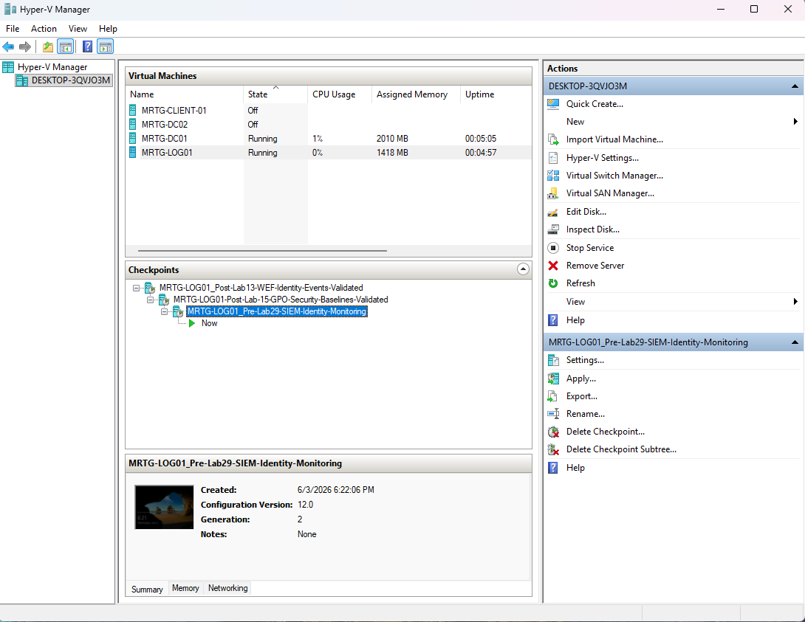

---

## Splunk Installation

### Step 3: Create the Installers Folder

`MRTG-LOG01` did not have direct internet access, so an offline installation workflow was used.

Installer staging folder:

```text
C:\Installers
```

A controlled staging location supports software installation on systems without direct internet access.


---

### Step 4: Stage the Splunk Installer

The Splunk Enterprise Windows installer was copied to the staging folder.

Installer:

```text
splunk-10.4.0-f798d4d49089-windows-x64.msi
```

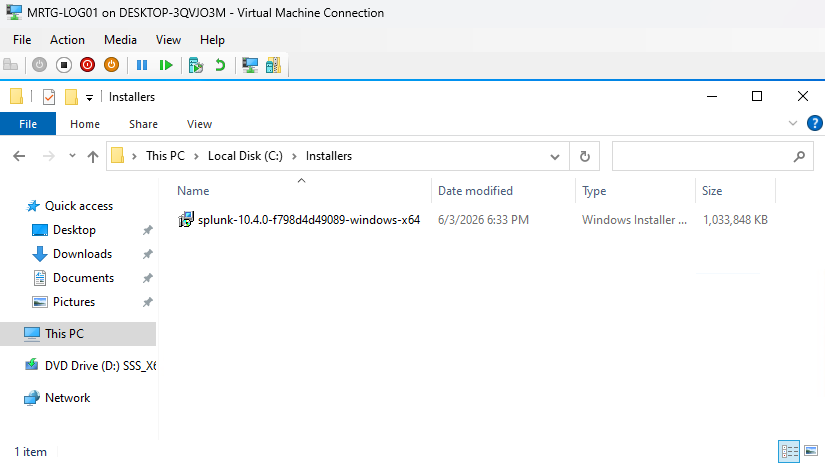

---

### Step 5: Check for Existing Splunk Services

An elevated PowerShell session was used to search for existing Splunk services.

Command used:

```powershell
Get-Service *splunk*
```

No matching services were returned.

This established that no Splunk service was registered at the time of the query. It did not independently prove that no Splunk files or incomplete installation artifacts existed.


---

### Step 6: Launch the Splunk Installer

The Splunk Enterprise installer was launched, the license agreement was accepted, and the installation options were reviewed.

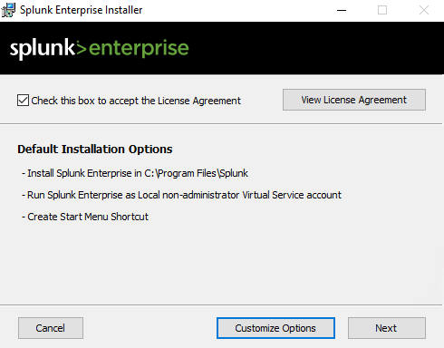

---

### Step 7: Confirm the Installation Path

Splunk Enterprise was installed to the default Windows path:

```text
C:\Program Files\Splunk\
```


---

### Step 8: Select the Splunk Service Identity

The installer was configured to use its local virtual account option.

Selected option:

```text
Virtual Account
```

This avoided creating a separate domain service account for the local installation.

The selection alone does not establish complete least privilege. Effective service permissions and access requirements would require a separate review.

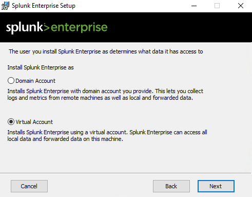

---

### Step 9: Configure the Splunk Administrator Account

A local Splunk administrator account was created during installation.

Username:

```text
admin
```

The password was excluded from screenshots and repository content.

> Excluding the password from evidence protects against public disclosure, but it does not validate password strength, storage, rotation, or administrative access governance.

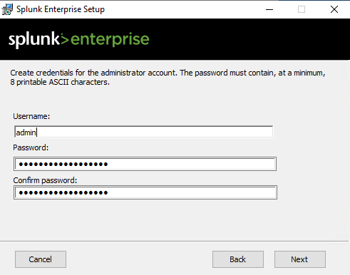

---

### Step 10: Complete the Installation

The installer copied the required files and completed the Splunk Enterprise installation.


---

## Splunk Web Validation

### Step 11: Open the Splunk Web Login Page

Splunk Web was accessed locally at:

```text
http://localhost:8000
```

The login page confirmed local availability of the Splunk Web interface on TCP port `8000`.


---

### Step 12: Validate the Splunk Enterprise Home Page

After authentication, the Splunk Enterprise home page loaded successfully.

This demonstrated that:

- Splunk Enterprise was installed
- Splunk Web was available locally
- The configured administrator credential authenticated
- The Search and Reporting interface was available


---

## Windows Security Log Ingestion

### Step 13: Configure the Windows Security Log Input

The local Windows Security event log was added as a Splunk input.

| Setting | Value |
|---|---|
| Input Type | Windows Event Logs |
| Event Log | Security |
| App Context | Search |
| Host | `MRTG-LOG01` |
| Index | `main` |
| Sourcetype | `WinEventLog:Security` |

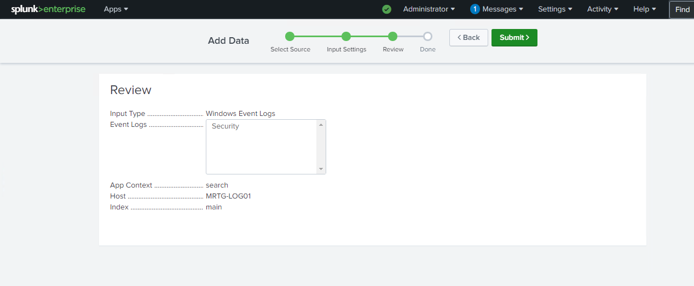

---

### Step 14: Validate Windows Security Event Ingestion

The indexed Security events were searched with SPL.

Search used:

```spl
index=main sourcetype="WinEventLog:Security"
```

The search displayed more than 13,000 Windows Security events associated with `MRTG-LOG01`.

This demonstrated that local Security events were present in the selected index, matched the specified sourcetype, and were searchable.

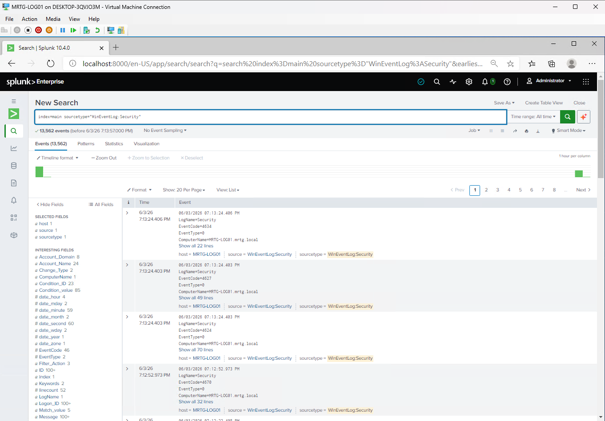

---

## Authentication Monitoring

### Step 15: Search Successful Logon Events

Successful logons were searched using Event ID `4624`.

Search used:

```spl
index=main sourcetype="WinEventLog:Security" EventCode=4624
```

The search displayed successful logon events.

Event ID `4624` can support:

- Account-activity review
- Logon baseline development
- Account-usage validation
- Source-system analysis
- Logon-type analysis
- Incident investigation

A complete analysis should inspect fields such as account name, logon type, source address, source workstation, authentication package, and process information.


---

### Step 16: Search Failed Logon Events

Failed logons were searched using Event ID `4625`.

Search used:

```spl
index=main sourcetype="WinEventLog:Security" EventCode=4625
```

The search displayed four matching events in the selected dataset and time range.

Event ID `4625` can be associated with:

- Mistyped passwords
- Expired credentials
- Disabled accounts
- Service credential problems
- Password spraying
- Brute-force attempts
- Unauthorized access attempts

A failed logon is not automatically malicious. Frequency, source, target account, logon type, failure reason, and timing must be evaluated before assigning a security conclusion.

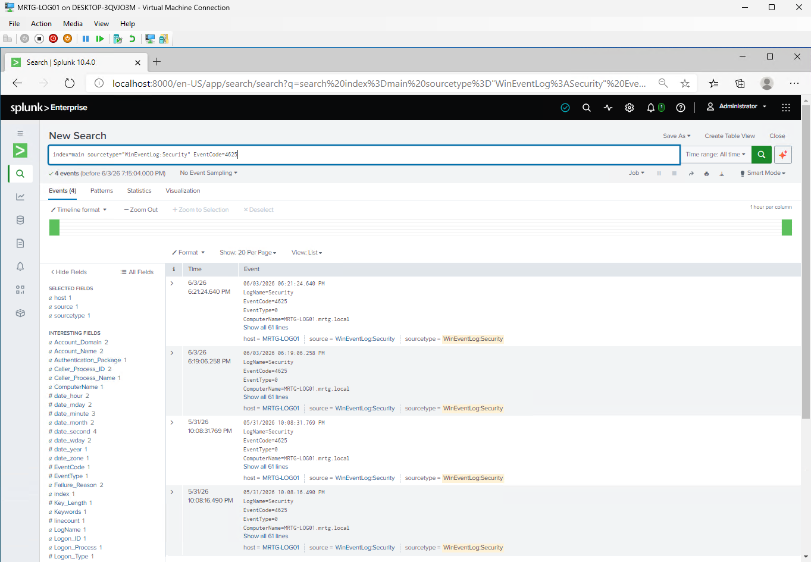

---

## Account Lifecycle Monitoring

### Step 17: Test the Account Management Search

Account lifecycle Event IDs were searched.

Search used:

```spl
index=main sourcetype="WinEventLog:Security" (EventCode=4720 OR EventCode=4722 OR EventCode=4725 OR EventCode=4726)
```

Event mappings:

| Event ID | Meaning |
|---:|---|
| `4720` | User account created |
| `4722` | User account enabled |
| `4725` | User account disabled |
| `4726` | User account deleted |

The search returned zero results for the selected data and time range.

This result did not prove that no account changes occurred in the MRTG domain. The input contained only the local `MRTG-LOG01` Security log.

Domain account lifecycle events must be collected from the domain controllers on which they are recorded.


---

## Group Membership Monitoring

### Step 18: Search Security Group Membership Changes

Global and local security group membership Event IDs were searched.

Search used:

```spl
index=main sourcetype="WinEventLog:Security" (EventCode=4728 OR EventCode=4729 OR EventCode=4732 OR EventCode=4733)
```

Event mappings:

| Event ID | Meaning |
|---:|---|
| `4728` | Member added to a global security group |
| `4729` | Member removed from a global security group |
| `4732` | Member added to a local security group |
| `4733` | Member removed from a local security group |

The search displayed two local security group membership events in the selected dataset and time range.

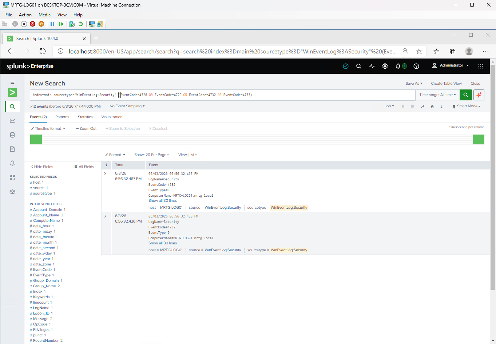

---

### Step 19: Isolate Local Security Group Additions

Event ID `4732` was searched separately.

Search used:

```spl
index=main sourcetype="WinEventLog:Security" EventCode=4732
```

The search displayed two matching events.

This confirmed that local security group addition events were available in the indexed data.

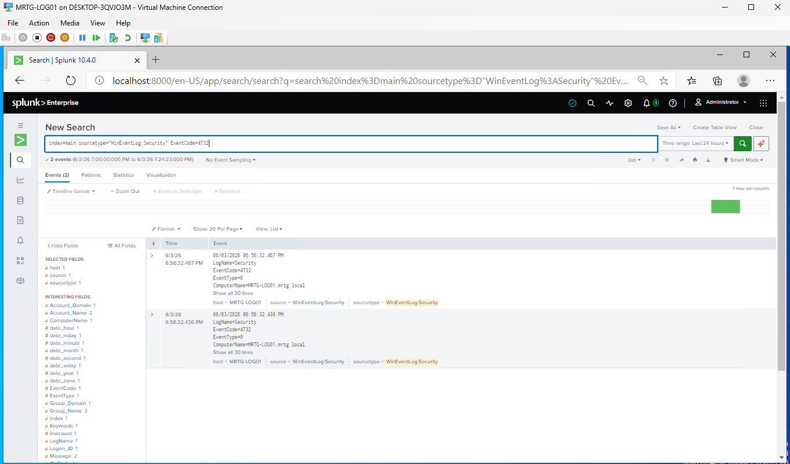

---

### Step 20: Search Local Group Additions and Removals

A combined search was used for additions to and removals from local security groups.

Search used:

```spl
index=main sourcetype="WinEventLog:Security" (EventCode=4732 OR EventCode=4733)
```

The search displayed two matching events in the selected time range.

This search can support monitoring for changes to groups such as:

- Administrators
- Remote Desktop Users
- Backup Operators
- Event Log Readers
- Remote Management Users

The target group and changed member must be extracted and validated before an alert can reliably distinguish sensitive groups.


---

### Step 21: Test an Administrator-Specific Search

A keyword-based search was tested for additions associated with Administrators.

Search used:

```spl
index=main sourcetype="WinEventLog:Security" EventCode=4732 Administrators
```

The search returned zero results.

This demonstrated that a broad raw-text keyword did not match the target events as expected.

A stronger tuning process would first inspect available fields:

```spl
index=main sourcetype="WinEventLog:Security" EventCode=4732
| table _time, SubjectUserName, MemberName, GroupName, ComputerName
```

The actual extracted field names and values must be confirmed from the indexed events before creating a reliable detection.

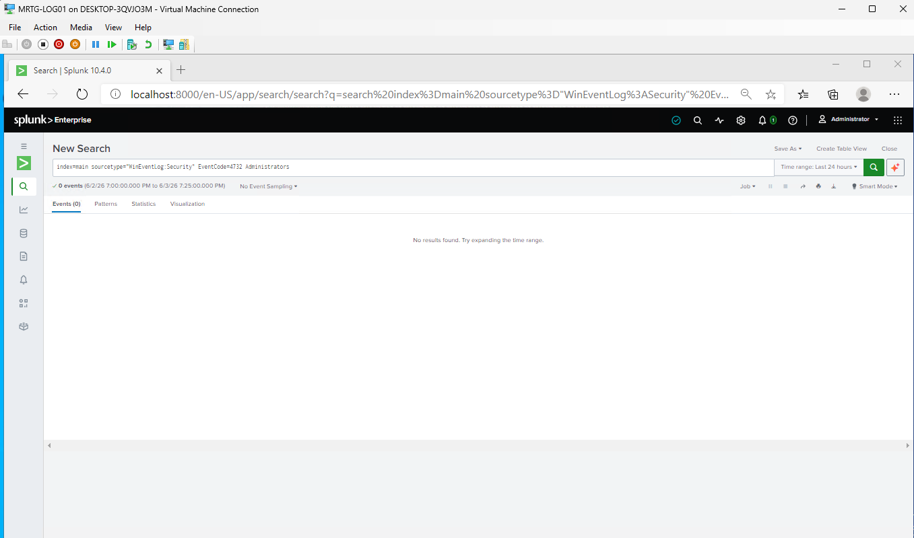

---

## Search Catalog

| Use Case | Event IDs | SPL |
|---|---|---|
| All Security events | Any | `index=main sourcetype="WinEventLog:Security"` |
| Successful logons | `4624` | `index=main sourcetype="WinEventLog:Security" EventCode=4624` |
| Failed logons | `4625` | `index=main sourcetype="WinEventLog:Security" EventCode=4625` |
| Account lifecycle | `4720`, `4722`, `4725`, `4726` | `index=main sourcetype="WinEventLog:Security" (EventCode=4720 OR EventCode=4722 OR EventCode=4725 OR EventCode=4726)` |
| Global and local group changes | `4728`, `4729`, `4732`, `4733` | `index=main sourcetype="WinEventLog:Security" (EventCode=4728 OR EventCode=4729 OR EventCode=4732 OR EventCode=4733)` |
| Local group additions | `4732` | `index=main sourcetype="WinEventLog:Security" EventCode=4732` |
| Local group changes | `4732`, `4733` | `index=main sourcetype="WinEventLog:Security" (EventCode=4732 OR EventCode=4733)` |
| Administrator keyword test | `4732` | `index=main sourcetype="WinEventLog:Security" EventCode=4732 Administrators` |

---

## Monitoring Findings

| Search Area | Observed Result | Interpretation |
|---|---|---|
| Windows Security events | More than 13,000 events displayed | Local Security events were indexed and searchable |
| Successful logons | 278 events displayed | Successful logon events were present |
| Failed logons | 4 events displayed | Failed logon events were present |
| Account lifecycle events | 0 events | No matches in the selected local dataset and time range |
| Group membership changes | 2 events | Local group-change events were present |
| Local group additions | 2 events | Event ID `4732` was searchable |
| Local additions and removals | 2 events | Combined local group query executed successfully |
| Administrator keyword search | 0 events | Query required field-aware tuning |

Event counts reflect the selected search time ranges and available indexed data. They should not be treated as permanent totals.

---

## Data Scope Limitation

The configured Splunk input collected:

```text
MRTG-LOG01 local Windows Security events
```

It did not collect Security events from domain controllers or endpoints.

Therefore:

- Local event ingestion was validated
- Basic SPL search construction was validated
- Domain-wide authentication monitoring was not established
- Domain account lifecycle monitoring was not established
- Domain group-change monitoring was not established
- Zero results could reflect source scope, time range, audit policy, retention, field extraction, or query logic

A production expansion would require approved collection from `MRTG-DC01`, `MRTG-DC02`, and selected endpoints.

---

## Post-Lab Checkpoints

### Step 22: Create the DC01 Post-Lab Checkpoint

A post-lab checkpoint was created for `MRTG-DC01`.

Checkpoint name:

```text
MRTG-DC01_Post-Lab29-SIEM-Identity-Monitoring-Validated
```

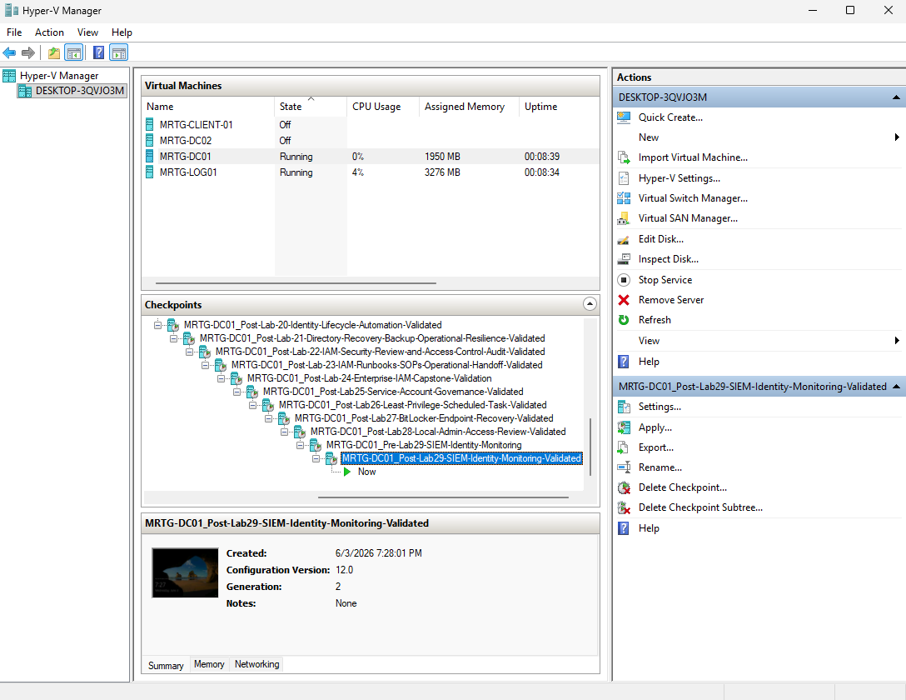

---

### Step 23: Create the LOG01 Post-Lab Checkpoint

A post-lab checkpoint was created for `MRTG-LOG01`.

Checkpoint name:

```text
MRTG-LOG01_Post-Lab29-SIEM-Identity-Monitoring-Validated
```


---

## IAM and Security Relevance

| IAM Area | Monitoring Value |
|---|---|
| Authentication | Successful and failed logons establish account activity |
| Identity lifecycle | Account creation, enablement, disablement, and deletion can be monitored |
| Authorization | Group changes reveal access assignments and removals |
| Privileged access | Sensitive group changes may indicate privilege escalation |
| Least privilege | Monitoring can identify when access expands |
| Incident response | Searchable events support investigation timelines |
| Evidence | Indexed events provide reviewable security records |
| Governance | Searches can support recurring identity-control reviews |

The current dataset validated only local `MRTG-LOG01` event visibility. Broader IAM monitoring requires collection from authoritative identity systems.

---

## Risk Addressed

This lab addressed risks associated with:

- Limited visibility into local Windows Security events
- Missed failed authentication activity on the logging server
- Unreviewed local security group changes
- Lack of searchable identity-event evidence
- Weak understanding of event-source scope
- Misinterpretation of zero-result searches
- Overreliance on raw keyword searches

Residual risks included:

- No domain controller event collection
- No endpoint event collection
- No alerts or correlation searches
- No formal detection thresholds
- No field-extraction validation
- No retention design
- No Splunk role separation
- No TLS validation
- No end-to-end incident response workflow

---

## Control Mapping

| Control Area | Lab Implementation |
|---|---|
| Log platform deployment | Installed Splunk Enterprise |
| Service identity selection | Used the local virtual account option |
| Event collection | Added the local Windows Security log |
| Authentication visibility | Searched Event IDs `4624` and `4625` |
| Lifecycle query testing | Tested Event IDs `4720`, `4722`, `4725`, and `4726` |
| Group-change visibility | Searched relevant membership-change Event IDs |
| Search development | Built and tested reusable SPL |
| Search validation | Documented positive and zero-result searches |
| Evidence collection | Preserved installation and search screenshots |
| Lab-state preservation | Created pre-lab and post-lab checkpoints |

> Splunk Enterprise provided log ingestion and search capabilities in this lab. Splunk Enterprise Security, correlation searches, alerting, and production detection operations were not deployed.

---

## Validation Summary

| Validation Item | Expected Result | Observed Result | Status |
|---|---|---|---|
| DC01 pre-lab checkpoint | Temporary lab state preserved | Created | Passed |
| LOG01 pre-lab checkpoint | LOG01 state preserved | Created | Passed |
| Installer folder | `C:\Installers` exists | Created | Passed |
| Installer staging | Splunk MSI available | Staged | Passed |
| Service baseline | No matching Splunk service | No service returned | Passed |
| Splunk installation | Application installs | Installed | Passed |
| Virtual account option | Selected service identity recorded | Selected | Passed |
| Administrator account | Account configured | Configured | Passed |
| Password exclusion | Credential absent from public evidence | Not exposed | Passed |
| Splunk Web | Local login page available | Loaded | Passed |
| Splunk authentication | Home page accessible | Login succeeded | Passed |
| Security input | Local Security log configured | Input added | Passed |
| Event ingestion | Security events searchable | More than 13,000 displayed | Passed |
| Successful-logon query | Event ID `4624` searchable | Events found | Passed |
| Failed-logon query | Event ID `4625` searchable | Events found | Passed |
| Account lifecycle query | Search executes | Zero results documented | Passed |
| Group-change query | Matching events searchable | Two events found | Passed |
| Local group query | Event IDs `4732` and `4733` searchable | Two events found | Passed |
| Administrator detection | Target group reliably identified | Keyword query returned zero | Needs Tuning |
| Domain-wide collection | DC and endpoint events indexed | Not configured | Not Validated |
| Alerting | Detection generates notification | Not configured | Not Validated |
| DC01 post-lab checkpoint | Lab environment state preserved | Created | Passed |
| LOG01 post-lab checkpoint | LOG01 state preserved | Created | Passed |

---

## Evidence Collected

| Evidence | Screenshot |
|---|---|
| DC01 pre-lab checkpoint | `screenshots/lab-29-01-dc01-pre-lab-checkpoint.png` |
| LOG01 pre-lab checkpoint | `screenshots/lab-29-02-log01-pre-lab-checkpoint.png` |
| Installers folder | `screenshots/lab-29-03-installers-folder-created.png` |
| Splunk installer | `screenshots/lab-29-04-splunk-installer-staged.png` |
| Pre-installation service query | `screenshots/lab-29-05-splunk-not-installed-validation.png` |
| Installer wizard | `screenshots/lab-29-06-splunk-installer-wizard.png` |
| Installation path | `screenshots/lab-29-07-splunk-install-path.png` |
| Virtual service account | `screenshots/lab-29-08-splunk-service-account-selection.png` |
| Administrator credential configuration | `screenshots/lab-29-09-splunk-admin-credentials-configured.png` |
| Installation progress | `screenshots/lab-29-10-splunk-install-progress.png` |
| Splunk Web login | `screenshots/lab-29-11-splunk-web-login.png` |
| Splunk Enterprise home | `screenshots/lab-29-12-splunk-enterprise-home.png` |
| Windows Security input | `screenshots/lab-29-13-windows-security-log-input-review.png` |
| Security event search | `screenshots/lab-29-14-windows-security-events-search.png` |
| Successful logons | `screenshots/lab-29-15-successful-logon-events-4624.png` |
| Failed logons | `screenshots/lab-29-16-failed-logon-events-4625.png` |
| Account management search | `screenshots/lab-29-17-account-management-event-search.png` |
| Group membership changes | `screenshots/lab-29-18-group-membership-change-events.png` |
| Local security group additions | `screenshots/lab-29-19-local-security-group-change-events.png` |
| Local group changes | `screenshots/lab-29-20-local-group-change-events.png` |
| Administrator-specific search | `screenshots/lab-29-21-local-admin-specific-search-no-results.png` |
| DC01 post-lab checkpoint | `screenshots/lab-29-22-dc01-post-lab-checkpoint.png` |
| LOG01 post-lab checkpoint | `screenshots/lab-29-23-log01-post-lab-checkpoint.png` |

---

## Troubleshooting Notes

### Offline Installation

`MRTG-LOG01` did not have direct internet access.

The installer was transferred through:

```text
C:\Installers
```

This allowed installation without enabling direct internet access on the server.

In production, staged software should also be validated through an approved source, digital signature verification, and cryptographic hash comparison.

### Account Management Search Returned Zero Results

The account lifecycle search returned no results because the current input contained only the local `MRTG-LOG01` Security log for the selected time range.

Domain account lifecycle events are recorded on domain controllers when the required audit policy is enabled.

The result identified a collection limitation rather than proving that no domain account activity occurred.

### Administrator Keyword Search Returned Zero Results

The following search returned no results:

```spl
index=main sourcetype="WinEventLog:Security" EventCode=4732 Administrators
```

The raw keyword did not match the target events as expected.

The next step would be to inspect field extractions and filter on the actual field containing the target group name.

---

## Security Considerations

The Splunk administrator password was excluded from the evidence.

Production security should also include:

- Restricted Splunk administrator membership
- Role-based access control
- Separate administrative and search identities
- TLS for Splunk Web
- Protected Splunk management interfaces
- Host firewall restrictions
- Protected service credentials
- Configuration backups
- Splunk audit-index monitoring
- Controlled app installation
- Index access restrictions
- Data retention requirements
- Reliable time synchronization
- Capacity and ingestion monitoring
- Software integrity validation
- Credential rotation
- Secure remote administration

Local HTTP access at `http://localhost:8000` demonstrated functionality but did not validate encrypted remote management.

---

## Real-World Relevance

Identity attacks often leave evidence in authentication, account-management, and authorization logs.

Common monitoring use cases include:

- Password spraying
- Brute-force attempts
- Disabled-account use
- Service-account failures
- New account creation
- Privileged account enablement
- Domain Admin membership changes
- Local Administrators group changes
- Suspicious logon types
- After-hours authentication
- Lateral movement
- Repeated account lockouts

This lab established the local collection and search fundamentals required before reliable detections, alerts, dashboards, and response procedures can be developed.

---

## Production Improvements

A production or government-regulated implementation should include:

- Approved Splunk architecture and licensing
- Splunk Universal Forwarders on domain controllers and endpoints
- A dedicated Windows Security index
- TLS-protected event forwarding
- TLS for Splunk Web and management interfaces
- Standardized host, source, and sourcetype naming
- Index retention and capacity policies
- Splunk role-based access control
- Separate Splunk administrator accounts
- Domain controller account-management monitoring
- Alerts for repeated Event ID `4625`
- Alerts for privileged group changes
- Monitoring for Domain Admin membership
- Monitoring for local Administrators changes
- Field-aware searches using validated extractions
- Dashboards for identity activity
- Correlation across authentication sources
- Time-synchronization validation
- Configuration backups
- Missing-forwarder health monitoring
- Documented alert ownership and response procedures
- Ticket integration
- Formal detection testing and tuning

---

## Lessons Learned

- Installing a log platform does not create visibility by itself
- Required event sources must be configured and monitored
- Data-source scope determines what a search can support
- Event ID `4624` records successful logons
- Event ID `4625` records failed logons
- Domain account lifecycle monitoring requires domain controller events
- Event IDs `4732` and `4733` support local group monitoring
- Zero-result searches may reveal source, time-range, extraction, or query gaps
- Keyword searches should use validated parsed fields when possible
- Failed logons require context before being classified as suspicious
- A local virtual account avoids introducing an unnecessary domain identity
- Search success does not establish an operational detection
- Effective monitoring requires collection, normalization, tuning, alerting, ownership, and response

---

## Skills Demonstrated

- Splunk Enterprise installation
- Offline software staging
- Windows service validation
- Splunk Web administration
- Windows Security log ingestion
- SPL search construction
- Successful-logon analysis
- Failed-logon analysis
- Account lifecycle query testing
- Security-group change monitoring
- Local administrator query development
- Zero-result analysis
- Data-scope assessment
- Service identity selection
- Evidence collection
- Hyper-V checkpoint management
- Production monitoring planning

---

## Outcome

Lab 29 installed Splunk Enterprise on `MRTG-LOG01` and established a foundation for identity-event monitoring.

The lab demonstrated:

- Offline Splunk installation
- Local virtual account selection
- Splunk Web access
- Local Windows Security event ingestion
- Successful-logon searches
- Failed-logon searches
- Account lifecycle query testing
- Security-group change searches
- Local group-change searches
- Initial SPL tuning
- Data-source limitation analysis
- Configuration and search evidence
- Pre-lab and post-lab checkpoints

The final environment could search identity-related Security events generated on `MRTG-LOG01`.

Domain-wide identity monitoring, reliable Administrator-group detection, alerting, correlation, and response workflows were not established. Those capabilities require additional event sources, field validation, detection engineering, access controls, and operational processes.

---

## Next Lab

[Lab 30: IAM Operations, Monitoring, and Governance Capstone](../Lab-30-IAM-Operations-Monitoring-and-Governance-Capstone/)

Lab 30 consolidates service account governance, least-privilege automation, endpoint encryption, local administrator remediation, identity-event monitoring, and operational evidence into the final IAM expansion capstone.
