# Lab 29 — SIEM Identity Monitoring with Splunk

---

## Objective

The objective of this lab is to install Splunk Enterprise on `MRTG-LOG01`, ingest Windows Security logs, and use Splunk searches to review identity-related security events.

This lab focuses on SIEM visibility for IAM and endpoint security activity, including successful logons, failed logons, account management events, and local security group changes.

---

## Business Problem

Monroe Redstone Technology Group needs visibility into identity-related activity across the environment.

Identity events such as successful logons, failed logons, account changes, and group membership changes are important because they can reveal normal authentication activity, misconfigurations, privilege changes, or possible unauthorized access attempts.

Without centralized search and monitoring, identity events remain trapped inside individual Windows systems and are harder to review, investigate, and document.

This lab addresses the need to:

- Install a SIEM-style log search platform
- Ingest Windows Security logs
- Search for identity-related event IDs
- Validate successful and failed logon activity
- Review account lifecycle event searches
- Review local security group change activity
- Document IAM and security monitoring findings
- Preserve the completed monitoring state with checkpoints

---

## Lab Summary

In this lab, I installed Splunk Enterprise on `MRTG-LOG01`.

Before installation, I verified that Splunk was not already installed by checking for Splunk services.

After installation, I accessed Splunk Web on port `8000`, added Windows Security logs as a local event log input, and confirmed that events were searchable in Splunk.

I then performed identity-focused searches for:

- Windows Security events
- Successful logons
- Failed logons
- Account lifecycle events
- Security group membership changes
- Local group membership changes

This lab demonstrated how Splunk can be used to search and review Windows identity activity in a simulated enterprise environment.

---

## Environment

| Component | Details |
|---|---|
| Domain | `mrtg.local` |
| Domain Controller | `MRTG-DC01` |
| SIEM / Logging Server | `MRTG-LOG01` |
| SIEM Platform | Splunk Enterprise |
| Splunk Version | Splunk Enterprise 10.4.0 |
| Splunk Web URL | `http://localhost:8000` |
| Log Source | Windows Security Event Log |
| Index | `main` |
| Sourcetype | `WinEventLog:Security` |
| Virtualization Platform | Hyper-V |
| Lab Organization | Monroe Redstone Technology Group |

---

## Hyper-V Pre-Lab Checkpoints

Before installing Splunk or modifying the logging server, I created pre-lab checkpoints for the systems involved.

### Domain Controller Pre-Lab Checkpoint

Checkpoint created:

`MRTG-DC01_Pre-Lab29-SIEM-Identity-Monitoring`

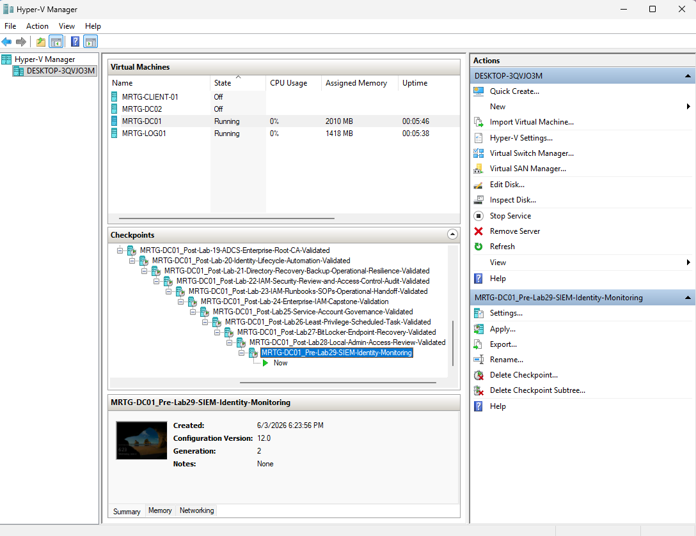

### Logging Server Pre-Lab Checkpoint

Checkpoint created:

`MRTG-LOG01_Pre-Lab29-SIEM-Identity-Monitoring`

---

## Splunk Installation Validation

Before installing Splunk Enterprise, I verified that Splunk was not already installed on `MRTG-LOG01`.

PowerShell command used:

`Get-Service *splunk*`

The command returned no Splunk services, confirming that Splunk was not currently installed as a Windows service.

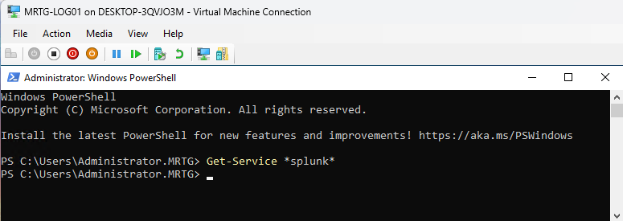

---

## Installer Folder Created

Because `MRTG-LOG01` did not have direct internet access, I used an offline installer workflow.

I created a local installer staging folder:

`C:\Installers`

This reflects a controlled installation workflow commonly used in restricted or regulated environments where servers may not have direct internet access.

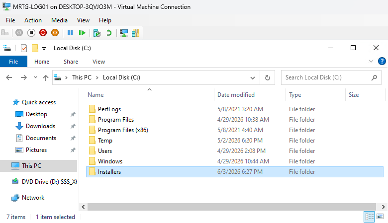

---

## Splunk Installer Staged

The Splunk Enterprise Windows installer was downloaded on the host machine and copied into `C:\Installers` on `MRTG-LOG01`.

Installer staged:

`splunk-10.4.0-...-windows-x64.msi`

---

## Splunk Installer Wizard

The Splunk Enterprise installer was launched on `MRTG-LOG01`.

The default installation options were used for the lab.

---

## Splunk Installation Path

Splunk Enterprise was installed to the default path:

`C:\Program Files\Splunk\`

Using the default path keeps the lab configuration simple and consistent with a standard Windows installation.

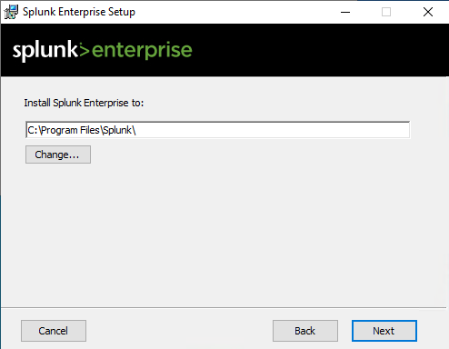

---

## Splunk Service Account Selection

Splunk Enterprise was installed using a local virtual account instead of a domain account.

This kept the Splunk service scoped to `MRTG-LOG01` and avoided granting unnecessary domain-level access.

Selected option:

`Virtual Account`

---

## Splunk Administrator Account

A local Splunk administrator account was created during installation.

The password is not exposed or documented in this lab evidence.

---

## Splunk Installation Progress

The installer copied files and completed the Splunk Enterprise installation on `MRTG-LOG01`.

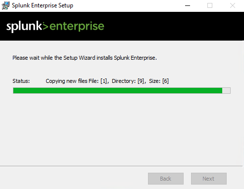

---

## Splunk Web Login

After installation, Splunk Web was accessible from `MRTG-LOG01` at:

`http://localhost:8000`

This confirmed that Splunk Web was running on port `8000`.

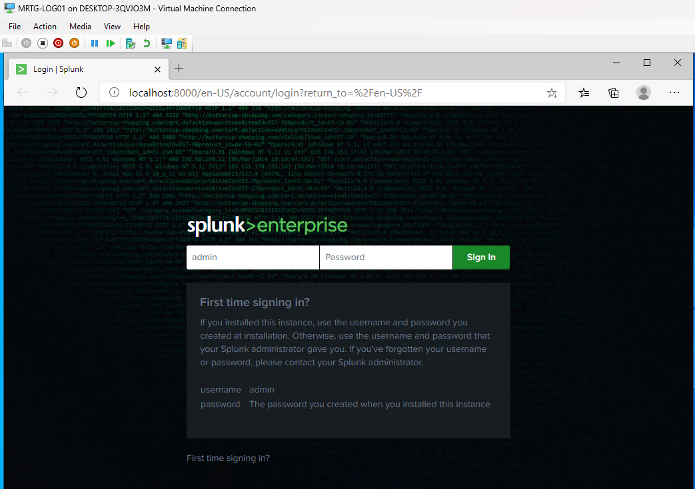

---

## Splunk Home Page

After logging into Splunk Web, the Splunk Enterprise home page loaded successfully.

This confirmed that Splunk was installed, running, and accessible through the web interface.

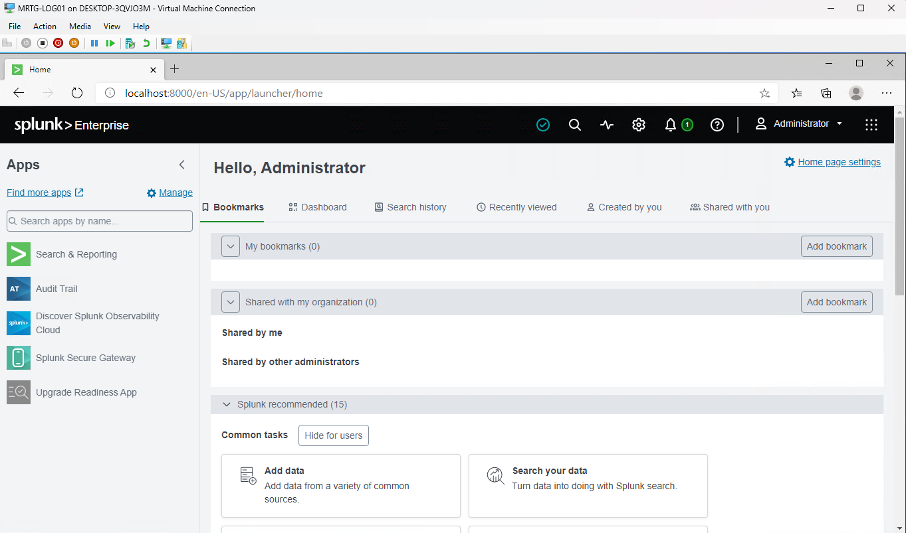

---

## Windows Security Log Input

I added Windows Security logs as a local event log input in Splunk.

Input settings:

| Setting | Value |
|---|---|
| Input Type | Windows Event Logs |
| Event Log | Security |
| Host | `MRTG-LOG01` |
| Index | `main` |
| App Context | `search` |

---

## Windows Security Events Search

After adding the Windows Security log input, I searched Splunk to confirm that security events were being indexed.

Search used:

`index=main sourcetype="WinEventLog:Security"`

The search returned Windows Security events from `MRTG-LOG01`.

---

## Successful Logon Events

I searched for successful logon events using Windows Security Event ID `4624`.

Search used:

`index=main sourcetype="WinEventLog:Security" EventCode=4624`

This search returned successful authentication activity.

Event ID `4624` is useful for reviewing normal logon activity and validating that authentication events are visible in Splunk.

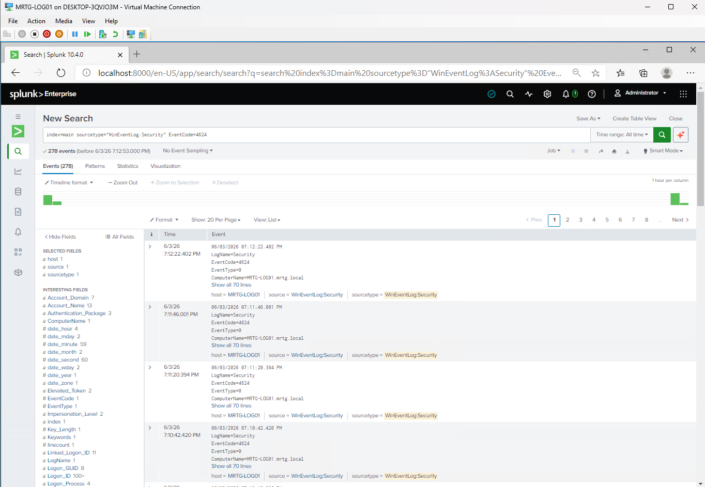

---

## Failed Logon Events

I searched for failed logon events using Windows Security Event ID `4625`.

Search used:

`index=main sourcetype="WinEventLog:Security" EventCode=4625`

This search returned failed authentication activity.

Event ID `4625` is useful for identifying failed logon attempts, password mistakes, account misuse, or possible password guessing activity.

---

## Account Management Events

I searched for account lifecycle events.

Search used:

`index=main sourcetype="WinEventLog:Security" (EventCode=4720 OR EventCode=4722 OR EventCode=4725 OR EventCode=4726)`

Event mappings:

| Event ID | Meaning |
|---:|---|
| `4720` | User account created |
| `4722` | User account enabled |
| `4725` | User account disabled |
| `4726` | User account deleted |

This search returned no results during the review window.

That is still useful because it confirms the search was tested and no account lifecycle activity was observed in the selected time range.

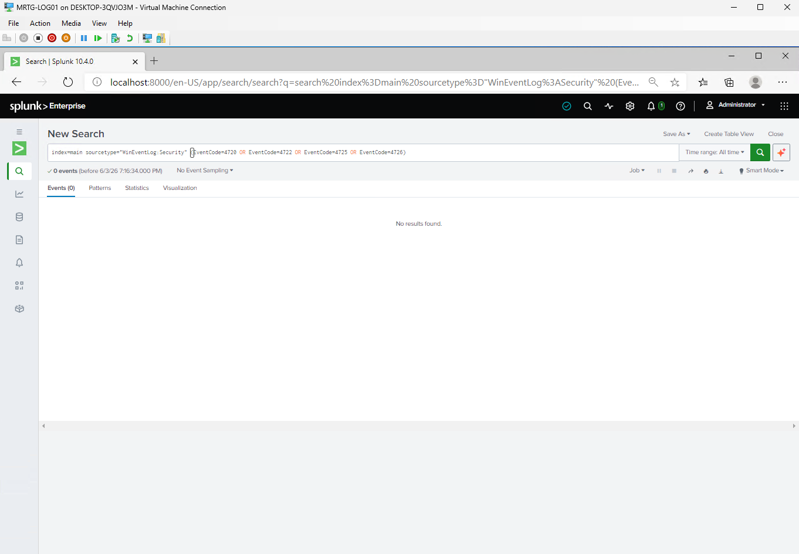

---

## Group Membership Change Events

I searched for security group membership change events.

Search used:

`index=main sourcetype="WinEventLog:Security" (EventCode=4728 OR EventCode=4729 OR EventCode=4732 OR EventCode=4733)`

Event mappings:

| Event ID | Meaning |
|---:|---|
| `4728` | Member added to a global security group |
| `4729` | Member removed from a global security group |
| `4732` | Member added to a local security group |
| `4733` | Member removed from a local security group |

This search returned group membership activity, including Event ID `4732`.

---

## Local Administrator Specific Search

I tested a more specific local administrator-related search.

Search used:

`index=main sourcetype="WinEventLog:Security" EventCode=4732 Administrators`

This search returned no results during the review window.

This is still a useful finding because it showed that field structure and event formatting matter when building SIEM searches. A broad event ID search may return results, while a keyword-based search may miss events if the target value is stored in a specific field or formatted differently.

---

## Local Group Change Events

I searched for local group membership changes using Event IDs `4732` and `4733`.

Search used:

`index=main sourcetype="WinEventLog:Security" (EventCode=4732 OR EventCode=4733)`

This search returned local security group membership activity.

This connects directly to local administrator governance and supports monitoring for privileged group changes.

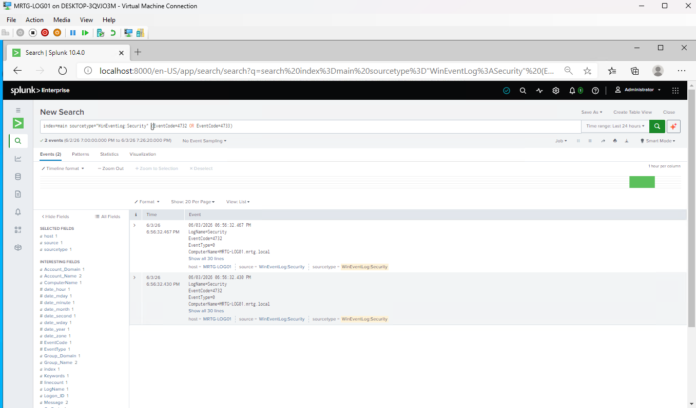

---

## Identity Monitoring Search Table

| Use Case | Event ID | Splunk Search | Purpose |
|---|---:|---|---|
| Windows Security log review | Any | `index=main sourcetype="WinEventLog:Security"` | Confirm Windows Security events are searchable |
| Successful logon review | `4624` | `index=main sourcetype="WinEventLog:Security" EventCode=4624` | Review successful authentication activity |
| Failed logon review | `4625` | `index=main sourcetype="WinEventLog:Security" EventCode=4625` | Identify failed authentication attempts |
| Account lifecycle review | `4720`, `4722`, `4725`, `4726` | `index=main sourcetype="WinEventLog:Security" (EventCode=4720 OR EventCode=4722 OR EventCode=4725 OR EventCode=4726)` | Review account creation, enablement, disablement, and deletion |
| Security group membership review | `4728`, `4729`, `4732`, `4733` | `index=main sourcetype="WinEventLog:Security" (EventCode=4728 OR EventCode=4729 OR EventCode=4732 OR EventCode=4733)` | Review group membership changes |
| Local group change review | `4732`, `4733` | `index=main sourcetype="WinEventLog:Security" (EventCode=4732 OR EventCode=4733)` | Review local security group membership changes |
| Local administrator keyword test | `4732` | `index=main sourcetype="WinEventLog:Security" EventCode=4732 Administrators` | Test keyword-based local administrator detection |

---

## Findings

| Search Area | Result | Finding |
|---|---|---|
| Windows Security events | Events found | Splunk successfully ingested and searched Windows Security logs |
| Successful logons | Events found | Event ID `4624` activity was searchable |
| Failed logons | Events found | Event ID `4625` activity was searchable |
| Account management events | No events found | No account lifecycle changes were observed during the review window |
| Group membership changes | Events found | Event ID `4732` activity was observed |
| Local administrator keyword search | No events found | Keyword-based search did not return results |
| Local group changes | Events found | Local security group membership activity was searchable |

---

## IAM and Security Relevance

This lab connects directly to IAM because authentication, account lifecycle events, and group membership changes are identity security signals.

Important IAM monitoring areas include:

| IAM Area | Relevance |
|---|---|
| Authentication monitoring | Successful and failed logons help establish user activity and authentication patterns |
| Account lifecycle monitoring | Account creation, enablement, disablement, and deletion events support identity governance |
| Group membership monitoring | Security group changes can indicate privilege changes |
| Local administrator monitoring | Local group changes can reveal endpoint privilege exposure |
| Least privilege | Monitoring helps detect when privileged access changes occur |
| Audit readiness | Splunk searches provide searchable evidence of identity-related events |
| Incident response | SIEM data helps investigate identity and access activity |

---

## Risk Addressed

Without SIEM visibility, identity activity can be difficult to review across systems.

This lab reduces that visibility gap by installing Splunk, ingesting Windows Security logs, and validating identity-focused searches.

The main risks addressed include:

- Lack of centralized visibility into Windows Security events
- Missed failed logon activity
- Missed group membership changes
- Limited ability to review identity events
- Weak audit evidence for authentication activity
- No searchable SIEM-style workflow for IAM events
- Poor visibility into local security group changes

---

## Control Mapping

This lab supports the following IAM and security concepts:

| Control Area | How This Lab Supports It |
|---|---|
| SIEM monitoring | Installs Splunk and searches Windows Security logs |
| Authentication review | Searches successful and failed logon events |
| Account governance | Tests account lifecycle event searches |
| Privileged access monitoring | Reviews group and local group membership changes |
| Endpoint security monitoring | Searches security events from `MRTG-LOG01` |
| Audit readiness | Captures installation, ingestion, search, and checkpoint evidence |
| Least privilege | Uses a virtual account for the Splunk service instead of a domain account |
| Operational resilience | Creates pre-lab and post-lab checkpoints |
| Detection engineering foundation | Documents reusable SPL searches for identity monitoring |

---

## Validation

The following validation checks were completed:

| Validation Item | Result |
|---|---|
| DC01 pre-lab checkpoint created | Passed |
| LOG01 pre-lab checkpoint created | Passed |
| Splunk not installed validation performed | Passed |
| Installer staging folder created | Passed |
| Splunk installer staged locally | Passed |
| Splunk Enterprise installed | Passed |
| Splunk virtual service account selected | Passed |
| Splunk administrator account created | Passed |
| Splunk Web accessible on port `8000` | Passed |
| Splunk home page loaded after login | Passed |
| Windows Security log input added | Passed |
| Windows Security events searchable | Passed |
| Successful logon events searched | Passed |
| Failed logon events searched | Passed |
| Account management event search tested | Passed |
| Group membership change search tested | Passed |
| Local administrator-specific search tested | Passed |
| Local group change search tested | Passed |
| LOG01 post-lab checkpoint created | Passed |
| DC01 post-lab checkpoint created | Passed |

---

## Evidence Collected

The following evidence was collected during the lab:

| Evidence | File |
|---|---|
| DC01 pre-lab checkpoint | `images/lab29-dc01-pre-lab-checkpoint.png` |
| LOG01 pre-lab checkpoint | `images/lab29-log01-pre-lab-checkpoint.png` |
| Splunk not installed validation | `images/lab29-splunk-not-installed-validation.png` |
| Installers folder created | `images/lab29-installers-folder-created.png` |
| Splunk installer staged | `images/lab29-splunk-installer-staged.png` |
| Splunk installer wizard | `images/lab29-splunk-installer-wizard.png` |
| Splunk installation path | `images/lab29-splunk-install-path.png` |
| Splunk service account selection | `images/lab29-splunk-service-account-selection.png` |
| Splunk administrator credentials screen | `images/lab29-splunk-admin-credentials.png` |
| Splunk install progress | `images/lab29-splunk-install-progress.png` |
| Splunk Web login | `images/lab29-splunk-web-login.png` |
| Splunk home page | `images/lab29-splunk-home.png` |
| Windows Security log input review | `images/lab29-windows-security-log-input-review.png` |
| Windows Security events search | `images/lab29-windows-security-events-search.png` |
| Successful logon event search | `images/lab29-successful-logon-events-4624.png` |
| Failed logon event search | `images/lab29-failed-logon-events-4625.png` |
| Account management event search | `images/lab29-account-management-events.png` |
| Group membership change event search | `images/lab29-group-membership-change-events.png` |
| Local administrator-specific search | `images/lab29-local-admin-specific-search-no-results.png` |
| Local group change event search | `images/lab29-local-group-change-events.png` |
| LOG01 post-lab checkpoint | `images/lab29-log01-post-lab-checkpoint.png` |
| DC01 post-lab checkpoint | `images/lab29-dc01-post-lab-checkpoint.png` |

---

## Hyper-V Post-Lab Checkpoints

After installing Splunk, adding Windows Security logs, and validating identity monitoring searches, I created post-lab checkpoints for the domain controller and logging server.

### Logging Server Post-Lab Checkpoint

Checkpoint created:

`MRTG-LOG01_Post-Lab29-SIEM-Identity-Monitoring-Validated`

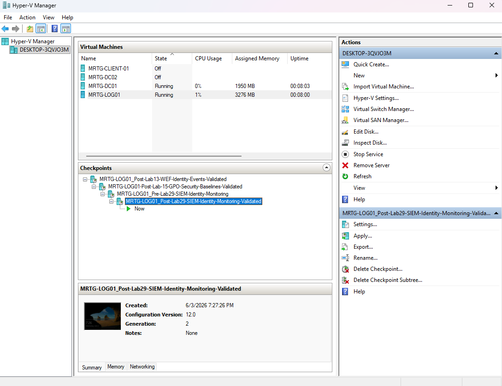

### Domain Controller Post-Lab Checkpoint

Checkpoint created:

`MRTG-DC01_Post-Lab29-SIEM-Identity-Monitoring-Validated`

---

## What I Would Improve in Production

In a production environment, I would improve this process by:

- Using a dedicated SIEM architecture with proper storage planning
- Forwarding logs from multiple systems, not only the local logging server
- Installing and configuring Splunk Universal Forwarders on endpoints and servers
- Creating a dedicated index for Windows Security logs
- Applying consistent source naming and host naming standards
- Building dashboards for authentication and account activity
- Creating alerts for repeated failed logons
- Creating alerts for privileged group membership changes
- Monitoring local Administrators group changes across endpoints
- Correlating domain controller and endpoint security events
- Restricting Splunk administrator access
- Using role-based access control inside Splunk
- Securing Splunk management and web ports
- Backing up Splunk configuration
- Documenting retention requirements
- Aligning event monitoring with compliance and incident response requirements

---

## Lessons Learned

This lab reinforced that identity monitoring depends on both log collection and useful searches.

Installing Splunk alone does not provide security value unless the right logs are ingested and searched.

The successful logon and failed logon searches proved that authentication events were searchable. The group membership searches showed that local security group activity could also be reviewed.

The local administrator-specific keyword search returned no results, which was also useful. It showed that SIEM searches must be tested and tuned because event fields and raw text formatting may not always match expectations.

The biggest takeaway is that SIEM monitoring is not just about collecting logs. It is about asking useful identity and security questions, validating the results, and documenting what the searches prove.

---

## Outcome

Lab 29 successfully installed Splunk Enterprise on `MRTG-LOG01` and used it to search Windows Security events.

The lab demonstrated:

- Pre-lab rollback planning
- Splunk installation validation
- Offline installer staging
- Splunk Enterprise installation
- Splunk Web access
- Windows Security log ingestion
- Successful logon search validation
- Failed logon search validation
- Account lifecycle search testing
- Group membership change search testing
- Local group change search validation
- SIEM search documentation
- Post-lab rollback planning

This lab strengthens the MRTG environment by adding SIEM-style identity monitoring and search capability to the IAM operations expansion track.

---

## Next Lab

[Lab 30 — IAM Operations, Monitoring, and Governance Capstone](../Lab-30-IAM-Operations-Monitoring-and-Governance-Capstone)

Lab 30 will consolidate the IAM expansion series by tying together service account governance, endpoint encryption, local administrator remediation, Splunk identity monitoring, evidence collection, and operational governance.
