# Lab 30 — IAM Operations, Monitoring, and Governance Capstone

---

## Objective

The objective of this lab is to complete an IAM operations, monitoring, and governance capstone review across the MRTG Active Directory lab environment.

This lab validates that the previous IAM expansion labs are not just configured, but operational, reviewable, monitored, and documented.

This capstone reviews:

- Service account governance
- Least-privilege scheduled task automation
- BitLocker endpoint encryption
- Local administrator access remediation
- Splunk identity monitoring
- Operational evidence
- Governance decisions
- Final rollback checkpoints

---

## Business Problem

Monroe Redstone Technology Group needs to confirm that identity controls implemented across the environment are still valid, supportable, and aligned with least privilege.

Individual technical controls are useful, but they do not provide long-term security value unless they are reviewed and validated.

This lab addresses the need to:

- Review service accounts for ownership and scope
- Confirm service accounts are not over-privileged
- Validate least-privilege automation still exists
- Confirm endpoint encryption remains enabled
- Verify local administrator remediation remains in place
- Confirm SIEM monitoring is still accessible
- Review identity-related Splunk searches
- Preserve the final operational state with checkpoints

---

## Lab Summary

In this lab, I performed a governance review across the IAM controls built in Labs 25 through 29.

The review confirmed that service accounts were organized and documented, the audit-review scheduled task still used a least-privilege service account, BitLocker remained enabled on the client endpoint, local administrator access remained remediated, and Splunk was still available for identity monitoring.

This lab serves as the final operational capstone for the IAM expansion series.

---

## Lab Scope

| Area | Reviewed Control |
|---|---|
| Service Account Governance | Service account OU, description, ownership, and group membership |
| Least-Privilege Automation | Scheduled task configuration, action path, script, and output |
| Endpoint Encryption | BitLocker protection status and key protectors |
| Local Administrator Access | Local Administrators group membership |
| SIEM Monitoring | Splunk availability and identity-focused searches |
| Operational Resilience | Pre-lab and post-lab Hyper-V checkpoints |

---

## Environment

| Component | Details |
|---|---|
| Domain | `mrtg.local` |
| Primary Domain Controller | `MRTG-DC01` |
| Logging / SIEM Server | `MRTG-LOG01` |
| Client Endpoint | `MRTG-CLIENT-01` |
| SIEM Platform | Splunk Enterprise |
| Endpoint Encryption | BitLocker |
| Automation Platform | Windows Task Scheduler |
| Virtualization Platform | Hyper-V |
| Lab Organization | Monroe Redstone Technology Group |

---

## Systems Reviewed

| System | Role |
|---|---|
| `MRTG-DC01` | Primary domain controller and Active Directory management system |
| `MRTG-LOG01` | Logging and SIEM server running Splunk Enterprise |
| `MRTG-CLIENT-01` | Domain-joined workstation used for endpoint and local administrator validation |

---

## Expansion Labs Consolidated

| Lab | Control Area | Capstone Review Focus |
|---|---|---|
| Lab 25 | Service Account Governance Foundation | Confirm service accounts are organized, documented, and reviewed |
| Lab 26 | Scheduled Task with Least-Privilege Service Account | Confirm automation still runs under a scoped service account |
| Lab 27 | BitLocker and Endpoint Encryption Recovery | Confirm endpoint encryption remains enabled |
| Lab 28 | Local Administrator Access Review and Remediation | Confirm unnecessary local admin exposure remains removed |
| Lab 29 | SIEM Identity Monitoring with Splunk | Confirm Splunk is accessible and identity searches are usable |

---

## Hyper-V Pre-Lab Checkpoints

Before beginning the capstone review, I created pre-lab checkpoints for the systems involved.

### DC01 Pre-Lab Checkpoint

Checkpoint created:

`MRTG-DC01_Pre-Lab30-IAM-Operations-Governance-Capstone`

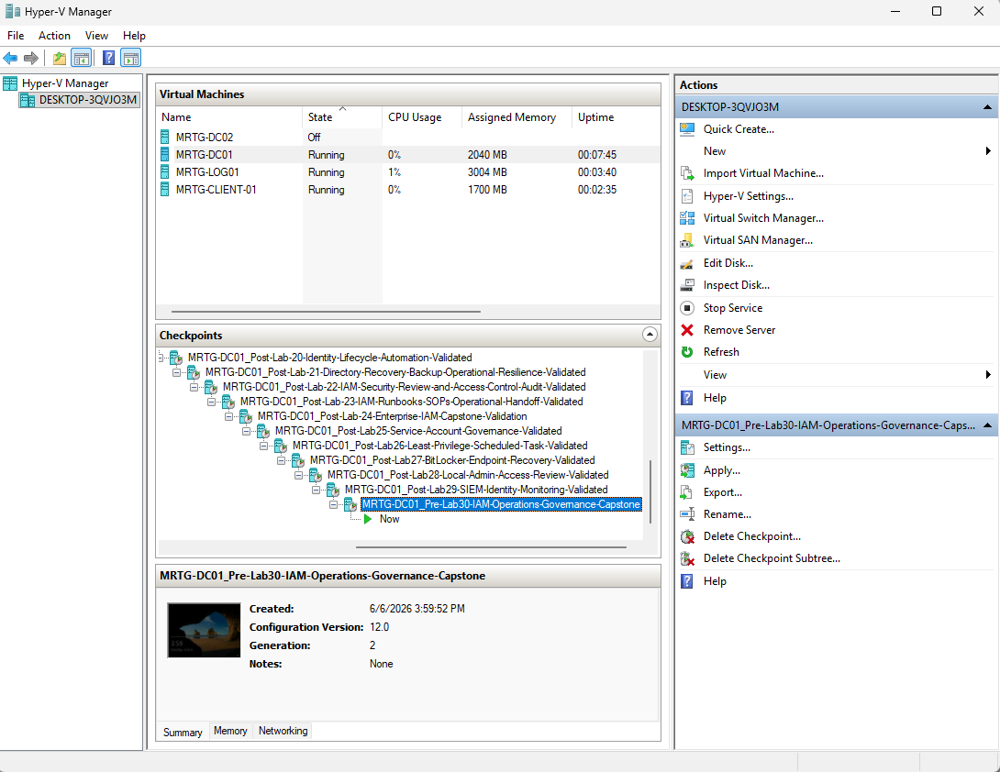

### LOG01 Pre-Lab Checkpoint

Checkpoint created:

`MRTG-LOG01_Pre-Lab30-IAM-Operations-Governance-Capstone`

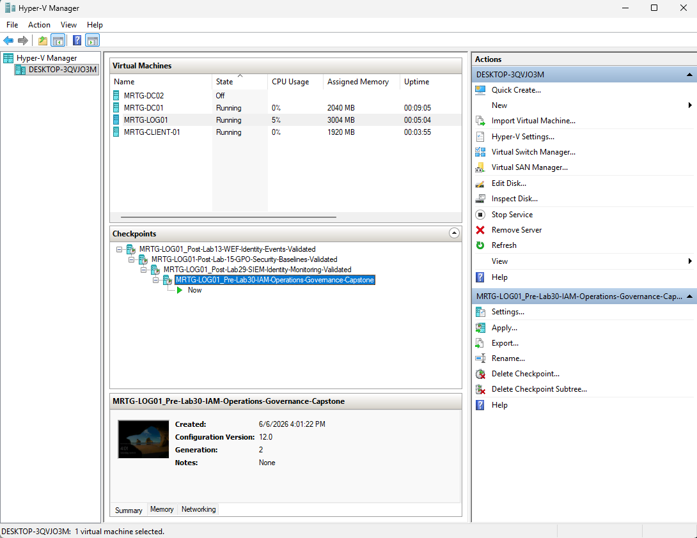

### CLIENT01 Pre-Lab Checkpoint

Checkpoint created:

`MRTG-CLIENT-01_Pre-Lab30-IAM-Operations-Governance-Capstone`

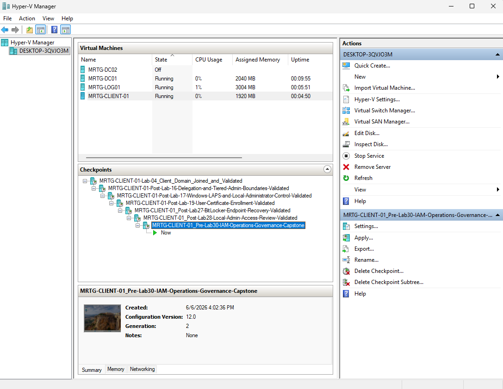

---

## Service Account OU Review

On `MRTG-DC01`, I reviewed the Service Accounts OU in Active Directory Users and Computers.

Path reviewed:

`mrtg.local → _MRTG → Service Accounts`

The OU contained the governed service accounts from the IAM expansion labs.

Visible service accounts:

- `Service App Deploy`
- `Service Audit Review`
- `Service Backup`

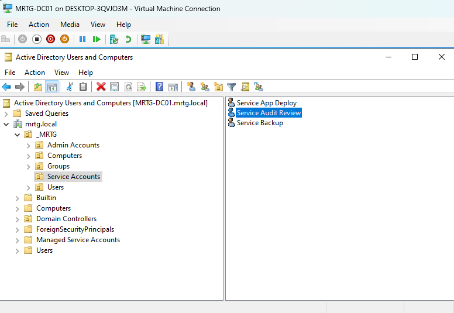

---

## Service Account Properties Review

I reviewed the `Service Audit Review` account properties.

The account description confirmed that the service account was documented with purpose, ownership, and review frequency.

Description reviewed:

`Lab 25 svc acct. Owner: IT Ops. Review: Qtrly.`

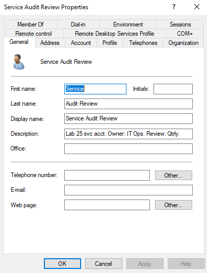

---

## Service Account Group Membership Review

I reviewed the group membership for the `Service Audit Review` service account.

The account was only a member of:

`Domain Users`

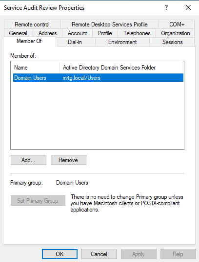

This confirms that the service account was not assigned to privileged groups such as:

- `Domain Admins`
- `Enterprise Admins`
- `Administrators`
- `Account Operators`
- `Server Operators`
- `Backup Operators`

---

## Service Account Governance Finding

The `Service Audit Review` account remained aligned to least privilege.

| Governance Check | Result |
|---|---|
| Stored in Service Accounts OU | Passed |
| Account purpose documented | Passed |
| Owner documented | Passed |
| Review frequency documented | Passed |
| Privileged group membership avoided | Passed |
| Limited to Domain Users | Passed |

---

## Scheduled Task Service Account Review

I reviewed the Lab 26 scheduled task in Task Scheduler.

Task reviewed:

`MRTG Audit Review Marker`

The task was configured to run under the service account:

`svc-audit-review`

The task description confirmed its intended use:

`Runs a basic audit-review marker script using a least-privilege service account.`

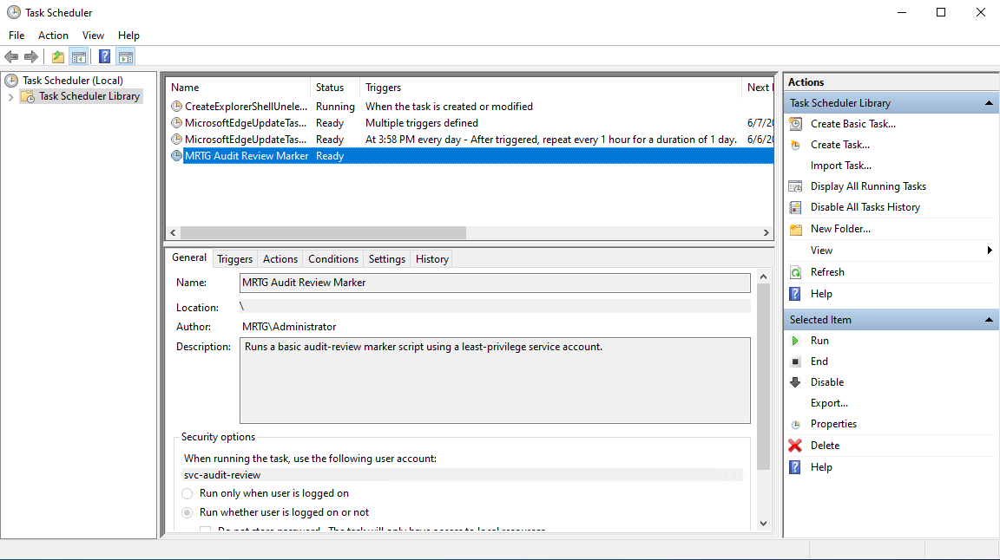

---

## Scheduled Task Action Review

I reviewed the scheduled task action.

The task action was configured to run a PowerShell script from the MRTG audit folder.

Action reviewed:

`powershell.exe -ExecutionPolicy Bypass -File "C:\MRTG-Audit\audit-review-marker.ps1"`

---

## Scheduled Task Output Review

I reviewed the scheduled task output folder.

Folder reviewed:

`C:\MRTG-Audit`

Visible files:

- `audit-review-marker`
- `audit-review-output`

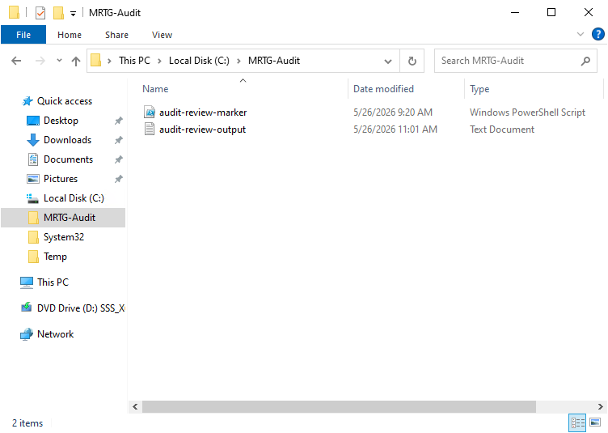

This confirmed that the scheduled task script and output artifact still existed.

---

## Least-Privilege Automation Finding

The scheduled task remained operationally reviewable.

| Governance Check | Result |
|---|---|
| Scheduled task exists | Passed |
| Task uses service account | Passed |
| Service account is least-privilege | Passed |
| Script path is documented | Passed |
| Output artifact exists | Passed |
| Automation evidence is available | Passed |

---

## BitLocker Protection Review

On `MRTG-CLIENT-01`, I reviewed BitLocker status using PowerShell.

Command used:

`manage-bde -status C:`

The output confirmed that BitLocker protection remained enabled.

Key results:

| Setting | Value |
|---|---|
| Percentage Encrypted | `100.0%` |
| Encryption Method | `XTS-AES 128` |
| Protection Status | `Protection On` |
| Lock Status | `Unlocked` |
| Key Protector | `TPM` |
| Key Protector | `Numerical Password` |

---

## Endpoint Encryption Finding

BitLocker remained enabled and protected on `MRTG-CLIENT-01`.

| Governance Check | Result |
|---|---|
| BitLocker enabled | Passed |
| Drive fully encrypted | Passed |
| Protection status on | Passed |
| TPM protector present | Passed |
| Numerical password protector present | Passed |
| Endpoint encryption control remains active | Passed |

---

## Local Administrator Membership Review

On `MRTG-CLIENT-01`, I reviewed the local Administrators group.

Command used:

`net localgroup administrators`

The output showed that the local Administrators group was limited to:

`Administrator`

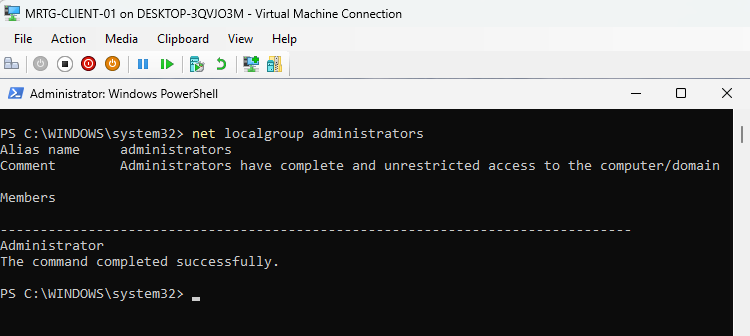

The previously remediated account was not present:

`localadmin`

---

## Local Administrator Governance Finding

The local administrator remediation from Lab 28 remained in place.

| Governance Check | Result |
|---|---|
| Local Administrators group reviewed | Passed |
| Built-in Administrator present | Passed |
| `localadmin` removed | Passed |
| Local admin exposure reduced | Passed |
| Remediation still valid | Passed |

---

## Splunk Home Review

On `MRTG-LOG01`, I opened Splunk Enterprise in the browser.

URL reviewed:

`http://localhost:8000`

Splunk Enterprise loaded successfully.

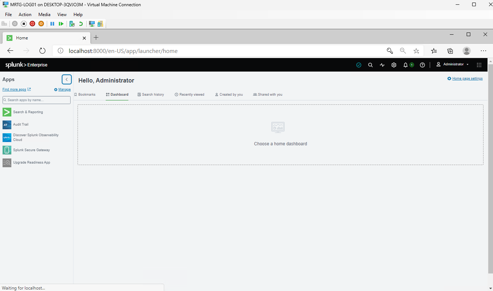

---

## Splunk Successful Logon Review

I reviewed successful logon events in Splunk.

Search used:

`index=main sourcetype="WinEventLog:Security" EventCode=4624`

The search returned successful logon events during the review window.

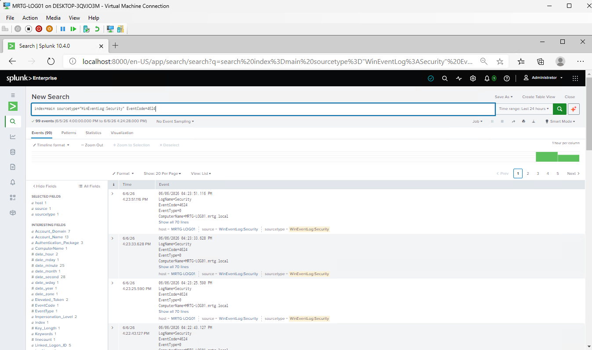

---

## Splunk Failed Logon Review

I reviewed failed logon events in Splunk.

Search used:

`index=main sourcetype="WinEventLog:Security" EventCode=4625`

No failed logon events were observed during the selected review window.

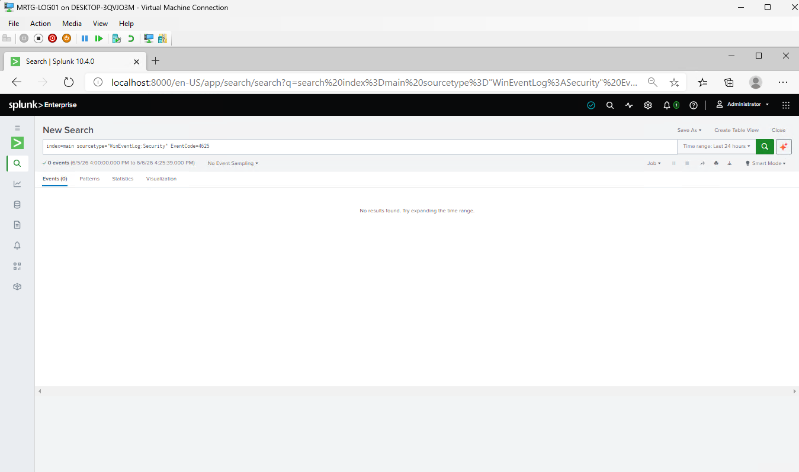

This indicates that no failed authentication attempts were detected in the selected time range.

---

## Splunk Local Group Change Review

I reviewed local group membership change events in Splunk.

Search used:

`index=main sourcetype="WinEventLog:Security" (EventCode=4732 OR EventCode=4733)`

No local group membership change events were observed during the selected review window.

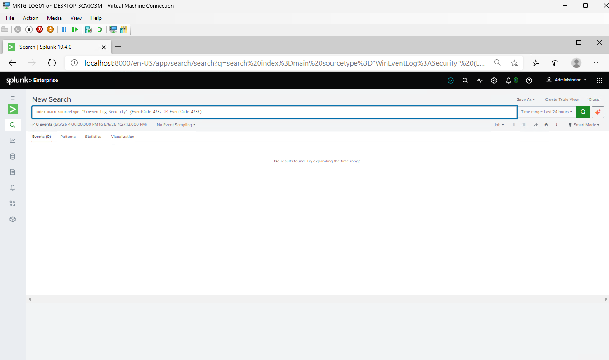

This indicates that no local group membership changes were detected in the selected time range.

---

## SIEM Monitoring Finding

Splunk remained accessible and usable for identity monitoring.

| Monitoring Check | Result |
|---|---|
| Splunk Web accessible | Passed |
| Successful logon search reviewed | Passed |
| Failed logon search reviewed | Passed |
| Local group change search reviewed | Passed |
| Windows Security logs searchable | Passed |
| SIEM review process validated | Passed |

---

## Governance Review Table

| Control Area | Lab Source | Current Status | Risk Reviewed | Governance Decision |
|---|---|---|---|---|
| Service account governance | Lab 25 | Validated | Service accounts can become unmanaged privileged identities | Continue quarterly review |
| Least-privilege automation | Lab 26 | Validated | Scheduled tasks can overuse privileged accounts | Keep service account scoped to required folder access |
| Endpoint encryption | Lab 27 | Validated | Lost or stolen endpoints may expose data | Keep BitLocker enabled and protect recovery keys |
| Local administrator access | Lab 28 | Validated | Local admin sprawl increases endpoint risk | Continue periodic local admin reviews |
| SIEM identity monitoring | Lab 29 | Validated | Identity events may go unnoticed | Continue monitoring logons and group changes |

---

## IAM Operations Review

This capstone demonstrated that IAM operations are not limited to creating accounts or assigning access.

Operational IAM also requires:

- Reviewing privileged and non-privileged accounts
- Validating service account ownership
- Confirming automation still runs as intended
- Reviewing endpoint protection controls
- Checking local administrator exposure
- Searching identity-related events
- Documenting evidence
- Preserving rollback points

---

## Security Relevance

This lab reinforces multiple security principles.

| Principle | How This Lab Supports It |
|---|---|
| Least privilege | Service accounts and local administrators were reviewed for unnecessary access |
| Defense in depth | Endpoint encryption, access control, and SIEM monitoring were reviewed together |
| Audit readiness | Evidence was collected across AD, Task Scheduler, BitLocker, local groups, and Splunk |
| Operational resilience | Pre-lab and post-lab checkpoints were created |
| Governance | Ownership, review frequency, and control status were documented |
| Monitoring | Splunk was used to review identity-related events |
| Access control | Local administrator exposure remained reduced |

---

## Risk Addressed

This lab addressed the risk of controls becoming stale after implementation.

Key risks reviewed:

- Service accounts without ownership
- Service accounts with excessive group membership
- Scheduled tasks running under overly privileged accounts
- Endpoint encryption being disabled after setup
- Local administrator accounts reappearing after remediation
- Identity events not being reviewed
- Lack of evidence for operational control status
- No rollback point after final validation

---

## Control Validation Summary

| Control | Validation Method | Result |
|---|---|---|
| Service account OU organization | Active Directory Users and Computers | Passed |
| Service account documentation | AD account description | Passed |
| Service account privilege review | Member Of tab | Passed |
| Scheduled task identity | Task Scheduler General tab | Passed |
| Scheduled task action | Task Scheduler Actions tab | Passed |
| Scheduled task output | `C:\MRTG-Audit` folder review | Passed |
| BitLocker protection | `manage-bde -status C:` | Passed |
| Local administrator remediation | `net localgroup administrators` | Passed |
| Splunk availability | Splunk home page | Passed |
| Successful logon monitoring | Splunk EventCode `4624` search | Passed |
| Failed logon monitoring | Splunk EventCode `4625` search | Reviewed |
| Local group change monitoring | Splunk EventCode `4732` and `4733` search | Reviewed |

---

## Evidence Collected

| Evidence | File |
|---|---|
| DC01 pre-lab checkpoint | `images/lab30-dc01-pre-lab-checkpoint.png` |
| LOG01 pre-lab checkpoint | `images/lab30-log01-pre-lab-checkpoint.png` |
| CLIENT01 pre-lab checkpoint | `images/lab30-client01-pre-lab-checkpoint.png` |
| Service account OU review | `images/lab30-service-account-ou-review.png` |
| Service account properties review | `images/lab30-service-account-properties-review.png` |
| Service account group membership review | `images/lab30-service-account-group-membership-review.png` |
| Scheduled task service account review | `images/lab30-scheduled-task-service-account-review.png` |
| Scheduled task action review | `images/lab30-scheduled-task-action-review.png` |
| Scheduled task output review | `images/lab30-scheduled-task-output-review.png` |
| BitLocker status review | `images/lab30-bitlocker-status-review.png` |
| Local administrator membership review | `images/lab30-local-admin-membership-review.png` |
| Splunk home review | `images/lab30-splunk-home-review.png` |
| Splunk successful logon review | `images/lab30-splunk-successful-logon-review.png` |
| Splunk failed logon review | `images/lab30-splunk-failed-logon-review.png` |
| Splunk local group change review | `images/lab30-splunk-local-group-change-review.png` |
| CLIENT01 post-lab checkpoint | `images/lab30-client01-post-lab-checkpoint.png` |
| DC01 post-lab checkpoint | `images/lab30-dc01-post-lab-checkpoint.png` |
| LOG01 post-lab checkpoint | `images/lab30-log01-post-lab-checkpoint.png` |

---

## Hyper-V Post-Lab Checkpoints

After completing the capstone review, I created post-lab checkpoints for the reviewed systems.

### CLIENT01 Post-Lab Checkpoint

Checkpoint created:

`MRTG-CLIENT-01_Post-Lab30-IAM-Operations-Governance-Capstone-Validated`

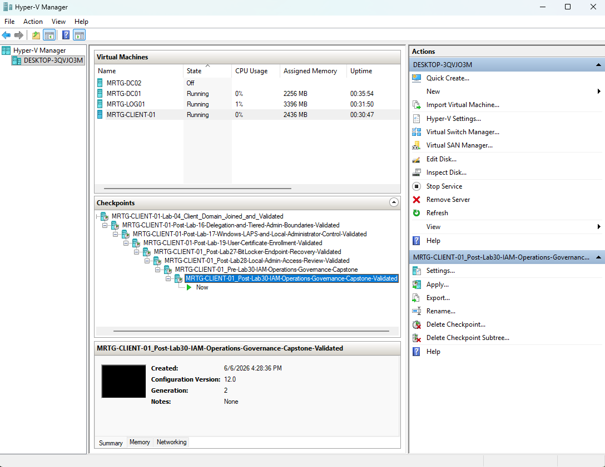

### DC01 Post-Lab Checkpoint

Checkpoint created:

`MRTG-DC01_Post-Lab30-IAM-Operations-Governance-Capstone-Validated`

### LOG01 Post-Lab Checkpoint

Checkpoint created:

`MRTG-LOG01_Post-Lab30-IAM-Operations-Governance-Capstone-Validated`

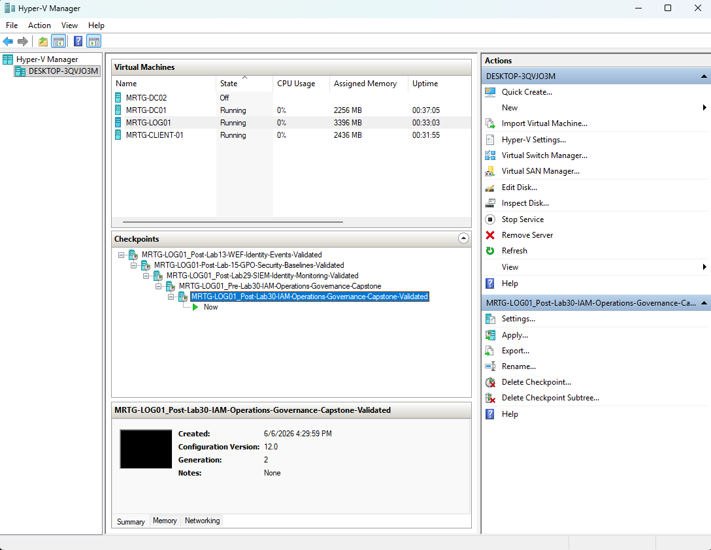

---

## What I Would Improve in Production

In a production environment, I would improve this process by:

- Building a formal service account review schedule
- Requiring service account owners and expiration/review dates
- Using managed service accounts where appropriate
- Centralizing scheduled task inventory
- Alerting on scheduled tasks running as privileged accounts
- Storing BitLocker recovery keys in a controlled enterprise location
- Monitoring BitLocker status across all endpoints
- Enforcing local administrator baselines with policy
- Deploying Splunk Universal Forwarders to endpoints and servers
- Creating Splunk dashboards for IAM operations
- Creating alerts for repeated failed logons
- Creating alerts for privileged group changes
- Reviewing local administrator membership at scale
- Building formal IAM control evidence packages
- Mapping controls to compliance requirements
- Documenting exception handling and approval workflows

---

## Lessons Learned

This lab reinforced that IAM work does not end after a control is configured.

Service accounts need ownership and review. Scheduled tasks need to run under the correct identity. Endpoint encryption needs to remain enabled. Local administrator remediation needs to be verified. SIEM monitoring needs to be checked and used.

The biggest takeaway is that good IAM operations require a review cycle.

A control that is not reviewed can quietly become stale, misconfigured, or risky.

This capstone pulled the previous labs together into one operational review and showed how identity governance, endpoint security, automation, and monitoring support each other.

---

## Outcome

Lab 30 successfully validated the IAM operations and governance state of the MRTG lab environment.

The lab confirmed:

- Service accounts were organized in the correct OU
- Service account documentation remained in place
- The `Service Audit Review` account was not privileged
- The scheduled task still used `svc-audit-review`
- The scheduled task action and output artifacts still existed
- BitLocker remained enabled on `MRTG-CLIENT-01`
- The local `localadmin` account remained removed
- Splunk remained accessible on `MRTG-LOG01`
- Successful logon events were searchable
- Failed logon monitoring was reviewed
- Local group change monitoring was reviewed
- Final post-lab checkpoints preserved the validated state

This completed the IAM expansion series by showing that the environment is not only configured, but reviewed, monitored, documented, and ready for operational handoff.

---

## Series Completion

Lab 30 completes the IAM operations expansion track.

This final capstone ties together:

- Lab 25 — Service Account Governance Foundation
- Lab 26 — Scheduled Task with Least-Privilege Service Account
- Lab 27 — BitLocker and Endpoint Encryption Recovery
- Lab 28 — Local Administrator Access Review and Remediation
- Lab 29 — SIEM Identity Monitoring with Splunk
- Lab 30 — IAM Operations, Monitoring, and Governance Capstone

Together, these labs demonstrate identity governance, endpoint protection, least-privilege operations, monitoring, and audit-ready documentation in a simulated enterprise Active Directory environment.
