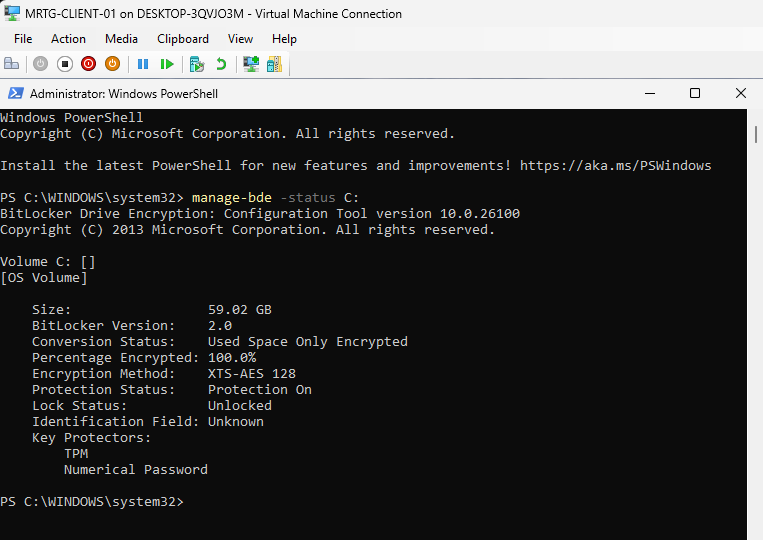
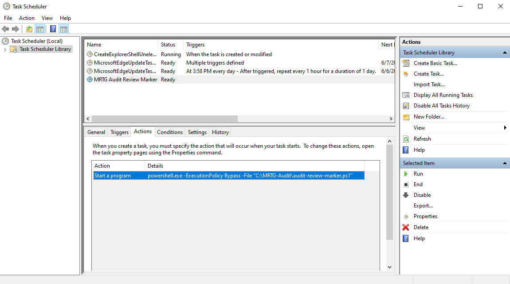
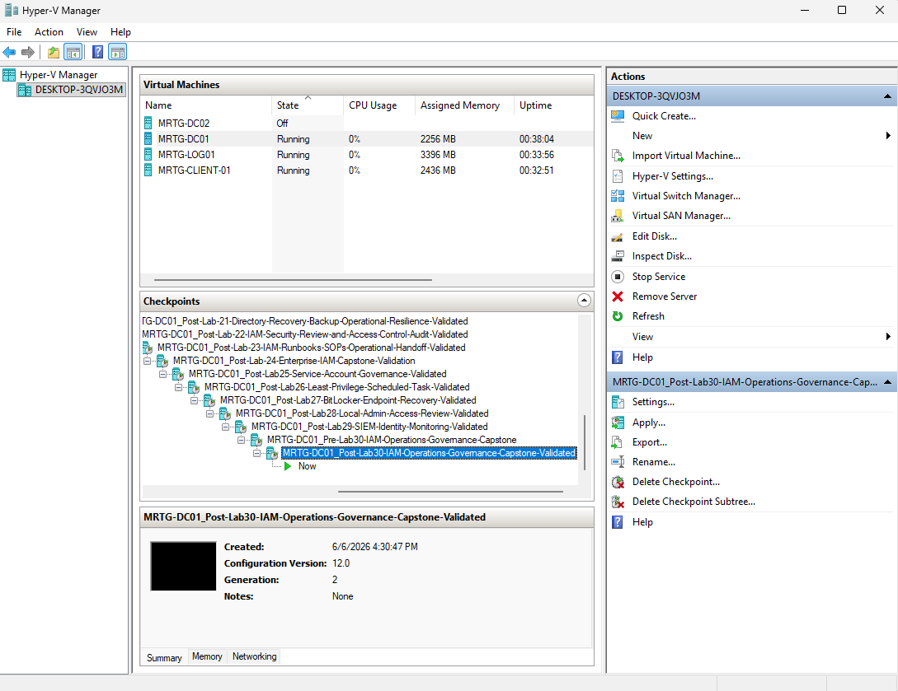

# Lab 30 - IAM Operations, Monitoring, and Governance Capstone


---

## Overview

In this lab, I completed an IAM operations, monitoring, and governance capstone across the Monroe Redstone Technology Group environment.

The capstone reviewed the controls implemented in Labs 25 through 29:

- Service account governance
- Least-privilege scheduled task automation
- BitLocker endpoint encryption
- Local administrator remediation
- Splunk identity monitoring
- Operational evidence
- Final rollback checkpoints

The purpose was to confirm that these controls remained visible, reviewable, and documented after implementation.

---

## Business Problem

MRTG needed to verify that previously implemented identity and security controls had not become stale, misconfigured, or overprivileged.

A control provides limited long-term value if nobody confirms that:

- The account still has an owner
- The assigned permissions remain appropriate
- Automation still uses the intended identity
- Endpoint encryption remains active
- Removed privileged access has not returned
- Monitoring tools remain available
- Detection searches still execute
- Evidence remains available for review

This lab addressed that problem through a structured operational governance review.

---

## Lab Summary

I created pre-lab checkpoints for `MRTG-DC01`, `MRTG-LOG01`, and `MRTG-CLIENT-01`.

On the client, I confirmed that BitLocker remained active with TPM and numerical password protectors. I also reviewed the local Administrators group and confirmed that only the built-in Administrator account was listed.

On the domain controller, I reviewed the Service Accounts OU, verified the ownership and review information for `svc-audit-review`, and confirmed that the account remained a member of only Domain Users.

I reviewed the Lab 26 scheduled task, its PowerShell action, and the existing script and output artifacts.

On the logging server, I confirmed that Splunk Enterprise remained accessible and reviewed searches for successful logons, failed logons, and local security group changes.

Finally, I created post-lab checkpoints for all three systems.

---

## Objectives

- Create pre-lab checkpoints for all reviewed systems
- Validate BitLocker protection
- Review local administrator membership
- Review the Service Accounts OU
- Validate service account documentation
- Validate service account group membership
- Review the scheduled task identity
- Review the scheduled task action
- Confirm the script and output artifacts exist
- Confirm Splunk Enterprise remains accessible
- Review successful logon events
- Review failed logon events
- Review local group change events
- Document monitoring limitations
- Create post-lab checkpoints
- Complete the IAM expansion series

---

## Scope

### Included

- Active Directory service account review
- Service account ownership review
- Service account group membership review
- Scheduled task configuration review
- Scheduled task action review
- Script and output artifact review
- BitLocker status validation
- Local Administrators group review
- Splunk availability validation
- Authentication event searches
- Local group change searches
- Hyper-V checkpoints
- Governance findings
- Audit evidence

### Not Included

- New service account creation
- Scheduled task reconfiguration
- Scheduled task execution testing
- BitLocker recovery testing
- Local administrator remediation
- Remote Windows event forwarding
- New Splunk dashboards
- New Splunk alerts
- Production policy enforcement
- Formal compliance certification
- Disaster recovery testing

---

## Environment

| Component | Details |
|---|---|
| Organization | Monroe Redstone Technology Group |
| Domain | `mrtg.local` |
| Primary Domain Controller | `MRTG-DC01` |
| Logging Server | `MRTG-LOG01` |
| Client Endpoint | `MRTG-CLIENT-01` |
| SIEM Platform | Splunk Enterprise `10.4.0` |
| SIEM URL | `http://localhost:8000` |
| Endpoint Encryption | BitLocker |
| Service Account | `svc-audit-review` |
| Scheduled Task | `MRTG Audit Review Marker` |
| Automation Platform | Windows Task Scheduler |
| Hypervisor | Hyper-V |

---

## Systems Reviewed

| System | Role | Capstone Review |
|---|---|---|
| `MRTG-DC01` | Domain controller | Service account governance |
| `MRTG-LOG01` | Logging server | Splunk availability and searches |
| `MRTG-CLIENT-01` | Domain workstation | BitLocker, local administrators, and scheduled task |

---

## Expansion Labs Consolidated

| Lab | Control Area | Capstone Review |
|---|---|---|
| Lab 25 | Service Account Governance | Account location, ownership, review frequency, and membership |
| Lab 26 | Least-Privilege Scheduled Task | Task identity, action, script, and output artifacts |
| Lab 27 | BitLocker Protection | Encryption status and key protectors |
| Lab 28 | Local Administrator Remediation | Current local Administrators membership |
| Lab 29 | Splunk Identity Monitoring | Platform availability and identity searches |

---

## Governance Review Model

```text
Review Identity → Validate Privilege → Review Automation → Validate Endpoint Controls → Review Monitoring → Preserve Evidence
```

---

## Implementation Steps

### Step 1 - Created DC01 Pre-Lab Checkpoint

A pre-lab checkpoint was created for `MRTG-DC01`.

Checkpoint name:

```text
MRTG-DC01_Pre-Lab30-IAM-Operations-Governance-Capstone
```


---

### Step 2 - Created LOG01 Pre-Lab Checkpoint

A pre-lab checkpoint was created for `MRTG-LOG01`.

Checkpoint name:

```text
MRTG-LOG01_Pre-Lab30-IAM-Operations-Governance-Capstone
```


---

### Step 3 - Created CLIENT-01 Pre-Lab Checkpoint

A pre-lab checkpoint was created for `MRTG-CLIENT-01`.

Checkpoint name:

```text
MRTG-CLIENT-01_Pre-Lab30-IAM-Operations-Governance-Capstone
```


---

## Endpoint Security Review

### Step 4 - Reviewed BitLocker Status

BitLocker status was reviewed on `MRTG-CLIENT-01`.

Command used:

```powershell
manage-bde -status C:
```

Observed results:

| Setting | Value |
|---|---|
| Volume | `C:` |
| BitLocker Version | `2.0` |
| Conversion Status | Used Space Only Encrypted |
| Percentage Encrypted | `100.0%` |
| Encryption Method | `XTS-AES 128` |
| Protection Status | `Protection On` |
| Lock Status | `Unlocked` |
| Key Protector | TPM |
| Key Protector | Numerical Password |

The endpoint remained encrypted and actively protected.



---

### BitLocker Governance Finding

| Governance Check | Result |
|---|---|
| Drive fully encrypted | Passed |
| Protection status enabled | Passed |
| TPM protector present | Passed |
| Numerical recovery protector present | Passed |
| Encryption control remained active | Passed |

The recovery password was not exposed in the evidence.

---

### Step 5 - Reviewed Local Administrator Membership

The local Administrators group was reviewed on `MRTG-CLIENT-01`.

Command used:

```powershell
net localgroup administrators
```

Observed membership:

```text
Administrator
```

The previously remediated `localadmin` account was not present.

`MRTG\Domain Admins`, which appeared during the Lab 28 review, was also not present in the current output.

The screenshot confirms the current state but does not independently identify which later policy or administrative action removed the domain group.


---

### Local Administrator Governance Finding

| Governance Check | Result |
|---|---|
| Local Administrators group reviewed | Passed |
| Built-in Administrator present | Confirmed |
| `localadmin` absent | Confirmed |
| `MRTG\Domain Admins` absent | Confirmed |
| Current membership reduced | Confirmed |

A production review would also confirm that the built-in Administrator password is managed by Windows LAPS.

---

## Service Account Governance Review

### Step 6 - Reviewed the Service Accounts OU

The Service Accounts OU was reviewed through Active Directory Users and Computers.

Path:

```text
mrtg.local
└── _MRTG
    └── Service Accounts
```

Visible service accounts:

```text
Service App Deploy
Service Audit Review
Service Backup
```

The dedicated OU continued to separate non-human identities from standard user accounts.


---

### Step 7 - Reviewed Service Account Properties

The properties of Service Audit Review were reviewed.

Account:

```text
svc-audit-review
```

Description:

```text
Lab 25 svc acct. Owner: IT Ops. Review: Qtrly.
```

The description continued to document:

- Account purpose
- Responsible team
- Quarterly review frequency


---

### Step 8 - Reviewed Service Account Group Membership

The Member Of tab was reviewed for Service Audit Review.

Observed membership:

```text
Domain Users
```

The account was not shown as a member of administrative groups such as:

```text
Domain Admins
Enterprise Admins
Schema Admins
Administrators
Account Operators
Server Operators
Backup Operators
```


---

### Service Account Governance Finding

| Governance Check | Result |
|---|---|
| Stored in Service Accounts OU | Passed |
| Account purpose documented | Passed |
| Owner documented | Passed |
| Review frequency documented | Passed |
| Domain Users membership confirmed | Passed |
| Privileged group membership not observed | Passed |

The account remained aligned with the Lab 25 governance standard.

---

## Least-Privilege Automation Review

### Step 9 - Reviewed the Scheduled Task Identity

The Lab 26 scheduled task was reviewed in Task Scheduler.

Task name:

```text
MRTG Audit Review Marker
```

Run-as account:

```text
svc-audit-review
```

Task description:

```text
Runs a basic audit-review marker script using a least-privilege service account.
```

The task remained present and configured to use the governed service account.


---

### Step 10 - Reviewed the Scheduled Task Action

The task action was reviewed.

Configured action:

```text
powershell.exe -ExecutionPolicy Bypass -File "C:\MRTG-Audit\audit-review-marker.ps1"
```

The action still referenced the expected PowerShell script.

`ExecutionPolicy Bypass` was acceptable for the lab but would require stronger script controls in production.



---

### Step 11 - Reviewed the Scheduled Task Artifacts

The task folder was reviewed.

Folder:

```text
C:\MRTG-Audit
```

Visible artifacts:

```text
audit-review-marker.ps1
audit-review-output.txt
```

The script and prior output file remained available.

Their existence confirms artifact retention, but it does not independently prove that the task was executed again during Lab 30.


---

### Automation Governance Finding

| Governance Check | Result |
|---|---|
| Scheduled task exists | Passed |
| Governed service account configured | Passed |
| Expected script path configured | Passed |
| Script artifact exists | Passed |
| Prior output artifact exists | Passed |
| Fresh execution validated during Lab 30 | Not tested |

The configuration remained reviewable, but a production control review should also execute the task and confirm a current success result.

---

## SIEM Monitoring Review

### Step 12 - Reviewed Splunk Enterprise Availability

Splunk Enterprise was opened on `MRTG-LOG01`.

URL:

```text
http://localhost:8000
```

The home page loaded successfully.

This confirmed that Splunk Web remained available.


---

### Step 13 - Reviewed Successful Logon Events

Successful logons were searched using Event ID `4624`.

Search:

```spl
index=main sourcetype="WinEventLog:Security" EventCode=4624
```

The selected 24-hour window returned 99 events.

This confirmed that successful logon events remained searchable in the current `MRTG-LOG01` dataset.


---

### Step 14 - Reviewed Failed Logon Events

Failed logons were searched using Event ID `4625`.

Search:

```spl
index=main sourcetype="WinEventLog:Security" EventCode=4625
```

The selected 24-hour window returned zero events.

This means no matching failed logon events were present in the current dataset and selected time range.

It does not prove that no failed logons occurred elsewhere in the MRTG environment.


---

### Step 15 - Reviewed Local Group Change Events

Local security group changes were searched using Event IDs `4732` and `4733`.

Search:

```spl
index=main sourcetype="WinEventLog:Security" (EventCode=4732 OR EventCode=4733)
```

The selected 24-hour window returned zero events.

This means no matching local group changes were present in the current dataset and time range.


---

### SIEM Governance Finding

| Monitoring Check | Result |
|---|---|
| Splunk Web accessible | Passed |
| Successful logon search executable | Passed |
| Successful logon events present | 99 events |
| Failed logon search executable | Passed |
| Failed logon events present | 0 events |
| Local group change search executable | Passed |
| Local group change events present | 0 events |

---

## SIEM Scope Limitation

The Splunk configuration reviewed in this capstone indexed the local Windows Security log from `MRTG-LOG01`.

The evidence does not show remote event forwarding from:

- `MRTG-DC01`
- `MRTG-DC02`
- `MRTG-CLIENT-01`

Therefore, the Splunk results should not be interpreted as complete domain-wide monitoring.

A production design would deploy Splunk Universal Forwarders to the domain controllers and selected endpoints.

---

## Governance Review Summary

| Control Area | Source Lab | Current Finding | Governance Decision |
|---|---|---|---|
| Service account governance | Lab 25 | Account remained documented and non-privileged | Continue quarterly reviews |
| Least-privilege automation | Lab 26 | Task, identity, action, and artifacts remained present | Add fresh execution validation |
| Endpoint encryption | Lab 27 | BitLocker remained protected | Continue compliance monitoring |
| Local administrator access | Lab 28 | Only built-in Administrator was listed | Continue recurring membership reviews |
| SIEM monitoring | Lab 29 | Splunk and searches remained available | Expand remote event collection |

---

## Control Validation Summary

| Control | Validation Method | Result | Status |
|---|---|---|---|
| DC01 rollback point | Hyper-V checkpoint | Created | Passed |
| LOG01 rollback point | Hyper-V checkpoint | Created | Passed |
| CLIENT-01 rollback point | Hyper-V checkpoint | Created | Passed |
| BitLocker protection | `manage-bde -status C:` | Protection On | Passed |
| TPM protector | `manage-bde` | Present | Passed |
| Numerical protector | `manage-bde` | Present | Passed |
| Local administrator membership | `net localgroup administrators` | Administrator only | Passed |
| Service account organization | Active Directory Users and Computers | Dedicated OU confirmed | Passed |
| Service account documentation | Description field | Owner and review recorded | Passed |
| Service account privilege | Member Of tab | Domain Users only | Passed |
| Scheduled task identity | Task Scheduler | `svc-audit-review` | Passed |
| Scheduled task action | Task Scheduler | Expected script referenced | Passed |
| Script artifact | File Explorer | Present | Passed |
| Prior output artifact | File Explorer | Present | Passed |
| Fresh task execution | Not performed | Not validated | Not Tested |
| Splunk availability | Splunk Web | Home page loaded | Passed |
| Successful logon monitoring | Event ID `4624` | 99 events | Passed |
| Failed logon monitoring | Event ID `4625` | 0 events | Reviewed |
| Local group monitoring | Event IDs `4732`, `4733` | 0 events | Reviewed |

---

## Post-Lab Checkpoints

### Step 16 - Created DC01 Post-Lab Checkpoint

Checkpoint name:

```text
MRTG-DC01_Post-Lab30-IAM-Operations-Governance-Capstone-Validated
```



---

### Step 17 - Created LOG01 Post-Lab Checkpoint

Checkpoint name:

```text
MRTG-LOG01_Post-Lab30-IAM-Operations-Governance-Capstone-Validated
```


---

### Step 18 - Created CLIENT-01 Post-Lab Checkpoint

Checkpoint name:

```text
MRTG-CLIENT-01_Post-Lab30-IAM-Operations-Governance-Capstone-Validated
```


---

## Evidence Collected

| Evidence | Screenshot |
|---|---|
| DC01 pre-lab checkpoint | `screenshots/lab-30-01-dc01-pre-lab-checkpoint.png` |
| LOG01 pre-lab checkpoint | `screenshots/lab-30-02-log01-pre-lab-checkpoint.png` |
| CLIENT-01 pre-lab checkpoint | `screenshots/lab-30-03-client01-pre-lab-checkpoint.png` |
| BitLocker status | `screenshots/lab-30-04-bitlocker-status-review.png` |
| Local administrator membership | `screenshots/lab-30-05-local-admin-membership-review.png` |
| Service Accounts OU | `screenshots/lab-30-06-service-account-ou-review.png` |
| Service account properties | `screenshots/lab-30-07-service-account-properties-review.png` |
| Service account group membership | `screenshots/lab-30-08-service-account-group-membership-review.png` |
| Scheduled task identity | `screenshots/lab-30-09-scheduled-task-service-account-review.png` |
| Scheduled task action | `screenshots/lab-30-10-scheduled-task-action-review.png` |
| Scheduled task artifacts | `screenshots/lab-30-11-scheduled-task-output-review.png` |
| Splunk home page | `screenshots/lab-30-12-splunk-home-review.png` |
| Successful logon search | `screenshots/lab-30-13-splunk-successful-logon-review.png` |
| Failed logon search | `screenshots/lab-30-14-splunk-failed-logon-review.png` |
| Local group change search | `screenshots/lab-30-15-splunk-local-group-change-review.png` |
| DC01 post-lab checkpoint | `screenshots/lab-30-16-dc01-post-lab-checkpoint.png` |
| LOG01 post-lab checkpoint | `screenshots/lab-30-17-log01-post-lab-checkpoint.png` |
| CLIENT-01 post-lab checkpoint | `screenshots/lab-30-18-client01-post-lab-checkpoint.png` |

---

## Troubleshooting and Review Notes

### Local Administrators Membership Changed

Lab 28 ended with `Administrator` and `MRTG\Domain Admins` listed.

Lab 30 showed only:

```text
Administrator
```

The current state is more restrictive, but the capstone evidence does not identify the change that removed `MRTG\Domain Admins`.

In production, that difference should be traced to:

- A change ticket
- Group Policy
- Endpoint management policy
- Administrative action
- Configuration management history

### Scheduled Task Was Not Re-Executed

The scheduled task, script, and prior output existed.

However, the evidence did not show a new Lab 30 execution result.

A stronger operational validation would run the task and confirm:

- Last Run Time
- Last Run Result
- New output timestamp
- Task Scheduler operational event
- Service account logon event

### Splunk Searches Returned Zero Events

The failed logon and local group change searches returned zero results in the selected 24-hour window.

This is not a failed validation. It confirms that the searches executed but found no matching events within the available LOG01 dataset.

---

## Security Considerations

The review identified several production concerns:

- `ExecutionPolicy Bypass` weakens script execution controls
- Existing output does not prove current task health
- Splunk collected only LOG01 local events
- Hyper-V checkpoints are not enterprise backups
- The built-in Administrator still requires LAPS governance
- Recovery keys require protected escrow
- Service account passwords require rotation or managed identities
- Splunk administrative access requires role separation

These do not invalidate the lab. They define the next maturity level.

---

## IAM and Security Relevance

| Principle | Capstone Application |
|---|---|
| Least privilege | Reviewed service account and local administrator access |
| Identity governance | Confirmed account ownership and review frequency |
| Defense in depth | Combined encryption, privilege control, automation, and monitoring |
| Continuous validation | Rechecked controls after implementation |
| Audit readiness | Preserved review evidence |
| Operational resilience | Created rollback checkpoints |
| Detection engineering | Reused identity-focused SPL searches |
| Non-human identity management | Reviewed service account scope and automation |
| Endpoint governance | Reviewed BitLocker and local administrator membership |

---

## Risk Addressed

This capstone addressed the risk of controls becoming stale after deployment.

Risks reviewed included:

- Orphaned service accounts
- Excessive service account privilege
- Scheduled tasks using inappropriate identities
- Missing automation artifacts
- Disabled endpoint encryption
- Reintroduced local administrator access
- Unavailable monitoring tools
- Untested SIEM searches
- Missing operational evidence
- Unexplained configuration drift

---

## What I Would Do Differently in Production

In a production or government-regulated environment, I would implement:

- Formal quarterly service account reviews
- Business and technical account owners
- Group Managed Service Accounts
- Automated credential rotation
- Central scheduled task inventory
- Current task execution validation
- Script signing
- Removal of unnecessary `ExecutionPolicy Bypass`
- BitLocker compliance reporting
- Recovery key escrow and access auditing
- Windows LAPS enforcement
- Local administrator membership baselines
- Change tracking for privileged group membership
- Splunk Universal Forwarders
- Domain controller Security log collection
- Dedicated Windows Security indexes
- Splunk role-based access control
- Authentication and privilege dashboards
- Alerts for failed logon thresholds
- Alerts for privileged group changes
- SIEM health monitoring
- Formal exception management
- Compliance control mapping
- Evidence retention standards

---

## Lessons Learned

- IAM controls require recurring review
- Service account ownership must remain visible
- Group membership should be revalidated after implementation
- Automation configuration and execution health are different checks
- Existing output is not proof of current execution
- BitLocker encryption and protectors should be reviewed together
- Local administrator membership can drift between reviews
- Configuration differences should be traceable to approved changes
- SIEM search scope depends on collected data sources
- Zero events do not mean a search failed
- Hyper-V checkpoints support labs but do not replace backups
- Operational IAM connects governance, endpoint security, automation, and monitoring

---

## Skills Demonstrated

- IAM governance review
- Service account auditing
- Non-human identity governance
- Active Directory Users and Computers
- Group membership validation
- Scheduled task review
- PowerShell automation review
- BitLocker validation
- Local administrator review
- Splunk availability validation
- SPL authentication searches
- Zero-result analysis
- Configuration drift analysis
- Audit evidence collection
- Hyper-V checkpoint management
- Production control planning

---

## Outcome

Lab 30 successfully completed the IAM operations, monitoring, and governance capstone.

The review confirmed:

- Service accounts remained organized in a dedicated OU
- `svc-audit-review` retained ownership and review documentation
- The service account remained a member of only Domain Users
- The scheduled task remained configured to use the service account
- The expected task action and artifacts remained present
- BitLocker remained fully encrypted and protected
- The unnecessary `localadmin` membership remained removed
- The current local Administrators group contained only Administrator
- Splunk Enterprise remained accessible
- Successful logon events remained searchable
- Failed logon and local group change searches remained usable
- Final checkpoints preserved the reviewed state

The capstone demonstrated that the expansion controls were not only implemented but could be revisited through a structured governance review.

---

## Series Completion

Lab 30 completes the IAM operations expansion track.

The expansion included:

- Lab 25 - Service Account Governance Foundation
- Lab 26 - Scheduled Task with Least-Privilege Service Account
- Lab 27 - BitLocker and Endpoint Encryption Recovery
- Lab 28 - Local Administrator Access Review and Remediation
- Lab 29 - SIEM Identity Monitoring with Splunk
- Lab 30 - IAM Operations, Monitoring, and Governance Capstone

Together, these labs demonstrate practical experience with:

- Non-human identity governance
- Least-privilege automation
- Endpoint encryption
- Local administrator remediation
- Identity monitoring
- Operational validation
- Audit-ready documentation
- Security control governance

The completed MRTG IAM lab series now provides an end-to-end portfolio covering Active Directory foundations, identity lifecycle operations, security controls, recovery, auditing, documentation, endpoint protection, monitoring, and governance.
